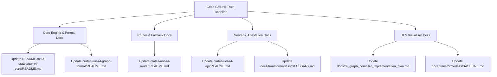

# Master Documentation Overhaul & Architectural Alignment Plan

> **Status:** SUPERSEDED (reconfirmed 2026-08-25, #948) — retained as history
> **Relates to:** Epic #201, PRs #206–#215
> **Author:** Antigravity / AI Agent Pair

---

> **Superseded (2026-08-19, issue #829).** This is a **point-in-time** (≈2026-07-26)
> documentation-alignment plan tied to Epic #201 / PRs #206–#215. It is retained as history
> and is **no longer authoritative**. For current architecture and direction see
> [`README.md`](../README.md), [`AGENTS.md`](../AGENTS.md),
> [`docs/RESEARCH.md`](../docs/RESEARCH.md), and the
> [`Geometric Causal Decoder Roadmap`](../docs/geometric_causal_decoder_plan.md).
>
> **Live-assertion corrections** (the "Ground-Truth Architectural Findings" in §2 are
> point-in-time; some have since drifted — the history below is not rewritten):
> - **Served identity:** `r4` is now the canonical served model identity (#655-F / #817),
>   with `uor-r4` a **deprecated request alias** — this plan predates that flip.
> - **Normative path:** the `FallbackRouter`→`TLA5` cascade (§2.3) and the `W(3,3)` phase-field
>   canvas (§2.5) are **exploratory / visualization** constructs, not the normative production
>   path. Designating the **one** normative R4G1 scorer is S0 work (#831); the `f64` router and
>   dashboard stay out of the graph-migration path.
> - **Store parsing:** `AGENTS.md` records that the on-disk compiled store predates the u32
>   token migration and a legacy reader (`runtime::parse_store_legacy_u16`) still loads it, so
>   §2.1's "strictly 32-bit" phrasing is aspirational/point-in-time, not an invariant.
> - **#784 / #811:** per the current summaries — #784 is continuation-distribution convergence
>   (not a full-depth context-code collision); #811 did not establish semantic abstention.

## 1. Executive Summary & Code Baseline Audit

Following the successful implementation of PRs #206 through #215, the `uor-r4` codebase has achieved complete data integrity alignment, runtime resilience, and Gate C evaluation certification. This plan establishes the ground-truth architectural baseline across all markdown documentation files (`README.md`, `docs/`, `GLOSSARY.md`, `BASELINE.md`, `AGENTS.md`, and crate `README.md` files).

---

## 2. Ground-Truth Architectural Findings

### 2.1 Core Execution & Context Window Doctrine (`crates/uor-r4-core`)
- **Dyadic-Recency Context Window (`WINDOW = 8`)**: The 8-token sliding context window `[t-7..t]` is a parameter bound of the Chain 2 context encoder. Over-length input context triggers `tracing::warn!` logging and zero-allocation stack/slice sliding truncation.
- **ChatML Prompt Formatting**: Instruction-tuned teacher models (e.g. `SmolLM2-135M-Instruct`) use canonical ChatML wrappers (`<|im_start|>system...<|im_end|>\n<|im_start|>user...<|im_end|>\n<|im_start|>assistant\n`) implemented in `scenarios.rs`.
- **Strict u32 Store Integer Alignment**: Legacy `u16` store parsing is marked `#[deprecated]`. Store loading is strictly 32-bit (`parse_store_strict_u32`), with cache purging via `purge_legacy_store_cache`.

### 2.2 Format & Verification (`crates/uor-r4-graph-format`)
- **`tokenizer_cid` Verification**: `GraphView::verify_tokenizer_cid` checks the BLAKE3 hash of `tokenizer.bin` against header `R4G1Header::tokenizer_cid`, failing fast with `FormatError::TokenizerCidMismatch` to prevent index shifts.

### 2.3 Dynamic Engine Fallback (`crates/uor-r4-router`)
- **`FallbackRouter` Pipeline**: Wraps primary (`r4g1-graph`) and secondary (`transformerless-tla5`) engines. Classifies errors via `EngineStatus` (`Success`, `UnmappedRegion`, `Pathological`, `Failed`). Cascades on unmapped/pathological states without dropping HTTP/WS streams.

### 2.4 Server & Provenance (`src/server.rs`)
- **UOR Attestation Envelopes**: `/api/chat` and `/api/sysinfo` wrap payloads with canonical `UorAttestationResult` envelopes containing BLAKE3 CIDs (`uor_address`, `artifact_cid`, `store_cid`, `attestation_cid`).
- **Verification Endpoint (`POST /api/uor/verify`)**: Endpoint validates payload CIDs against BLAKE3 signatures.

### 2.5 Visualisation Interface (`index.html`)
- **W(3,3) Phase Field Canvas**: 96-vertex $S^3$ graph canvas rendering real-time Markov trajectories from WebSocket telemetry streams.
- **Developer Mode Toggle**: `#dev-mode-toggle` checkbox controls collapsible `#advanced-telemetry-panel`.

---

## 3. Detailed Work Breakdown & Documentation Deliverables

### Module 1: Root & Core Architecture Documentation (`README.md`, `crates/uor-r4-core/README.md`)
- [ ] Add Mermaid sequence diagram illustrating Chain 1 (BPE codec) vs Chain 2 (lossy context encoder, 288-bit sign signature, `WINDOW = 8`).
- [ ] Document ChatML prompt formatting requirements and `encode_chat_prompt` API.
- [ ] Document strict 32-bit token ID alignment and `parse_store_strict_u32`.

### Module 2: Format & Verification Specification (`crates/uor-r4-graph-format/README.md`, `crates/uor-r4-api/README.md`)
- [ ] Document `tokenizer_cid` BLAKE3 header verification in `GraphView`.
- [ ] Update `R4Engine::load` error handling documentation with `LoadError::TokenizerCidMismatch`.

### Module 3: Router & Resilient Fallback Specification (`crates/uor-r4-router/README.md`)
- [ ] Add documentation for `FallbackRouter`, `EngineStatus`, `EngineResponse`, and `FallbackResult`.
- [ ] Document `R4G1` -> `TLA5` cascade execution sequence.

### Module 4: Server & Attestation API Docs (`src/server.rs`, `docs/transformerless/GLOSSARY.md`)
- [ ] Document `POST /api/uor/verify` payload format and validation rules.
- [ ] Update `GLOSSARY.md` with terms: `FallbackRouter`, `EngineStatus`, `TokenizerCid`, `UorAttestationResult`, `W(3,3) Phase Field`.

### Module 5: Roadmap & Baseline Metrics Alignment (`docs/r4_graph_compiler_implementation_plan.md`, `docs/transformerless/BASELINE.md`)
- [ ] Mark Phase 1–4 PRs (#206–#215) as completed in the Implementation Plan.
- [ ] Document `instruction-eval.json` schema and Gate C evaluation metrics in `BASELINE.md`.

---

## 4. Verification & Quality Assurance Criteria

Every documentation update must be validated against:
1. **Source Code Parity**: All function names, types, and error codes in docs match Rust code.
2. **Quality Gates**:
   - `cargo fmt --check`
   - `cargo check --workspace`
   - `cargo clippy --workspace --all-targets --all-features --offline -- -D warnings`
   - `cargo test --workspace --offline`
3. **No Stale Claims**: Eliminate deprecated `u16` references or unverified claims.
