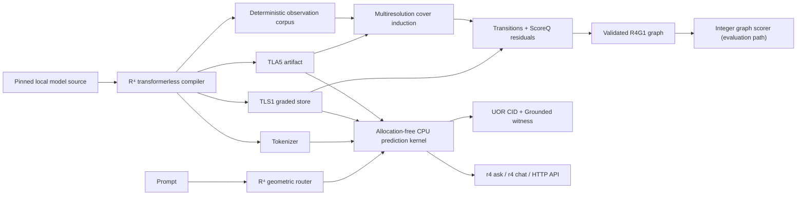

# R⁴ Local Transformerless AI

R⁴ is a local, CPU-first AI and geometric routing system aligned with the
[Universal Object Reference Framework](https://github.com/UOR-Foundation/UOR-Framework),
[Prism](https://github.com/UOR-Foundation/prism), and
[uor-addr](https://github.com/UOR-Foundation/uor-addr).

Transformerless inference is core R⁴ functionality. It is not an external
provider adapter or a separate product: the compiler, runtime, tokenizer,
graded store, witnesses, and model-source adapters live under
[`uor_r4_core::transformerless`](crates/uor-r4-core/src/transformerless).
R⁴ does not require Ollama, llama.cpp, OpenAI, Anthropic, or another inference
service at runtime.

## Current status

R⁴ currently provides:

- a geometric text router and browser dashboard;
- a CPU-only transformerless compiler and table-native inference runtime;
- TLA3/TLA4 compatibility and the current TLA5 artifact format (no f32
  centroids in deployed containers);
- TLS1 graded evidence stores (plus a legacy u16-era reader);
- direct BF16 Safetensors loading for compatible, unsharded Llama-family
  Hugging Face models, without Candle;
- byte-level BPE tokenizer export;
- resumable compilation with progress reporting;
- content-addressed model objects and manifests using UOR CIDs;
- witnessed prediction, indexing, and generation APIs;
- one-shot and interactive chat as application examples of the core runtime.

The **R⁴ holographic graph compiler** program (multiresolution, overlapping
semantic graphs with an allocation-free integer runtime) is underway on top of
this engine — see `docs/r4_graph_compiler_implementation_plan.md`. Already
landed: the R4G1 packed artifact format with two-stage validation
(`crates/uor-r4-graph-format`), the TLA/TLS1 → R4G1 migration converter, the
observation pipeline (content-addressed sample IDs, deterministic shard
spill/resume), multiresolution cover induction (spherical k-means with
calibrated overlapping memberships), semantic transitions + reverse indexes,
ScoreQ fixed-point residuals, and the executable proof model
(`crates/uor-r4-proof-model`). CI runs fmt/clippy/tests/no_std/deterministic-
rebuild/audit/fuzz/wasm gates on every push (`.github/workflows/ci.yml`).

There is an important boundary in the current workflow: compiling a Hugging
Face model produces continuation evidence and runtime artifacts, but it does
not automatically prove instruction-following quality. `ask` accepts only an
imported `instruction-chat` manifest with a CID-addressed passing evaluation
report produced by `evaluate-report`. This guard prevents a fast but
low-quality continuation artifact from being presented as an accurate
question-answering model.

| Operation | Works from a fresh checkout? | Additional state |
|---|---:|---|
| Build and test the workspace | Yes (UOR standards are pinned git deps) | None |
| Geometric router and dashboard | Yes | None |
| Legacy TinyStories certification/benchmark | After `setup` and corpus generation | Pinned llama2.c checkpoint |
| Compile a compatible Hugging Face source | After downloading the source | Pinned model revision |
| `ask` and interactive chat | No | Compiled, evaluated, imported `instruction-chat` manifest |

## Documentation

- [AGENTS.md](AGENTS.md) — contributor/agent operating manual: gates, invariants, κ re-pin procedure
- [ELI5 explainer](docs/explainers/ELI5.md)
- [Undergraduate explainer](docs/explainers/UNDERGRADUATE.md)
- [Transformerless design](docs/transformerless/TRANSFORMERLESS.md)
- [Proof and certificate](docs/transformerless/PROOF.md)
- [Performance comparison](docs/transformerless/COMPARISON.md)
- [Local-only runtime contract](docs/transformerless/LOCAL_ONLY.md)
- [R⁴ graph compiler implementation plan](docs/r4_graph_compiler_implementation_plan.md)
- [Glossary](docs/transformerless/GLOSSARY.md) · [R4G1 wire format](docs/transformerless/R4G1.md) · [Baseline](docs/transformerless/BASELINE.md) · [Threat model](docs/transformerless/THREAT_MODEL.md)
- [Roadmap](ROADMAP.md)

## Requirements

- Current stable Rust and Cargo.
- `hf` from the Hugging Face CLI for `model download` or
  `cargo run --release -- compile --model`.
- `curl` and `unzip` only for the legacy TinyStories setup workflow.

Inference is CPU-only. GPU features, `--device`, Metal, CUDA, and Candle are
intentionally not part of this runtime.

## Quick start

Verify the workspace:

```bash
cargo check --workspace
cargo test --workspace
```

The project exposes one executable, `r4`. With no subcommand it runs the HTTP
server:

```bash
cargo run
# equivalent after a release build: ./target/release/r4
```

Open <http://127.0.0.1:8000>. The geometric router and dashboard work without a
chat model. Use another listener when needed:

```bash
cargo run -- --host 0.0.0.0 --port 9000
```

Build the browser package with:

```bash
wasm-pack build --target web
```

Static deployments use geometric synthesis in WebAssembly. Transformerless
artifact loading and synthesis run through the native server.

## Model lifecycle

The local lifecycle has two artifact lanes:

```text
pinned source -> resumable teacher observation -> TLA5 + TLS1 bundle
                                             |       |
                                             |       +-> local ask/evaluate/import
                                             +-> multiresolution cover
                                                 -> scored R4G1 graph + Gate C report
```

Downloading and compiling are explicit offline operations. Neither `ask` nor
the HTTP server downloads a model or contacts an inference provider.

The top-level `compile` command builds the deployable transformerless bundle
and retains its observation corpus. The graph compiler then consumes those
outputs through `transformerless cover` and `transformerless score`. This
separation makes expensive stages reusable and keeps the deployed runtime
independent of the Hugging Face teacher.

### 1. Download pinned compiler input

```bash
cargo run -- download \
  --repository HuggingFaceTB/SmolLM2-135M-Instruct \
  --revision 7e27bd9f95328f0f3b08261d1252705110c806f8 \
  --name smollm2-135m-instruct
```

The default destination is
`.uor-models/sources/smollm2-135m-instruct`. Override it with `--output`:

```bash
cargo run -- download \
  --repository HuggingFaceTB/SmolLM2-135M-Instruct \
  --revision 7e27bd9f95328f0f3b08261d1252705110c806f8 \
  --name smollm2-135m-instruct \
  --output /path/to/model-sources/smollm2-135m-instruct
```

The downloader prints the repository and destination immediately, streams the
`hf` process, and emits a heartbeat every two seconds with file count, bytes,
and elapsed time.

### 2. Compile the source

Compile an already downloaded directory:

```bash
cargo run --release -- compile \
  --source .uor-models/sources/smollm2-135m-instruct \
  --output .uor-models/compiled/smollm2-135m-instruct \
  --seconds 300 \
  --target 20000 \
  --sequence-length 128
```

Or let the compiler download an immutable revision through `hf`:

```bash
cargo run --release -- compile \
  --model HuggingFaceTB/SmolLM2-135M-Instruct \
  --revision 7e27bd9f95328f0f3b08261d1252705110c806f8 \
  --seconds 300 \
  --target 20000 \
  --sequence-length 128 \
  --r4-attention
```

`--revision` must be a full 40-character commit hash. `--seconds` limits the
teacher-generation work performed by one invocation, while `--target` is the
teacher-token goal. `--r4-attention` enables the experimental 4D softmax-free
Spin(4) attention geometry during teacher generation (omitting this flag runs
standard scaled dot-product attention). Hugging Face compilation defaults to
20,000 tokens and 128-token teacher stories. The bounded story length keeps
attention cost and KV memory proportional to the eight-token deployed runtime
window; increase `--target` or `--sequence-length` explicitly for quality
experiments. Repeat the same command to resume an incomplete corpus.

On macOS, offline Hugging Face teacher execution uses Apple Accelerate's
SIMD-optimized CPU BLAS. Linux and Windows use explicit NEON on AArch64 or
runtime-detected AVX2/FMA on x86-64, with a dependency-free scalar fallback.
These compiler accelerators do not add a runtime dependency or change the
allocation-free table-native inference path. Set `TLESS_TEACHER_EXACT=1` to
force the slower, reduction-order-preserving scalar path for diagnostic
comparisons. The pinned legacy proof workflow always uses that exact path.

When compilation completes, the output directory contains:

```text
tless_artifacts.bin       # TLA5 teacher projection and class tables
tless_store.bin           # TLS1 graded continuation evidence
tokenizer.bin
corpus.meta               # observation-corpus metadata
corpus.records            # deterministic observation records
hamming_calibration.json
hierarchical_codes.json
space_manifest.json
```

Interactive terminals show progress bars. Redirected output receives periodic
`progress:` lines suitable for build logs. Source loading and compilation may
allocate; the allocation-free guarantee applies to the deployed prediction hot
path, which uses fixed and caller-owned buffers.

### 3. Compile the holographic graph

The graph compiler turns the retained observation corpus and TLA5 artifact
into a multiresolution, overlapping semantic graph. First induce and measure
the cover:

```bash
cargo run --release -- transformerless cover \
  --corpus-meta .uor-models/compiled/smollm2-135m-instruct/corpus.meta \
  --corpus-recs .uor-models/compiled/smollm2-135m-instruct/corpus.records \
  --artifacts .uor-models/compiled/smollm2-135m-instruct/tless_artifacts.bin \
  --out .uor-models/compiled/smollm2-135m-instruct/graph-cover
```

This writes `cover.r4g1` and `cover_report.json`. Then compile semantic
transitions, fixed-point emission residuals, and exact-evidence carryover:

```bash
cargo run --release -- transformerless score \
  --corpus-meta .uor-models/compiled/smollm2-135m-instruct/corpus.meta \
  --corpus-recs .uor-models/compiled/smollm2-135m-instruct/corpus.records \
  --artifacts .uor-models/compiled/smollm2-135m-instruct/tless_artifacts.bin \
  --cover .uor-models/compiled/smollm2-135m-instruct/graph-cover/cover.r4g1 \
  --out .uor-models/compiled/smollm2-135m-instruct/graph
```

The result is `graph/score.r4g1`, a stage-validated packed graph containing
regions, refinement/neighbor/forward edges, ScoreQ emission tables, and the
EXCT evidence section. `graph/score_report.json` records artifact and corpus
kappas plus held-out Gate C top-1 agreement, bits/token, and witness replay.

Passing `--cover` reuses the measured cover. It may be omitted to re-induce
the default cover deterministically during scoring. For experiments, `cover`
also accepts `--depths`, `--k0`, `--regions-budget`, and `--memory-budget`.

The public `ask` and `chat` library paths still load the TLA5/TLS1 files from
step 2. The native HTTP server auto-loads `graph/score.r4g1` beside
`tless_artifacts.bin` when present (or accepts `--r4g1-artifact`), validates it,
and uses it for the `transformerless` engine before falling back to TLA5/TLS1.
When the dashboard is served by that native process, its **Compile / Refresh
R4G1 Graph** button runs the same cover → score pipeline against the bundle's
`corpus.meta` and `corpus.records`, validates the new graph, and hot-swaps it
into the running server. Static WASM deployments cannot run this compiler.
Static deployments still use the geometric WASM fallback because they have no
native filesystem-backed graph loader yet.

The native dashboard also exposes **Download Hugging Face Weights**. Its input
defaults to the pinned `owner/repository@commit` from
`models/smollm2-135m-instruct.json`, but accepts any repository paired with a
full 40-character commit. Downloads go into `.uor-models/sources/`; nothing is
downloaded until the button is pressed. Afterward, run the bundle compiler and
then the R4G1 graph compiler. If the downloaded source is present and the
compiled bundle is not, the native **Compile / Refresh R4G1 Graph** action now
runs the bundle compiler first, then cover and score compilation, as one server
job.

### 4. Ask locally

Compilation produces a directly loadable local bundle. On first use, R⁴
content-addresses the artifact, store, and tokenizer in `.uor-models/objects`:

```bash
cargo run --release -- ask "why is the sky blue?"
```

This direct path verifies container integrity but does not claim that the
compiled approximation has passed an instruction-quality evaluation. The CLI
logs that distinction. Compilation success and answer quality are separate
properties.

### 5. Evaluate instruction quality

Run held-out instruction and grounding evaluation against the compiled bundle
and retain a machine-readable report:

```bash
cargo run --release -- evaluate-report \
  --source .uor-models/sources/smollm2-135m-instruct \
  --compiled .uor-models/compiled/smollm2-135m-instruct \
  --report .uor-models/compiled/smollm2-135m-instruct/instruction-eval.json
```

The report file stores an envelope with the held-out D3 metrics (top-1
accuracy, teacher-argmax agreement, Witten–Bell bits/token vs the teacher
floor), source/artifact/store/tokenizer/corpus CIDs, and
`report_cid_of_report_bytes` for the inner metrics payload. Do not mark an
artifact as passing merely to bypass the chat quality gate.

### 6. Import the evaluated bundle

```bash
cargo run -- import \
  --name my-chat-model \
  --source-model HuggingFaceTB/SmolLM2-135M-Instruct@7e27bd9f95328f0f3b08261d1252705110c806f8 \
  --capability instruction-chat \
  --artifacts .uor-models/compiled/smollm2-135m-instruct/tless_artifacts.bin \
  --store .uor-models/compiled/smollm2-135m-instruct/tless_store.bin \
  --tokenizer .uor-models/compiled/smollm2-135m-instruct/tokenizer.bin \
  --evaluation-report /path/to/instruction-eval.json \
  --instruction-eval-passed \
  --grounded-answer-rate 0.80 \
  --repetition-rate 0.01
```

The model store defaults to `.uor-models`; set `UOR_MODEL_STORE` to relocate
it. Objects are stored once under `objects/blake3/<digest>`. Reads verify both
the declared byte length and UOR CID. The import command prints the manifest
CID.

Continuation-only bundles may be imported for certification and benchmarking,
but `ask` refuses to load them.

### 7. Ask or chat with an imported manifest

One-shot `ask` calls the R⁴ library directly without a server or network hop:

```bash
cargo run --release -- ask \
  --model my-chat-model \
  "why is the sky blue?"
```

Interactive chat retains turn history:

```bash
cargo run --release -- chat --model my-chat-model
```

`--model` is optional. Selection order is `TLESS_MODEL`, the newest JSON
descriptor in `models/`, then `smollm2-135m-instruct`. A descriptor selects a
name; R⁴ first uses an imported manifest and otherwise falls back to a complete
local bundle under `.uor-models/compiled/<name>`.

Library consumers can use the chat example directly:

```rust,no_run
use uor_r4_wasm_router::chat::ChatEngine;

let mut chat = ChatEngine::builder().model("my-chat-model").build()?;
let answer = chat.ask("why is the sky blue?")?;
println!("{}", answer.text);
# Ok::<(), Box<dyn std::error::Error>>(())
```

Chat is an application of transformerless R⁴, not a separate crate or
inference layer.

## Legacy benchmark and certification workflow

The pinned llama2.c TinyStories path remains available for proof reproduction
and same-machine performance comparison.

```bash
cargo run --release -- setup
cargo run --release -- gen 300 150000
# repeat gen until it reports done=1
cargo run --release -- compile
cargo run --release -- store
cargo run --release -- certify
cargo run --release -- compare
cargo run --release -- scenarios
```

Its default files are:

```text
/tmp/tless_artifacts.bin
/tmp/tless_store.bin
/tmp/ref/tokenizer.bin
```

This is a TinyStories continuation artifact, not an instruction-chat model.
Use `compare-report` for the recorded certificate without loading the source
checkpoint:

```bash
cargo run --release -- compare-report
```

See [COMPARISON.md](docs/transformerless/COMPARISON.md) for the measured quality
and throughput evidence.

## CLI reference

Build once and invoke `r4` directly, or use the equivalent Cargo commands:

```bash
cargo build --release
./target/release/r4 --help
./target/release/r4 ask "why is the sky blue?"

cargo run -- --help
cargo run -- ask --help
cargo run -- compile --help
cargo run -- download --help
cargo run -- import --help
cargo run -- transformerless cover
cargo run -- transformerless score
```

All subcommands support `-v`, `-vv`, and `-vvv` for info, debug, and trace
logging. Tracing uses a dependency-light subscriber.

The server defaults are:

| Option | Environment | Default |
|---|---|---|
| `--host` | `UOR_R4_HOST` | `127.0.0.1` |
| `--port` | `UOR_R4_PORT` | `8000` |
| `--manifold-cache` | `UOR_R4_MANIFOLD_CACHE` | `manifold_cache_rust.json` |
| `--tless-artifacts` | `TLESS_ARTIFACTS` | `/tmp/tless_artifacts.bin` |
| `--tless-store` | `TLESS_STORE` | `/tmp/tless_store.bin` |
| `--tless-tokenizer` | `TLESS_TOKENIZER` | `/tmp/ref/tokenizer.bin` |
| `--r4g1-artifact` | `R4G1_ARTIFACT` | `<compiled>/graph/score.r4g1` when present |
| `--tless-corpus-meta` | `TLESS_CORPUS_META` | Beside the configured artifact when present |
| `--tless-corpus-recs` | `TLESS_CORPUS_RECS` | Beside the configured artifact when present |

## Architecture



The workspace has one public package and four internal implementation crates:

| Package | Responsibility |
|---|---|
| `uor-r4-wasm-router` | Public facade, UOR witness integration, HTTP server, WASM surface, and the single `r4` executable |
| [`uor-r4-core`](crates/uor-r4-core) | Core R⁴ mathematics and transformerless compiler/runtime/tokenizer/certifier |
| [`uor-r4-router`](crates/uor-r4-router) | Manifold state, indexing, geometric routing, and router witnesses |
| [`uor-r4-graph-format`](crates/uor-r4-graph-format) | Canonical R4G1 serialization, two-stage validation, and borrowed graph views |
| [`uor-r4-proof-model`](crates/uor-r4-proof-model) | Executable graph-compiler proof obligations and proof-status matrix |

The public [`tless_uor`](src/tless_uor.rs) module provides `TlessAxis`,
`UorTlessModel`, CID addressing, and per-prediction `Grounded` certificates.
The root [`chat`](src/chat.rs) and [`model`](src/model.rs) modules are
application-level consumers of the core runtime.

## HTTP API

### `POST /api/chat`

Routes and synthesizes a prompt. The `engine` parameter selects the generation mechanism:

- `"transformerless"`: Run allocation-free table-native codebook retrieval (sub-millisecond latency on CPU).
- `"r4g1"`: Run the validated R4G1 graph scorer when a `score.r4g1` artifact is loaded.
- `"attention"`: Run standard scaled dot-product attention on the loaded teacher model (generates up to 256 tokens).
- `"r4-attention"`: Run experimental 4D Spin(4) softmax-free attention on the loaded teacher model (generates up to 256 tokens, yielding ~25% computation speedup on CPU by bypassing standard softmax exponents).
- `"geometric"`: Route purely geometrically and decode directly from the manifold resonance.

Example request payload:

```json
{
  "text": "dry season aquifer depth in the Gambia",
  "identity": "tenant-alpha",
  "engine": "transformerless"
}
```

The browser dashboard (<http://127.0.0.1:8000>) includes an engine selector dropdown to easily swap between these modes. The dashboard displays a **Speed** metric (in tokens/sec) under the telemetry card that persists after generation completes, allowing for easy execution speed profiling and audit comparison across the attention and transformerless pathways.

### `GET /api/sysinfo`

Returns initialization metrics, uptime, and UOR validation state.

### `POST /api/r4g1/compile` and `GET /api/r4g1/status`

Starts and monitors the native server's cover → score compilation job. The
resulting graph is loaded only after validation succeeds; the status response
also includes the generated `score_report.json` when available.

### `POST /api/huggingface/download` and `GET /api/huggingface/status`

Starts and monitors an explicit download. The optional JSON body is
`{"model":"owner/repository@<40-character-commit>"}`; omitting it uses the
pinned source defined by `models/smollm2-135m-instruct.json`. The server
requires the `hf` CLI and rejects unpinned revisions.

### `POST /api/corpus`

Indexes text into the geometric manifold:

```json
{
  "corpus": "Text to index into the manifold.",
  "identity": "tenant-alpha"
}
```

### `GET /api/export` and `POST /api/import`

Export or restore router vocabulary, prime products, and sentence manifolds.

### `POST /api/tless/predict`

Runs one witnessed token prediction:

```json
{ "window": [1, 298, 263, 221, 437, 238, 15, 1979] }
```

Only the eight most recent token IDs are read. The response includes the token,
resolution depth, graded code, evidence count, operation census, artifact and
store kappas, UOR address, and `Grounded` witness metrics.

### `POST /api/tless/index`

Adds tokenized text to the graded store:

```json
{ "text": "Once upon a time, there was a little dog named Rex." }
```

The response includes token count, evidence positions written, and the updated
store kappa.

### `POST /api/tless/generate`

Runs attributable greedy generation:

```json
{ "text": "Once upon a time, there was a little", "max_tokens": 24 }
```

The response includes generated text and tokens plus each step's resolution
depth and evidence count.

## Testing and quality gates

```bash
cargo fmt --all -- --check
cargo check --workspace --all-targets --offline
cargo test --workspace --all-targets --offline
cargo clippy --workspace --all-targets --offline -- -D warnings
```

Reproduce the transformerless proof witnesses with:

```bash
cargo test -p uor-r4-core
cargo test -p uor-r4-core --release --test kappa_reproduction -- --ignored
```

The ignored reproduction and real-SmolLM2 adapter tests require their external
model fixtures.

## Common errors

- **Downloaded source data is not a compiled chat bundle:** run the exact
  `compile --source ...` command printed by `ask`.
- **Compiled bundle has no quality attestation:** local `ask` can still run it
  and content-addresses its files. Evaluate and `import` it before presenting
  its output as instruction-quality validated.
- **Manifest not found:** select an imported manifest name/CID or set
  `TLESS_MODEL`.
- **Tokenizer or transformerless state unavailable:** build the legacy files or
  pass the three `TLESS_*` paths explicitly.
- **No `metal` feature or `--device`:** expected; inference is CPU-only.
