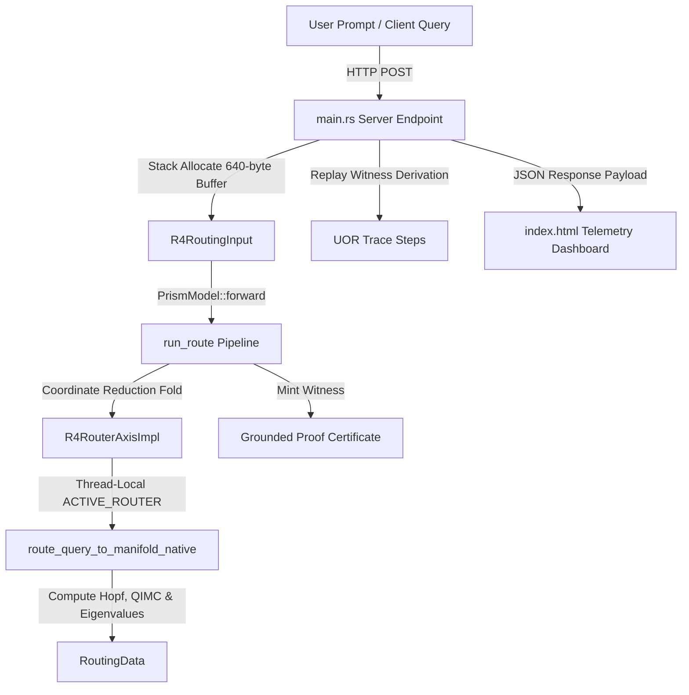

# R⁴ Tangent Space Router (UOR Framework Standard)

A high-dimensional continuous $R^4$ tangent space router, rebased under the official **Universal Object Reference (UOR) Framework** and **Prism Model** standards. This system replaces traditional transformer MoE gating mechanisms with a stable, zero-allocation coordinate reduction pipeline mapped across the first 512 non-trivial Riemann zeta zeroes.

---

## 📖 Overview

Traditional transformers route token inputs using learned parameter gates, which are computationally expensive and act as a black box. The **R⁴ Prime Router** maps natural language queries onto a 512-dimensional prime-factor frequency manifold. By leveraging the **3/8 Resonance Hashing Law**, the router coordinates and synthesizes reasoning trajectories along geometric paths ($R^4$ tangent space vectors), resulting in near-instant local routing.

With this release, the entire coordination engine is rebased onto the **UOR foundation ontology**, converting the routing mechanism into a formally verifiable, type-safe coordinate reduction pipeline.

## 🔗 UOR Standards & Repository Integrations

This codebase leverages three core UOR specifications to track, index, and verify thought trajectories:

1. **[UOR-Framework](https://github.com/UOR-Foundation/UOR-Framework)**: Tracks internal reasoning states and active expert selections as formal, ontological objects. In [src/lib.rs](src/lib.rs), the `ThoughtStream` struct models the agent's thought trajectories, while UOR's witness proof mechanism generates mathematical certificates (`Grounded`) to prove that a specific path has been correctly evaluated at a given Witt-level stratum.
2. **[uor-addr](https://github.com/UOR-Foundation/uor-addr)**: Provides content addressing for agent-produced content. Every query and response is serialized into a canonical JSON payload, and its unique, chain-agnostic identifier is computed using `uor_addr::json::address`. This allows every thought in the system to be tracked, linked, and verified in an immutable graph using URI patterns (e.g. `uor-addr-xxxxxxxx`).
3. **[prism](https://github.com/UOR-Foundation/prism)**: Implements the universal coordinate system for information. It maps natural language inputs into continuous mathematical coordinates ($R^4$ tangent vectors). The coordination engine uses coordinate reduction folds to match inputs against the local knowledge manifold.

---

## ⚡ Core Features

- **Algebraic Shape Constraints**: Mapped query contexts and metrics onto formal UOR shapes (`R4RoutingInput` and `R4RoutingOutput`) inside [src/lib.rs](src/lib.rs) using the `partition_product!` standard.
- **Formal Coordinate Reduction**: Queries are processed through `uor_foundation::pipeline::run_route` by the `UorR4RouterModel` (implementing `PrismModel`), providing formal type-level checking and verification.
- **Real-Time Attestation Witnesses**: Every route execution outputs a `Grounded` witness containing a cryptographic certificate with the following metrics:
  * **UOR Sigma**: The grounding completion ratio ($\sigma \in [0.0, 1.0]$).
  * **UOR $d_\Delta$**: Metric incompatibility between ring distance and Hamming distance.
  * **UOR Euler**: Nerve Euler characteristic ($\chi$) of the constraints.
  * **UOR Free Sites**: The residual free-site rank.
  * **UOR Stratum**: The two-adic valuation stratum coordinate.
- **Wasm-Optimized Zero Allocation**: Borrowed input lifetimes in `R4RoutingInput` pass query buffers on the stack without heap allocation, maximizing execution speed.
- **Interactive 3D Visualizer**: Real-time projection of coordinates onto the $S^2$ base sphere with Hopf fiber rings ($S^1$) and animated trajectory paths.
- **Continuous Manifold Learning**: Learns dynamically during chats by folding prompt-response pairs back into its local JSON database (`manifold_cache_rust.json`).

---

## 📡 OpenTelemetry & Hash Standardization

### Distributed Tracing with OpenTelemetry
The coordination engine integrates OpenTelemetry (OTel) tracing paradigms to track active geodesic trajectories and cascade paths:
- **Traces & Spans**: A **Trace** represents the complete life cycle of an input query routing through the manifold and steering the synthesis engine. Individual operations (such as prime frequency projections, Hopf coordinate mappings, and LLM text generation) are mapped as individual **Spans** within the trace context.
- **Trace Context Propagation**: The OTel `TraceId` (16-byte hex value) and `SpanId` (8-byte hex value) are captured at the server layer. These IDs flow directly into the tangent space vectors ($R^4$), allowing distributed debuggers to trace the physical trajectory and coordinate calculations linked back to a specific HTTP execution span.

### Unified Hash Standardization
The router serves as a bridge between the physical and logical layers of the network stack by unifying hash representations into continuous $R^4$ space:
- **UOR Addresses**: The UOR Framework utilizes content addressing to identify information nodes based on their content multihash.
- **MAC Addressing**: Hardware-layer identifiers are captured and mapped into coordinates to resolve localized node topologies.
- **Blockchain Mappings**: Chain-agnostic transaction hashes and state roots are mapped to the geometric manifold, binding the execution of a routing trajectory to a verifiable, immutable ledger state.
- **Traces and Spans**: The 16-byte OTel `TraceId` and `SpanId` are parsed into 32-byte content address boundaries, converting tracing metadata into addressable UOR nodes.

By mapping all of these disparate identifiers (OTel TraceIds, MAC addresses, transaction hashes, and UOR addresses) into standard 32-byte content addresses, the router unifies them as inputs to the same coordinate reduction fold.

---

## 🏗️ Architecture



---

## 🚀 Getting Started

### 🌐 GitHub Pages & Static Fallback Mode

This application is configured with a fully self-contained WebAssembly (WASM) fallback mechanism. When deployed to **GitHub Pages** (or run statically without a backend server):
- **Automatic Fallback**: The client-side dashboard detects that the backend server is offline and automatically initializes the WASM router (`UorR4Router`) locally inside the browser.
- **Client-Side Simulation**: All prime coordinate mappings, coordinate reductions, thought stream visualizations, QIMC panel attestation updates, MoE expert cell activations, and trace logs are computed directly in your browser using compiled WebAssembly.
- **Limitation**: Pure geometric synthesis is run locally on the client-side manifold coordinates. To use the full synthesis backend (leveraging local LLMs like Ollama/Gemma), you must clone the repository and run the server locally following the instructions below.

### Prerequisites & Ollama Configuration

Ensure you have the following installed on your machine:
* **Rust** (MSRV 1.65+): `curl --proto '=https' --tlsv1.2 -sSf https://sh.rustup.rs | sh`
* **Ollama** (Required for LLM-driven synthesis):
  1. Download and install from [ollama.com](https://ollama.com).
  2. Pull the default routing model (e.g. `gemma:2b` or `gemma2:2b` / `gemma4:e2b`):
     ```bash
     ollama pull gemma:2b
     ```
  3. **Configure CORS (Disable CORS)**: By default, browsers prevent web apps hosted on external domains (like GitHub Pages) from talking to `localhost`. You must allow origins on Ollama:
     * **macOS**: Set the environment variable via launchctl or terminal:
       * *Terminal Option*: Quit Ollama from the menu bar, then run:
         ```bash
         OLLAMA_ORIGINS="*" ollama serve
         ```
       * *System-wide Option*:
         ```bash
         launchctl setenv OLLAMA_ORIGINS "*"
         ```
         Then relaunch the Ollama app from Applications.
     * **Linux**: Edit the systemd service configuration:
       ```bash
       sudo systemctl edit ollama.service
       ```
       Add the following under the `[Service]` section:
       ```ini
       Environment="OLLAMA_ORIGINS=*"
       ```
       Save and restart:
       ```bash
       sudo systemctl daemon-reload
       sudo systemctl restart ollama
       ```
     * **Windows**: Quit Ollama from the taskbar tray, set the user/system environment variable `OLLAMA_ORIGINS` to `*` via Settings, and relaunch Ollama.

### Configuration

The project workspace integrates path dependencies to local standards crates in [Cargo.toml](Cargo.toml):
* `uor-foundation` ([UOR-Framework/foundation](https://github.com/UOR-Foundation/UOR-Framework/tree/main/foundation))
* `uor-prism` ([prism/crates/uor-prism](https://github.com/UOR-Foundation/prism/tree/main/crates/uor-prism))
* `uor-addr` ([uor-addr/crates/uor-addr](https://github.com/UOR-Foundation/uor-addr/tree/main/crates/uor-addr))

### Running the Server

Start the local server target:
```bash
cargo run --release --bin server
```
*The server loads the manifold cache from `manifold_cache_rust.json` and starts listening on **`http://127.0.0.1:8000`**.*

---

## 💻 How to Use the App

1. **Access the Dashboard**: Open your browser and go to `http://127.0.0.1:8000/` (loads [index.html](index.html)) or visit the static site deployment.
2. **First Load Corpus Setup**:
   - **Default Corpus**: On first load, a default bootstrap corpus is automatically indexed by the local WebAssembly router or loaded by the server to populate baseline vocabulary and resonance paths.
   - **Custom Manifold Loading**: To make the router more intelligent, you can paste custom texts under **Index Text to Manifold** or import a pre-saved `manifold.json` using the **Import Manifold** button.
3. **Select Synthesis Engine**: Choose between **Pure Geometric** (local decoding on the manifold coordinates) or **Ollama (Gemma)** (routed prompt steered by prime coordinates and grounded context sentences).
4. **Submit Queries**: Type prompts in the chat box. On submission:
   * The **3D Trajectory visualizer** will project a white pulse path showing the reasoning coordinate evolution.
   * The **QIMC Panel** will display the active prime, the witness validation state (`Verified`), and formal UOR metrics.
   * The **Cascade Trace Logs** console (bottom-right) will output the official step-by-step UOR reduction events in real time.
5. **Index Knowledge**: Paste textual reference materials in the bottom-left text area and click **Index Manifold** to dynamically inject new knowledge coordinates into the local brain.

---

## 📡 API Reference

### 1. Chat Generation
* **Endpoint**: `/api/chat`
* **Method**: `POST`
* **Payload**:
  ```json
  {
    "text": "dry season aquifer depth in the Gambia",
    "identity": "tenant-alpha",
    "engine": "auto",
    "ollama_url": "http://127.0.0.1:11434",
    "ollama_model": "gemma4:e2b"
  }
  ```
* **Response**: Contains `description`, `metrics` (including `uor` validation struct), `trajectory`, and `uor_trace_steps`.

### 2. System Status
* **Endpoint**: `/api/sysinfo`
* **Method**: `GET`
* **Response**: Baseline metrics, uptime, and UOR validation state for initialization.

### 3. Bulk Indexing
* **Endpoint**: `/api/corpus`
* **Method**: `POST`
* **Payload**:
  ```json
  {
    "corpus": "Full text corpus to index into the manifold...",
    "identity": "tenant-alpha"
  }
  ```

### 4. Database Export / Import
* **Endpoint**: `/api/export` (GET) / `/api/import` (POST)
* **Description**: Extracts or restores the complete router vocabulary, prime products, and sentence manifolds in JSON format.

---

## 🧪 Testing

To run the full suite of unit and compilation tests:
```bash
cargo test
```
