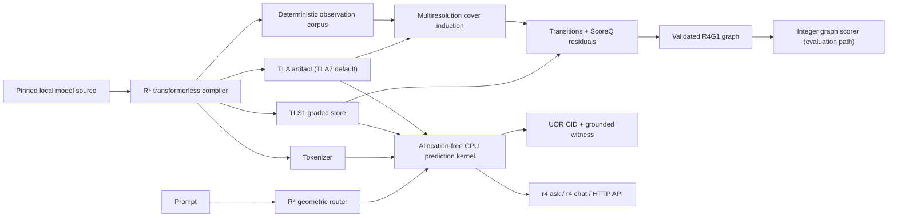

# R⁴ — Local Transformerless AI

[](https://github.com/UOR-Foundation/uor-r4/actions/workflows/ci.yml)
[](LICENSE)
[](rust-toolchain.toml)

R⁴ cross-compiles a pinned Hugging Face model into a **table-native artifact that
runs inference with no multiplication, no floating point, and no allocation in
the hot path** — on a CPU, locally, with a content-addressed witness for every
prediction. It also contains a geometric text router and a browser dashboard.

No Ollama, llama.cpp, OpenAI, or Anthropic at runtime. Nothing leaves the
machine.

R⁴ is aligned with the
[Universal Object Reference Framework](https://github.com/UOR-Foundation/UOR-Framework),
[Prism](https://github.com/UOR-Foundation/prism) and
[uor-addr](https://github.com/UOR-Foundation/uor-addr).

> **Status: research project, v0.1.0.** The compiler, runtime, artifact format
> and measurement harnesses work and are exercised by CI. Generation quality is
> *not* competitive with the teacher models it compiles — see
> [What actually works](#what-actually-works) for honest numbers. This repository
> is run as a measured research programme; [docs/RESEARCH.md](docs/RESEARCH.md)
> records what has been established and what has been refuted.

---

## Contents

- [Quick start](#quick-start) · [Requirements](#requirements) · [What actually works](#what-actually-works)
- [Project layout](#project-layout) · [Architecture](#architecture)
- [CLI reference](#cli-reference) · [HTTP API](#http-api) · [Configuration](#configuration)
- [Testing and quality gates](#testing-and-quality-gates) · [Troubleshooting](#troubleshooting)
- [Documentation map](#documentation-map) · [Contributing](#contributing) · [License](#license)

---

## Quick start

### 60 seconds — router and dashboard, no model required

```bash
git clone https://github.com/UOR-Foundation/uor-r4.git
cd uor-r4
cargo run --release          # starts the server on 127.0.0.1:8000
```

Open <http://127.0.0.1:8000>. The geometric router, the 96-vertex W(3,3)
phase-field canvas and the semantic map all work with no model, no download and
no compile. This is the fastest way to confirm the repository builds and runs on
your machine.

### 5 minutes — run the measurement pipeline on the committed fixtures

The Gate C scoring harness runs end to end on fixtures checked into the
repository — no teacher, no checkpoint, no network:

```bash
cargo run --release --bin r4 -- transformerless score \
  --corpus-meta crates/uor-r4-core/tests/fixtures/c_meta.bin \
  --corpus-recs crates/uor-r4-core/tests/fixtures/c_recs.bin \
  --artifacts   crates/uor-r4-core/tests/fixtures/tless_artifacts.bin \
  --out /tmp/score-demo
```

It writes `/tmp/score-demo/score_report.json` (schema 26) and prints a per-phase
wall clock. This is the same command CI runs as its Gate C trend alarm, so a
clean run here means your build agrees with ours.

### Hours — compile your own model

Downloading, compiling, scoring, evaluating and importing a real teacher is a
multi-hour CPU pipeline with its own guide:
**[docs/MODEL_LIFECYCLE.md](docs/MODEL_LIFECYCLE.md)**.

The single-command orchestrator runs the whole chain and drops you into a chat
client at the end:

```bash
./uor-r4-cli          # menu: SmolLM2 135M / 360M / 1.7B, or audit
```

---

## Requirements

| | |
|---|---|
| **Rust** | Pinned to **1.97.1** by `rust-toolchain.toml`. rustup resolves it automatically. |
| **Python 3** | For `scripts/*.py` — two of them are CI gates. |
| **`hf`** (Hugging Face CLI) | Only for downloading teacher models. |
| **`wasm-pack`** | Only to rebuild the browser WASM bundle. |
| **`cargo-nextest`** | Only to mirror CI's test runner locally. |
| **Nightly Rust** | Only for `cargo fuzz`. |
| **Disk / RAM** | Building the workspace needs a few GB. A 500k-record scoring run peaks near 1.4 GB RSS; corpus-scale compiles run for hours. |

> **Toolchain trap.** A non-rustup Rust earlier in `PATH` (Homebrew, system
> packages) silently ignores the pin. Verify `which cargo` resolves to
> `~/.cargo/bin/cargo`, or run gates as `rustup run stable cargo …`.

UOR standards (`uor-addr`, `UOR-Framework`) are **pinned git dependencies** — a
fresh clone builds with no extra checkouts. The `uor_standards/` directory is
gitignored legacy material and is not required to build.

---

## What actually works

Being precise here matters more than being impressive, because this repository's
whole method is measurement.

**Solid, exercised by CI:**

- The **transformerless compiler and runtime**. A pinned Hugging Face model
  cross-compiles to a TLA artifact plus a graded store, and the prediction kernel
  uses only XOR/AND/OR/shift/rotate/popcount/integer add-sub/compare and table
  reads — no multiply, no divide, no float, enforced by a machine-checked source
  scan. The hot path is allocation-free in steady state, asserted by a test.
- **Determinism.** Identical pinned inputs produce identical artifact bytes, and
  a κ-reproduction gate (Gate E) checks that against a committed fixture.
- The **R4G1 packed graph format** with two-stage validation, a `no_std`
  allocation-free graph runtime, and a TLA/TLS1 → R4G1 migration converter.
- **A-mode infill serving** — filling gaps between supplied anchors — is
  validated and shipped (`r4 graph infill`). Anchors are inputs, so the mode is
  immune to the drift that killed the standalone variant.
- **UOR attestation**: content-addressed model objects and manifests, witnessed
  prediction, and a `POST /api/uor/verify` validation endpoint.
- The **geometric router**, browser dashboard and OpenAI-compatible server.
- A **measurement apparatus**: 34 harnesses with pre-declared exit rules, null
  baselines and falsifiers, plus a Gate C trend alarm that fails CI on
  regression.

**Real limitations, stated plainly:**

- **Generation quality is weak.** On out-of-distribution prompts the compiled
  runtimes score around 1% top-1 against the teacher. On in-distribution corpus
  replay Gate C measures ~36% top-1 on the 500k fixture. This is a research
  engine, not a chat model.
- **Instruction following is gated, not solved.** `r4 ask` accepts only an
  imported `instruction-chat` manifest carrying a CID-addressed passing
  evaluation report, precisely so a fast continuation artifact cannot be
  presented as a question-answering model.
- **Standalone two-pass generation is refuted**, twice, and is not coming back.
- **The geometric router's retrieval was measured broken**, and the fix sits
  behind a default-off knob. Until issue #490 clears its gate, the deployed
  retrieval ranking is word overlap, not geometry.

Every claim above traces to a merged measurement — see
[docs/RESEARCH.md](docs/RESEARCH.md).

---

## Project layout

```
crates/
  uor-r4-core            R⁴ math + transformerless compiler/runtime/tokenizer/certifier
  uor-r4-router          geometric router, dashboard backend (f64; outside the graph plan)
  uor-r4-graph-format    R4G1 packed artifact format, two-stage validation, no_std
  uor-r4-graph-compiler  offline graph-compiler stages (observation, cover induction, packing)
  uor-r4-graph-certify   offline certification and measurement (Gate C `score` harness)
  uor-r4-graph-runtime   no_std, allocation-free R4G1 runtime (engine, routing, patch chains)
  uor-r4-graph-cli       `r4 transformerless …` stage dispatch
  uor-r4-model-source    teacher forward-pass port + pinned Safetensors adapter
  uor-r4-proof-model     executable proof obligations + proof-status matrix
  uor-r4-api             typed compile + engine library facade for downstream consumers
src/                     root package: the `r4` binary, HTTP server, chat, WASM facade
docs/                    research records, design docs, explainers, formal material
features/                Cucumber BDD suites (teacher parity, FMM)
scripts/                 CI gates and corpus tooling
research/                exploratory notes (290-fmm, 395-e8)
models/                  pinned model descriptors
tests/                   root-package integration tests and BDD steps
index.html, index.css    browser dashboard
r4_worker.js             dashboard WASM worker
uor-r4-cli, r4-app.sh    single-command orchestrator
```

---

## Architecture


```mermaid
flowchart LR
    Source["Pinned local model source"] --> Compiler["R⁴ transformerless compiler"]
    Compiler --> Corpus["Deterministic observation corpus"]
    Compiler --> Artifact["TLA artifact (TLA7 default)"]
    Compiler --> Store["TLS1 graded store"]
    Compiler --> Tokenizer["Tokenizer"]
    Corpus --> Cover["Multiresolution cover induction"]
    Artifact --> Cover
    Cover --> Score["Transitions + ScoreQ residuals"]
    Store --> Score
    Score --> Graph["Validated R4G1 graph"]
    Graph --> GraphRuntime["Integer graph scorer (evaluation path)"]
    Artifact --> Runtime["Allocation-free CPU prediction kernel"]
    Store --> Runtime
    Tokenizer --> Runtime
    Prompt["Prompt"] --> Router["R⁴ geometric router"]
    Router --> Runtime
    Runtime --> Witness["UOR CID + grounded witness"]
    Runtime --> Apps["r4 ask / r4 chat / HTTP API"]
```

**Serving order.** The stack consults packed NGRAM context rows (trigram with
bigram backoff), then the graph chain with D4 exact-context precedence, then the
root prior. A `FallbackRouter` cascades from primary `r4g1-graph` to secondary
`transformerless-tla5` on unmapped or pathological states.

**Artifact format eras.** Deployed compiles emit **TLA7** by default (per-stage
i8 centroid copies, a norm-fold constant, per-stage decode shifts). TLA6 (packed
shift-add dot tables) is the fallback, and TLA3/TLA4/TLA5 remain readable through
the era-generic parser. `R4_TLESS_TLA7=0` and `R4_TLESS_TLA6=0` opt a compile
back out. The committed fixture is TLA7.

**Context window.** `WINDOW = 8` dyadic-recency, with zero-allocation stack/slice
sliding truncation. Token stores are strict 32-bit (`parse_store_strict_u32`);
legacy u16 stores are readable but want a recompile.

---

## CLI reference

Everything below supports `--help`. Global flags (`--host`, `--port`,
`--tless-artifacts`, `--tless-store`, `--tless-tokenizer`, `--r4g1-artifact`,
`--manifold-cache`, `-v`) are accepted before or after any subcommand. `r4` with
no subcommand is `r4 serve`.

**Serving and interaction**

```bash
r4 serve                                    # HTTP server + dashboard
r4 ask [--model NAME|CID] <question...>     # one-shot; prints only the answer
r4 chat [--model NAME|CID] [--remote URL]   # REPL, local or against a remote /v1
r4 client [--remote http://127.0.0.1:8000/v1]
r4 audit [--log-file .uor-models/audit_log.json]
```

**Model lifecycle** — full guide in [docs/MODEL_LIFECYCLE.md](docs/MODEL_LIFECYCLE.md)

```bash
r4 download --repository OWNER/REPO --revision <40-char SHA> --name NAME
r4 compile --source DIR [--output DIR] [--seconds N] [--target N] [--sequence-length N]
r4 compile --corpus-meta META --corpus-recs RECS --vocab-size N     # teacher-free
r4 evaluate-report [--source DIR] [--compiled DIR] [--report PATH]
r4 import --name N --source-model M --capability continuation|instruction-chat \
          --artifacts F --store F --tokenizer F [--evaluation-report F]
```

**Graph pipeline**

```bash
r4 transformerless observe      [--source DIR] [--out obs] [--shards 4]
r4 transformerless observe-text [--input PATH] [--out obs-text]
r4 transformerless cover        [--corpus-meta M] [--corpus-recs R] [--artifacts A] [--out cover]
r4 transformerless cover-sweep  [...]
r4 transformerless score        [--corpus-meta M] [--corpus-recs R] [--artifacts A] [--out DIR]
r4 transformerless convert-r4g1 --artifacts TLA --store TLS1 --out R4G1
r4 transformerless compile-recorded --corpus-meta M --corpus-recs R --vocab-size N --out DIR
r4 graph infill --artifact score.r4g1 --skeleton 12,_,_,_,99,_,_,_,7
```

**Certification and comparison** (need the llama2.c checkpoint — see
[Troubleshooting](#troubleshooting))

```bash
r4 certify          # full certificate + zero-multiply op census + serving row
r4 compare          # against the reference implementation
r4 compare-report   # prints the recorded certificate; needs no artifacts
r4 setup            # prints the prerequisite commands
```

> `r4 transformerless compare` and `compare-report` appear in the subcommand
> help but are not implemented there. The working spellings are the root
> `r4 compare` and `r4 compare-report`.

---

## HTTP API

`r4 serve` exposes an OpenAI-compatible surface and a dashboard surface. JSON
responses carry permissive CORS.

**OpenAI-compatible (`/v1`)** — this is what `r4 client` and `r4 chat --remote`
speak; `/v1` is kept a pure OpenAI surface (see `profiles/openai/`):

| Endpoint | Purpose |
|---|---|
| `POST /v1/chat/completions` | Chat completion (non-streaming and SSE streaming) |
| `POST /v1/responses` | Responses API |
| `GET /v1/models` | List available models |
| `GET /v1/models/{model}` | Retrieve one model |

**R4 extended API (`/uor/v1`)** — capabilities beyond the OpenAI surface, under a
vendor namespace so they never collide with the OpenAI standard on `/v1`:

| Endpoint | Purpose |
|---|---|
| `GET /uor/v1/status` | Engine and artifact status (4-stage lifecycle) |
| `POST /uor/v1/reload` | Reload the R4G1 graph and teacher for a model |
| `POST /uor/v1/corpus` | Manage the extra-reading corpus (add / export / list) |

The bare `/v1/status`, `/v1/reload`, and `/v1/corpus` paths remain as
**deprecated aliases** — they still work but respond with an RFC 8594
`Deprecation` header and a `Link` to the `/uor/v1` successor. Prefer `/uor/v1`.

**Dashboard:**

| Endpoint | Purpose |
|---|---|
| `POST /api/chat` | Route and synthesize; `engine` selects the mechanism (below) |
| `POST /api/tless/predict` · `/index` · `/generate` | Transformerless runtime |
| `POST /api/r4g1/predict` · `/generate` · `/compile`, `GET /api/r4g1/status` | R4G1 graph runtime and background compile |
| `POST /api/corpus` · `/api/reset` · `/api/import`, `GET\|POST /api/export` | Corpus and state management |
| `POST /api/uor/verify` | Validate a UOR attestation envelope |
| `GET /api/huggingface/status`, `POST /api/huggingface/download` | Background teacher download |
| `GET /api/tags` | Ollama-style tag list |
| `GET /api/sysinfo` · `GET /api/map` | Host info; semantic map points |

Anything else is served as a static file from the working directory; `/` serves
`index.html`.

**`engine` values for `POST /api/chat`**

| Value | Mechanism |
|---|---|
| `transformerless` | Allocation-free table-native codebook retrieval, sub-millisecond on CPU |
| `r4g1` | The validated R4G1 graph scorer; needs a loaded `score.r4g1` |
| `attention` | Standard scaled dot-product attention on the loaded teacher (up to 256 tokens) |
| `r4-attention` | Experimental teacher attention variant (#602 operator `experimental-r4-source-attention/1`: a 4-wide-chunked dot product with the same softmax selector as `attention`; never measured against it — see `docs/deferral_record_2026_08_05.md`) |
| `geometric` | Route purely geometrically and decode from manifold resonance |

Omitting `engine` runs the **full cascade, r4g1-first** — it does *not* mean
`transformerless`. The dashboard's engine selector sets this, and
`.uor-models/last_engine.txt` persists the preference across requests that omit
it. The dashboard also shows a tokens/sec **Speed** metric that persists after
generation, for profiling across the attention and transformerless paths.

Example:

```json
{
  "text": "dry season aquifer depth in the Gambia",
  "identity": "tenant-alpha",
  "engine": "transformerless"
}
```

---

## Configuration

Environment knobs, grouped by purpose. The full inventory with defaults and
owning modules is in [docs/CONFIGURATION.md](docs/CONFIGURATION.md).

**Paths and inputs** — `TLESS_CHECKPOINT`, `TLESS_ARTIFACTS`, `TLESS_STORE`,
`TLESS_TOKENIZER`, `TLESS_MODEL`, `R4G1_ARTIFACT`, `R4_CORPUS_META`,
`R4_CORPUS_RECS`, `R4_ARTIFACTS`, `R4_CODES_PATH`, `UOR_MODEL_STORE`,
`UOR_R4_HOST`, `UOR_R4_PORT`.

**Determinism and teacher math** — `TLESS_CANONICAL_DETERMINISTIC` (required for
the cross-platform Gate E claim), `TLESS_EXACT_SCALAR`, `R4_TLESS_TLA6`,
`R4_TLESS_TLA7`, `TLESS_REPIN_WRITE` (maintainer-only).

**Measurement** — `R4_GATE_C_SAMPLE` (deterministic stride subsample; the sample
size and standard error travel with every rate, so a sampled number cannot be
read as a census), `R4_GATE_C_SKIP_ARMS=right_context` (skips the whole-corpus
right-context code pass — about 60% of a sampled run's wall clock), plus
per-harness caps.

**Capacity overrides** — the `R4_COVER_*` and `R4_*_SAMPLE` family share one
contract: **unset is κ-neutral; set-but-invalid or zero panics.** A knob that
silently did nothing would be indistinguishable from a knob that does not work.

---

## Testing and quality gates

Local gates, all clean before every commit:

```bash
cargo test --workspace --offline
cargo clippy --workspace --all-targets --all-features --offline -- -D warnings
cargo fmt --check
cargo check -p uor-r4-graph-format --no-default-features
cargo check -p uor-r4-graph-format --no-default-features --features alloc
```

Any change under `uor-r4-core` or `uor-r4-router` additionally needs the wasm
target, because clippy does not build it and the merge queue does:

```bash
cargo check --target wasm32-unknown-unknown -p uor-r4-wasm-router --lib
```

Other suites: `cargo test --test bdd` (or `just bdd`) runs the Cucumber
teacher-parity suite — it **vacuously skips** without a compiled bundle, so check
the fixture before trusting green. `cargo test --doc --workspace` runs doc tests.
`cargo +nightly fuzz run parse_arbitrary` fuzzes the format parser.

**CI** reports five required checks. On `pull_request` they are fast — claim
wording, fmt, clippy, `cargo audit`. On `merge_group` the full ladder runs
against the speculative merge: tests, no_std, deterministic rebuild,
κ-reproduction, Gate C trend, wasm, fuzz smoke. A **docs-only fast path**
short-circuits Markdown-only PRs. Any new required check name must be reported in
*both* contexts, or PRs hang forever waiting on a check that never runs.
Separate workflows cover Kani formal verification and GitHub Pages deployment.

**Measurement harnesses** are `#[ignore]`d and run explicitly. The cheap gate
that must precede any long run:

```bash
cargo test -p uor-r4-graph-certify --test capacity_scaling -- --ignored   # ~12 min
```

It prints a saturation verdict per structure. If it reports SATURATED on the
structure your experiment intends to move, the long run does not launch. The full
harness inventory is in [docs/RESEARCH.md](docs/RESEARCH.md).

---

## Troubleshooting

| Symptom | Cause and fix |
|---|---|
| κ tests pass suspiciously fast | `/tmp/ref/out/model.bin` is missing, so they **skip silently and report vacuous green**. `/tmp` cleanup deletes it. Re-fetch (below) and confirm the file exists before trusting a pass. |
| fmt/clippy disagree with CI | A non-rustup Rust earlier in `PATH` ignores the toolchain pin. Check `which cargo`. |
| clippy passes locally, fails in CI | You omitted `--all-features`. Use the exact invocation above. |
| `r4 ask` refuses to run | The bundle has no CID-addressed passing evaluation report. Run `r4 evaluate-report`, then `r4 import`. |
| Port 8000 already in use | Use `--port` / `UOR_R4_PORT`, or `PORT=9000 ./uor-r4-cli`. |
| Compiled bundle behaves oddly after an upgrade | The on-disk store in `.uor-models/` may predate the u32 token migration. A full recompile refreshes it. |
| `--revision` rejected | It must be a full 40-character commit hash; the server refuses unpinned revisions. |
| Measurement harness prints `SKIP` | Its corpus fixtures or `R4_*` inputs are absent. Check the harness header for what it needs. |

Fetch the reference checkpoint:

```bash
curl -sL -o /tmp/run.com \
  https://github.com/trholding/llama2.c/releases/download/experimental/run.com
cd /tmp && unzip -o run.com out/model.bin tokenizer.bin -d ref
```

---

## Documentation map

**Start here**

- [docs/RESEARCH.md](docs/RESEARCH.md) — what is measured, what is closed, what is open.
- [docs/MODEL_LIFECYCLE.md](docs/MODEL_LIFECYCLE.md) — download → compile → cover → score → evaluate → import → serve.
- [AGENTS.md](AGENTS.md) — contributor manual: gates, normative invariants, κ re-pin, long-run discipline.
- [CONTRIBUTING.md](CONTRIBUTING.md) — how to open a PR here.
- [docs/CONFIGURATION.md](docs/CONFIGURATION.md) — every environment knob.

**Explainers** — [ELI5](docs/explainers/ELI5.md) ·
[Undergraduate](docs/explainers/UNDERGRADUATE.md) ·
[Glossary](docs/transformerless/GLOSSARY.md)

**Design and contract** — [Transformerless design](docs/transformerless/TRANSFORMERLESS.md) ·
[Proof and certificate](docs/transformerless/PROOF.md) ·
[R4G1 wire format](docs/transformerless/R4G1.md) ·
[Baseline](docs/transformerless/BASELINE.md) ·
[Threat model](docs/transformerless/THREAT_MODEL.md) ·
[Local-only runtime contract](docs/transformerless/LOCAL_ONLY.md) ·
[Inference contract](docs/inference_contract.md) ·
[Scoring semantics](docs/scoring_semantics.md) ·
[Formal vocabulary](docs/formal_vocabulary.md) (normative for claim wording) ·
[Reproducibility](docs/reproducibility.md) ·
[Performance comparison](docs/transformerless/COMPARISON.md)

**Plan** — [R⁴ graph compiler implementation plan](docs/r4_graph_compiler_implementation_plan.md) ·
[ROADMAP.md](ROADMAP.md) · [Minimal client](docs/minimal_client.md)

---

## Contributing

Read [AGENTS.md](AGENTS.md) first — it is the operating manual, not a formality.
[CONTRIBUTING.md](CONTRIBUTING.md) has the short version:

1. **Assign yourself the issue**, work on `issue-<n>-<slug>`, open a PR, merge
   through the queue, close the issue with the evidence.
2. **Every substantive claim arrives with a pre-declared exit rule, a null
   baseline and a falsifier.** Negative results are recorded and kept — several
   of the most valuable entries in [docs/RESEARCH.md](docs/RESEARCH.md) are
   refutations that redirected the programme.
3. **Do not weaken the normative invariants**: no multiply/divide/float in the
   deployed kernel, allocation-free hot path, deterministic artifacts, no
   `unwrap`/`expect` on recoverable paths, no `unsafe` in the portable runtime or
   the format crate.
4. **Claim language is machine-checked.** `python3 scripts/check_claim_wording.py`
   blocks exact-equivalence wording that has no linked proof artifact.
5. **Before any run measured in hours**, compute the reachability ceiling, run
   the cheap instrument first and treat its verdict as binding, and pre-declare
   what each outcome causes. Paste the run contract into the issue.

Security-relevant design is documented in
[docs/transformerless/THREAT_MODEL.md](docs/transformerless/THREAT_MODEL.md).

## License

MIT — see [LICENSE](LICENSE). © 2026 UOR Foundation.
