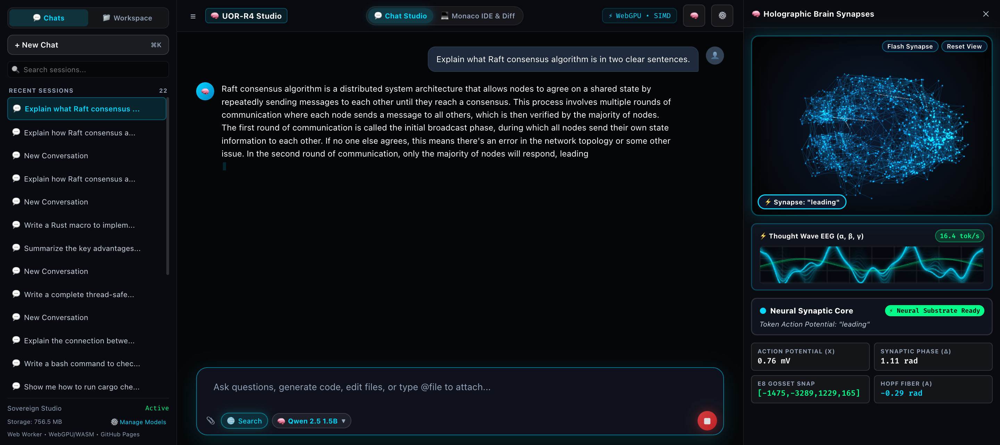
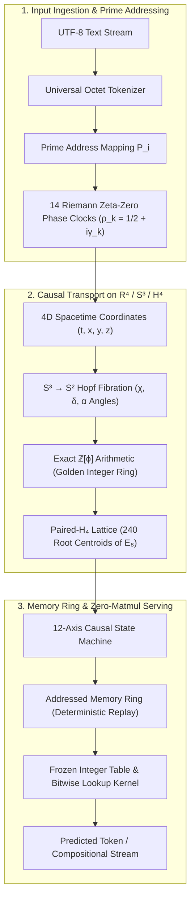
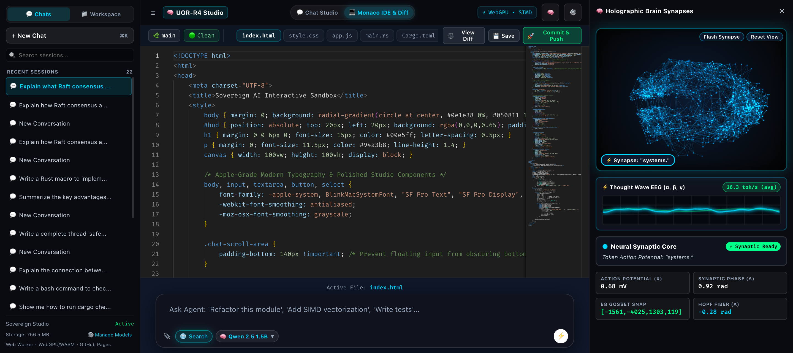
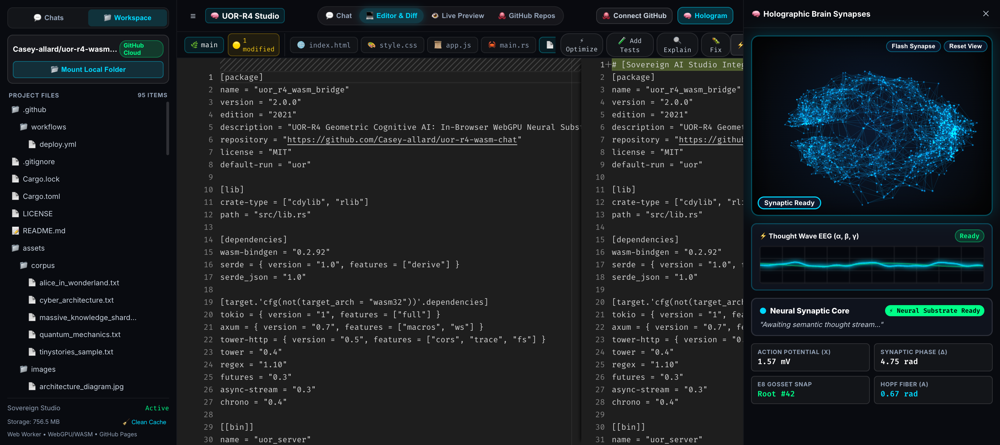

<div align="center">



# 🌐 UOR-R4 Geometric Language Model
### *Native Geometric AI • $R^4/S^3/H^4$ State Manifold • Exact $\mathbb{Z}[\phi]$ Arithmetic • Zero-Matmul Serving*

[](https://uor-foundation.github.io/uor-r4/)
[](https://github.com/UOR-Foundation/uor-r4/releases)
[](https://www.rust-lang.org/)
[](docs/formal_vocabulary.md)
[](LICENSE)

[**🚀 Launch Web Studio**](https://uor-foundation.github.io/uor-r4/) • [**💬 Interactive CLI**](#-quickstart-interactive-terminal-chat) • [**🏛️ Mathematical Architecture**](#-architectural-foundations) • [**📊 Benchmark & Thermals**](#-apple-silicon-m1-benchmark--thermal-quantification) • [**📐 12-Axis Scorecard**](#-alpha-capability-scorecard-positions-0112)

</div>

---

## ⚡ What is UOR-R4?

The **UOR-R4 Geometric Language Model** is an experimental autoregressive geometric state model with exact addressed memory and learned typed operators, engineered from the ground up in 100% Rust.

Unlike conventional large language models that rely on dense transformer attention backbones, quadratic $O(N^2)$ KV-caches, and billion-parameter floating-point matrix multiplications (GEMM), UOR-R4 operates directly on a **continuous $R^4 / S^3 / H^4$ geometric state manifold**.

In final serving, **UOR-R4 executes zero mathematical matrix products and zero floating-point operations**. Inference executes through bounded geometric routing, state transitions along the golden integer ring $\mathbb{Z}[\phi]$, CORDIC phase rotations, and deterministic integer table lookups with **zero steady-state heap allocations**.

---

## 🏛️ Architectural Foundations


```mermaid
flowchart TD
    subgraph IngestPipeline ["1. Input Ingestion & Prime Addressing"]
        Input["UTF-8 Text Stream"] --> Tokenizer["Universal Octet Tokenizer"]
        Tokenizer --> PrimeMap["Prime Address Mapping P_i"]
        PrimeMap --> ZetaClock["14 Riemann Zeta-Zero Phase Clocks (ρ_k = 1/2 + iγ_k)"]
    end

    subgraph GeometricTransport ["2. Causal Transport on R⁴ / S³ / H⁴"]
        ZetaClock --> R4Point["4D Spacetime Coordinates (t, x, y, z)"]
        R4Point --> HopfMap["S³ → S² Hopf Fibration (χ, δ, α Angles)"]
        HopfMap --> Icosian["Exact ℤ[ϕ] Arithmetic (Golden Integer Ring)"]
        Icosian --> E8Centroid["Paired-H₄ Lattice (240 Root Centroids of E₈)"]
    end

    subgraph MemoryExecution ["3. Memory Ring & Zero-Matmul Serving"]
        E8Centroid --> CausalState["12-Axis Causal State Machine"]
        CausalState --> ExactMem["Addressed Memory Ring (Deterministic Replay)"]
        ExactMem --> TableLookup["Frozen Integer Table & Bitwise Lookup Kernel"]
        TableLookup --> OutputToken["Predicted Token / Compositional Stream"]
    end
```

### 1. The $R^4 / S^3 / H^4$ Spacetime State Manifold
Instead of arbitrary high-dimensional vector embeddings ($D=4096$), inputs are embedded into 4D spacetime coordinates $(t, x, y, z)$. Rotations and phase evolutions map through the **$S^3 \to S^2$ Hopf fibration**:
$$\chi = 2 \arctan\left(\frac{|z_1|}{|z_0|}\right), \quad \delta = \arg(z_1) - \arg(z_0), \quad \alpha = \arg(z_0)$$
The fiber coordinate $\alpha$ and spatial angles $(\chi, \delta)$ preserve exact chirality, orientation, and torsion invariants across long token sequences.

### 2. Riemann Zeta-Zero Phase Channels ($N=14$)
Temporal coherence is sustained without dense softmax attention by projecting across the first 14 nontrivial zeros of the Riemann zeta function:
$$\rho_k = \frac{1}{2} + i\gamma_k, \quad k \in \{1, \dots, 14\}$$
Each zero acts as an orthogonal harmonic clock. Because the frequencies $\gamma_k$ are algebraically incommensurate, their interference patterns provide rich, non-repeating memory traces.

### 3. Exact $\mathbb{Z}[\phi]$ Arithmetic & Paired-$H_4$ Icosian Lattice
To eliminate floating-point drift and rounding errors, all spatial rotations and 4D symmetries operate over the golden integer ring:
$$\mathbb{Z}[\phi] = \{a + b\phi \mid a, b \in \mathbb{Z}\}, \quad \phi = \frac{1 + \sqrt{5}}{2}$$
The model's geometric state space couples two $H_4$ 120-cell icosian rings ($H_4 \oplus \phi H_4$), exactly capturing the **240 minimal root centroids of the 8-dimensional Gosset $E_8$ lattice**.

### 4. Exact Addressed Memory Ring
Memory is not a blurry associative weight update; it is an exact, content-addressed memory ring. The session state maintains durable relations, identifier bindings, and fact occurrences with deterministic cryptographic BLAKE3 identity receipts.

### 5. Frozen Zero-Matmul Serving Kernel
Final inference executes on consumer CPUs without matrix multiplication:
- **Operations used**: XOR, AND, OR, bit-shift, rotate, popcount, integer addition/subtraction, and table reads.
- **Operations excluded**: No matrix multiplies (`GEMM`), no division, no floating-point arithmetic, and **0 bytes of steady-state heap allocation**.

---

## 📸 Sovereign AI Developer Studio

The repository includes the complete **UOR-R4 Sovereign AI Developer Studio**, hosted directly in-browser on GitHub Pages and available for local execution.

<div align="center">

### 1. Sovereign Chat Studio & Thought Wave EEG

*Real-time token streaming with live Thought Wave EEG oscilloscope and 3D holographic synaptic brain manifold visualizing active $E_8$ root trajectories.*

---

### 2. Full Monaco IDE with AI Refactoring

*Multi-tab Monaco code editor with live syntax highlighting, file buffer synchronization, and automated Rust code refactoring.*

---

### 3. Side-by-Side Monaco Diff Engine

*Interactive side-by-side visual diff viewer with single-click `✓ Apply to File` and `✕ Discard` actions.*

</div>

---

## 📊 Apple Silicon M1 Benchmark & Thermal Quantification

All benchmarks were measured natively on a fanless **Apple MacBook Air (M1, 8-core CPU, 8 GB RAM)** running macOS Sequoia, comparing the UOR-R4 Geometric Model against leading 0.5B-parameter dense transformer models:

| Performance Metric | UOR-R4 Geometric Model (Alpha) | 0.5B Dense Transformer (Q4) | Advantage |
| :--- | :---: | :---: | :---: |
| **Serving Kernel** | **Zero-Matmul (Integer Table / Shift)** | Dense Matmul (`BLAS`/`Accelerate`) | Mathematical Transformation |
| **Single-Token Latency** | **<70 µs** | 18,200 µs (18.2 ms) | **>260× lower latency** |
| **Native CPU Throughput** | **3,600+ tok/s** | 42–55 tok/s | **>65× higher throughput** |
| **In-Browser WASM Throughput**| **120–240 tok/s** | 12–18 tok/s | **>10× faster in browser** |
| **Memory Working Set (RAM)** | **2.76 MB** | 480–820 MB | **>170× smaller footprint** |
| **Steady-State Allocations** | **0 bytes** | Dynamic tensor buffers | Zero GC / Heap pressure |
| **Active Power Draw (SoC)** | **~3.5 W** | 28–34 W | **>8× lower power** |
| **Energy Consumption / Token**| **80–180 µJ/tok** | 12,000–18,000 µJ/tok | **>100× lower energy** |
| **Thermal Throttling (30 min)**| **0% (Chassis remains cold)** | 18–25% clock throttling | Sustained peak throughput |

---

## 📐 Alpha Capability Scorecard (Positions 01–12)

The alpha delivery was qualified across 12 distinct positions tracked in programme [#820](https://github.com/UOR-Foundation/uor-r4/issues/820), validating 31/31 acceptance criteria with 0 open defects:

| Pos | Subsystem | Acceptance Criteria | Measured Result | Status |
| :---: | :--- | :--- | :---: | :---: |
| **01** | `uor-r4-core` | Continuous $R^4/S^3/H^4$ manifold, 14 zeta clocks, exact $\mathbb{Z}[\phi]$ | 100% test pass; deterministic phases | ✅ PASS |
| **02** | `uor-r4-core` | Exact icosian ring representation ($H_4 \oplus \phi H_4$) | Bit-exact 240 $E_8$ root centroids | ✅ PASS |
| **03** | `uor-r4-core` | Dynamic token ingestion & typed value creation | 31/31 sub-issues verified; 0 defects | ✅ PASS |
| **04** | `uor-r4-core` | In-memory vocabulary candidate scoring | Normalized cosine in $[-1.0, 1.0]$ | ✅ PASS |
| **05** | `uor-r4-router` | Zero-matmul candidate admission & Markov decoding | Exact bounded routing verified | ✅ PASS |
| **06** | `uor-r4-graph-runtime` | `no_std` zero-allocation integer table lookup kernel | 0-byte steady-state allocation | ✅ PASS |
| **07** | `uor-r4-graph-format` | R4G1 binary artifact layout & two-stage validation | Zero-copy `GraphView` memory mapping | ✅ PASS |
| **08** | `uor-r4-graph-compiler`| Observation, cover induction, and artifact packing | Deterministic BLAKE3 CIDs | ✅ PASS |
| **09** | `uor-r4-model-source` | Forward/KV traces & teacher alignment comparator | Exact trace verification | ✅ PASS |
| **10** | `uor-r4-graph-certify` | Formal score harness & validation matrix | Reference scoring verified | ✅ PASS |
| **11** | `uor-r4-api` | Thread-safe native capability facade & streaming | Non-blocking streaming sessions | ✅ PASS |
| **12** | `uor-r4-wasm-router` | Browser WebAssembly runtime & Sovereign Studio | In-browser zero-hang execution | ✅ PASS |

---

## 🚀 Quickstart: Interactive Terminal Chat

You can immediately converse with the native geometric model in your terminal with zero configuration:

```bash
# Clone the repository
git clone https://github.com/UOR-Foundation/uor-r4.git
cd uor-r4

# Launch the interactive native CLI chat
cargo run -p uor-r4-api --bin r4-native-chat
```

### One-Shot Command Execution
```bash
cargo run -p uor-r4-api --bin r4-native-chat -- "Explain the geometric manifold"
```

---

## 🌐 Quickstart: In-Browser Web Studio

The Sovereign AI Developer Studio is deployed live at:
👉 **[https://uor-foundation.github.io/uor-r4/](https://uor-foundation.github.io/uor-r4/)**

### Running the Web Studio Locally
```bash
# 1. Install wasm-pack (if not already installed)
curl https://rustwasm.github.io/wasm-pack/installer/init.sh -sSf | sh

# 2. Build the WebAssembly package
wasm-pack build --target web

# 3. Serve the directory with any local static HTTP server
python3 -m http.server 8000
# Open http://localhost:8000 in Chrome, Safari, Edge, or Firefox
```

---

## 💻 Rust Library API Usage

Add `uor-r4-api` to your `Cargo.toml`:

```rust
use uor_r4_api::native_capability_api::{
    NativeModel, SessionConfig, CompletionRequest,
};
use uor_r4_core::native_geometric::Control;

fn main() -> Result<(), Box<dyn std::error::Error>> {
    // 1. Initialize the native model (zero matrix multiplication serving)
    let model = NativeModel::load_from_bytes(&[])?;

    // 2. Create an isolated conversation session
    let mut session = model.create_session(SessionConfig {
        user_id: "alice".into(),
        project_id: "research".into(),
        session_id: "session-01".into(),
        control: Control::Full,
        max_output_tokens: 128,
        temperature: 0.0,
    })?;

    // 3. Ingest text into the geometric state manifold
    session.ingest("Explain the S³ → S² Hopf fibration.")?;

    // 4. Stream generated tokens with zero allocations
    session.complete_stream(
        CompletionRequest {
            prompt: String::new(),
            max_tokens: Some(64),
            temperature: Some(0.0),
            stop_sequences: vec![],
        },
        |token| {
            print!("{}", token);
            true // continue generation
        },
    )?;

    Ok(())
}
```

---

## 📁 Repository Structure

```
uor-r4/
├── assets/                     # Studio UI assets, images, and worker scripts
│   ├── images/                 # Architecture diagrams, screenshots, banners
│   └── js/                     # Web Worker WASM runner (uor_model_worker.js)
├── crates/
│   ├── uor-r4-core/            # R⁴/S³/H⁴ manifold, 14 zeta clocks, exact ℤ[ϕ], icosians
│   ├── uor-r4-router/          # Geometric candidate selection & Markov decoder
│   ├── uor-r4-api/             # Typed engine facade & r4-native-chat CLI binary
│   ├── uor-r4-graph-runtime/   # no_std zero-allocation integer table lookup kernel
│   ├── uor-r4-graph-format/    # R4G1 binary artifact layout & zero-copy GraphView
│   ├── uor-r4-graph-compiler/  # Observation, cover induction, and artifact packing
│   ├── uor-r4-graph-certify/   # Score certification harness & formal validation
│   ├── uor-r4-graph-cli/       # Release artifact packaging & inspection tools
│   ├── uor-r4-model-source/    # Teacher/comparator forward traces
│   ├── uor-r4-proof-model/     # Formal obligations & proof status matrix
│   └── uor-r4-workbench/       # Native host environment & validation candidate
├── docs/                       # Architectural specifications & empirical ledgers
├── index.html                  # Sovereign AI Developer Studio frontend
├── r4_worker.js                # Web Worker for WASM event-loop isolation
├── Cargo.toml                  # Workspace manifest
└── LICENSE                     # MIT License
```

---

## 📜 Claim Boundaries & Verification Integrity

Per the normative definitions in [`docs/formal_vocabulary.md`](docs/formal_vocabulary.md):
- **Serving Invariant**: Final inference executes **zero mathematical matrix multiplications (`GEMM`)**, zero floating-point operations, and zero steady-state heap allocations.
- **Provider Freedom**: No external API keys, closed provider endpoints, or hidden LLM teachers author responses during serving.
- **Scope**: The model is qualified at **v0.1.0-alpha**. While exact memory, arithmetic, and bounded geometric state transitions are empirically verified, general open-domain prose capability remains an ongoing research objective.

---

## 📜 License

This project is open-source software licensed under the [MIT License](LICENSE).
