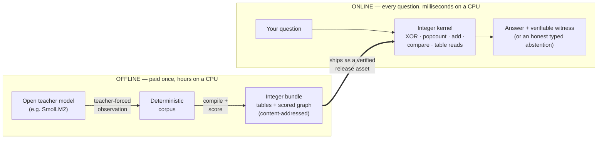
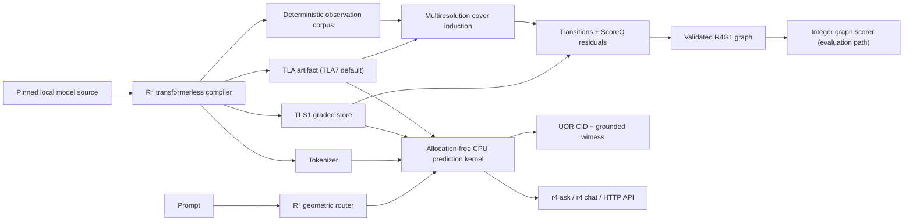
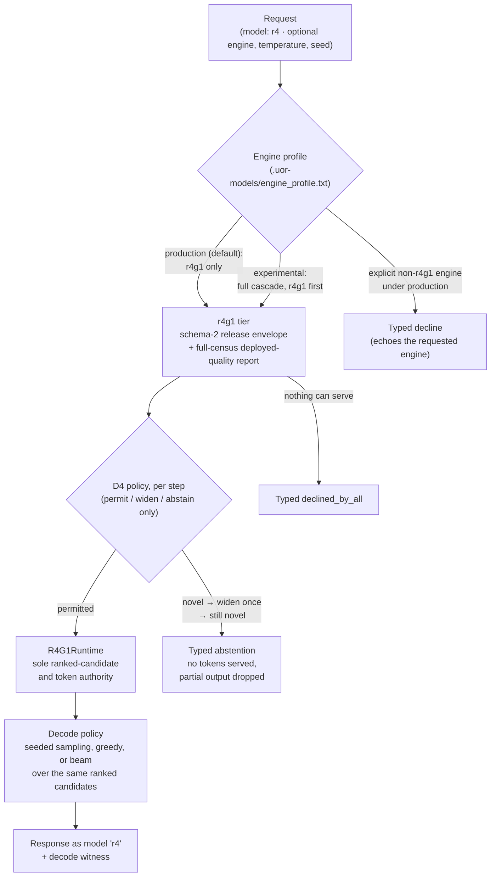
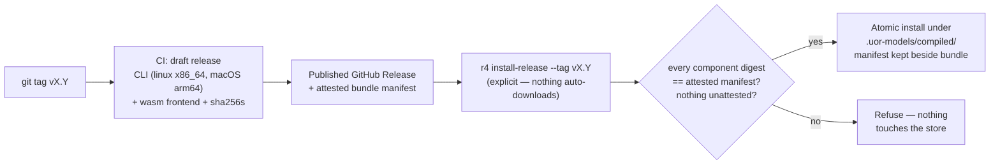

# R⁴ — Local Transformerless AI

[](https://github.com/UOR-Foundation/uor-r4/actions/workflows/ci.yml)
[](https://github.com/UOR-Foundation/uor-r4/releases/latest)
[](LICENSE)
[](rust-toolchain.toml)

## What is this?

Modern AI models answer questions by doing billions of floating-point
multiplications per word, which is why they want GPUs, datacenters, and a
power budget. **R⁴ asks whether the expensive math can be paid once, ahead
of time, instead of on every single question.**

It takes an ordinary open language model (the *teacher*), watches how it
behaves on a corpus, and **compiles** that behavior into integer lookup
structures — packed tables and a scored graph. Answering then needs only
bit operations, integer adds, compares, and table reads: **no
multiplication, no floating point, no GPU, no allocation in the hot path**,
on an ordinary CPU. Every answer carries a content-addressed witness — a
verifiable receipt of exactly which evidence produced it — and when the
engine doesn't have grounded evidence for a prompt, it says so with a typed
abstention instead of guessing confidently.

Everything runs locally. No Ollama, llama.cpp, OpenAI, or Anthropic at
runtime; nothing leaves the machine, and nothing downloads unless you
explicitly ask it to.

**Who this is for.** Researchers and engineers curious whether serving-time
AI can shed the GPU/energy footprint — and anyone who wants to watch a
measurement-driven research programme happen in the open. It is **not** a
ChatGPT replacement: output quality is research-grade and honestly
disclosed ([What actually works](#what-actually-works)). If you are
completely new, the [ELI5](docs/explainers/ELI5.md) and
[undergraduate](docs/explainers/UNDERGRADUATE.md) explainers are written
for you.

R⁴ is part of the [UOR Foundation](https://github.com/UOR-Foundation)'s
work, aligned with the
[Universal Object Reference Framework](https://github.com/UOR-Foundation/UOR-Framework),
[Prism](https://github.com/UOR-Foundation/prism) and
[uor-addr](https://github.com/UOR-Foundation/uor-addr).

## The idea in one picture


```mermaid
flowchart LR
    subgraph offline["OFFLINE — paid once, hours on a CPU"]
        direction LR
        Teacher["Open teacher model<br/>(e.g. SmolLM2)"] -->|"teacher-forced<br/>observation"| Corpus["Deterministic<br/>corpus"]
        Corpus -->|"compile +<br/>score"| Bundle["Integer bundle<br/>tables + scored graph<br/>(content-addressed)"]
    end
    subgraph online["ONLINE — every question, milliseconds on a CPU"]
        direction LR
        Q["Your question"] --> Kernel["Integer kernel<br/>XOR · popcount · add ·<br/>compare · table reads"]
        Kernel --> A["Answer + verifiable witness<br/>(or an honest typed abstention)"]
    end
    Bundle ==>|"ships as a verified<br/>release asset"| Kernel
```

The heavy math (the teacher's matrix multiplications) happens only in the
offline compile — and even there it runs through the project's own pinned
exact-arithmetic library, not platform BLAS. The deployed answer path is
enforced multiplication-free by a machine-checked source scan and an
operation census, not by convention.

> **Status: research project.** Historical
> [release v0.1](https://github.com/UOR-Foundation/uor-r4/releases/tag/v0.1)
> ships working binaries and a digest-verified, pre-schema-2 research bundle.
> Current `main` serves that historical bundle only through the explicit
> `--research` compatibility path. Production admission requires a schema-2
> envelope bound to a full deployed-quality census; a missing, sampled,
> mismatched, or off-serving result is not production evidence. #933 has now
> produced a distinct schema-2 canonical broad bundle whose evaluation required
> no live teacher forward and that passes those exact admission gates, including
> strict admission from an empty model store. That result is bound to its
> artifact, population, selector, and decode configuration; it does not upgrade
> v0.1 or establish live-teacher parity. The compiler, runtime, artifact format
> and measurement harnesses are exercised by CI. Generation quality is *not*
> competitive with the teacher
> models it compiles — answers are valid English with weak prompt-conditioning
> and research-grade factuality; see
> [What actually works](#what-actually-works) for honest numbers. This
> repository is run as a measured research programme;
> [docs/RESEARCH.md](docs/RESEARCH.md) records what has been established
> and what has been refuted.

---

## Contents

- [Quick start](#quick-start) · [Requirements](#requirements) · [What actually works](#what-actually-works)
- [Project layout](#project-layout) · [Architecture](#architecture) · [How a request is served](#how-a-request-is-served)
- [Releases and verified install](#releases-and-verified-install)
- [CLI reference](#cli-reference) · [HTTP API](#http-api) · [Configuration](#configuration)
- [Testing and quality gates](#testing-and-quality-gates) · [Troubleshooting](#troubleshooting)
- [Documentation map](#documentation-map) · [Contributing](#contributing) · [License](#license)

---

## Quick start

### 60 seconds — router and dashboard, no model required

```bash
git clone https://github.com/UOR-Foundation/uor-r4.git
cd uor-r4
cargo run --release          # starts the server on 127.0.0.1:8000
```

Open <http://127.0.0.1:8000>. The geometric router, the 96-vertex W(3,3)
phase-field canvas and the semantic map all work with no model, no download and
no compile. This is the fastest way to confirm the repository builds and runs on
your machine.

### 2 minutes — inspect the historical released model in research mode

Skip the multi-hour compile entirely: [release v0.1](https://github.com/UOR-Foundation/uor-r4/releases/tag/v0.1)
ships a compiled bundle as an attested asset.

```bash
cargo build --release
./target/release/r4 install-release --tag v0.1   # explicit, digest-verified fetch (~16 MB)
./target/release/r4 ask --research --model r4 "Tell me a fact about the ocean."
```

`install-release` verifies every component's blake3 digest against the
release's attested manifest before anything lands on disk, and refuses
archives containing anything unattested. `--research` is required because
v0.1 predates the schema-2 production envelope; the CLI prints that boundary
as a typed warning rather than silently promoting the bundle. The answer will
be valid English of research-grade quality — read the honest release notes and
[What actually works](#what-actually-works) before judging it as a
chatbot. Decode defaults to seeded sampling with a pinned seed, so the
same question reproduces the same answer; `--greedy` opts into the
deterministic beam.

### 5 minutes — run the measurement pipeline on the committed fixtures

The Gate C scoring harness runs end to end on fixtures checked into the
repository — no teacher, no checkpoint, no network:

```bash
cargo run --release --bin r4 -- transformerless score \
  --corpus-meta crates/uor-r4-core/tests/fixtures/c_meta.bin \
  --corpus-recs crates/uor-r4-core/tests/fixtures/c_recs.bin \
  --artifacts   crates/uor-r4-core/tests/fixtures/tless_artifacts.bin \
  --out /tmp/score-demo
```

It writes `/tmp/score-demo/score_report.json` (schema 26) and prints a per-phase
wall clock. This is the same command CI runs as its Gate C trend alarm, so a
clean run here means your build agrees with ours.

### Hours — compile your own model

Downloading, compiling, scoring, evaluating and importing a real teacher is a
multi-hour CPU pipeline with its own guide:
**[docs/MODEL_LIFECYCLE.md](docs/MODEL_LIFECYCLE.md)**.

The single-command orchestrator runs the whole chain and drops you into a chat
client at the end:

```bash
./uor-r4-cli          # menu: SmolLM2 135M / 360M / 1.7B, or audit
```

---

## Requirements

| | |
|---|---|
| **Rust** | Pinned to **1.97.1** by `rust-toolchain.toml`. rustup resolves it automatically. |
| **Python 3** | For `scripts/*.py` — two of them are CI gates. |
| **`hf`** (Hugging Face CLI) | Only for downloading teacher models. |
| **`curl` + `tar`** | Only for `r4 install-release` (fetching released bundle assets). Present by default on macOS and most Linux. |
| **`wasm-pack`** | Only to rebuild the browser WASM bundle. |
| **`cargo-nextest`** | Only to mirror CI's test runner locally. |
| **Nightly Rust** | Only for `cargo fuzz`. |
| **Disk / RAM** | Building the workspace needs a few GB. A 500k-record scoring run peaks near 1.4 GB RSS; corpus-scale compiles run for hours. |

> **Toolchain trap.** A non-rustup Rust earlier in `PATH` (Homebrew, system
> packages) silently ignores the pin. Verify `which cargo` resolves to
> `~/.cargo/bin/cargo`, or run gates as `rustup run stable cargo …`.

UOR standards (`uor-addr`, `UOR-Framework`) are **pinned git dependencies** — a
fresh clone builds with no extra checkouts. The `uor_standards/` directory is
legacy material excluded from the workspace build; its `.gitignore` entry
blocks new additions, though ~1,100 legacy files remain tracked in the tree
(recorded 2026-08-18, baseline audit).

---

## What actually works

Being precise here matters more than being impressive, because this repository's
whole method is measurement.

> **Current quality-baseline scope (#933/#934, 2026-08-25).** There is no
> universal absolute 30% floor. The rounded **29.7%** tolerance belongs only to
> historical pinned/legacy reports. On the exact 72,130-position canonical
> broad population, the CID-bound `R4G1Runtime` census records **21,293 / 72,130
> = 29.5203%**, versus same-position TLA **20,284 / 72,130 = 28.1214%**: paired
> **+13.988‰**, 95% CI **[11.057, 16.919]**. Against the same-generation
> sections-absent runtime it records **18,806 / 72,130 = 26.0723%**: paired
> **+34.479‰ [31.681, 37.277]**, clearing the frozen +20‰ RF-31 floor. #933
> therefore records **RATIFY** for that exact graph, report, population,
> selector, and greedy decode, with zero binding/surface/witness failures and
> strict empty-store admission. The historical **29.702%** #908 result remains
> separate `R4Engine` reference/off-serving evidence. The repository BDD run
> was **124 / 124**, but live-teacher parity fixtures were absent and those
> scenarios vacuously skipped, so it is not parity evidence. See the
> [#933 evidence record](docs/normative_r4g1_quality_933.md) and
> [#934 genealogy](docs/canonical_quality_baseline_934.md); #932's observable
> exact live-teacher BDD work remains a distinct downstream verification task.

**Solid, exercised by CI:**

- The **transformerless compiler and runtime**. A pinned Hugging Face model
  cross-compiles to a TLA artifact plus a graded store, and the prediction kernel
  uses only XOR/AND/OR/shift/rotate/popcount/integer add-sub/compare and table
  reads — no multiply, no divide, no float, enforced by a machine-checked source
  scan. The hot path is allocation-free in steady state, asserted by a test.
- **Determinism.** Identical pinned inputs produce identical artifact bytes, and
  a κ-reproduction gate (Gate E) checks that against a committed fixture.
- The **R4G1 packed graph format** with two-stage validation, a `no_std`
  allocation-free graph runtime, and a TLA/TLS1 → R4G1 migration converter.
- **A-mode infill serving** — filling gaps between supplied anchors — is
  validated and shipped (`r4 graph infill`). Anchors are inputs, so the mode is
  immune to the drift that killed the standalone variant.
- **UOR attestation**: content-addressed model objects and manifests, witnessed
  prediction, and a `POST /api/uor/verify` validation endpoint.
- The **geometric router**, browser dashboard and OpenAI-compatible server.
- **Honest serving semantics, by construction.** The default `production`
  profile admits only the audited r4g1 tier; a request nothing can serve gets
  a typed `declined_by_all`, never a silent fallback; out-of-distribution
  resolution triggers the D4 policy (serve / widen-once / abstain) on both
  the HTTP and CLI surfaces, and an abstention serves *no* tokens rather
  than a guess. Decode defaults to seeded sampling with a pinned seed —
  identical requests reproduce identical completions.
- **A shipped, verifiable release.** `v*` tags build both frontends and bind
  code SHA + inference-contract version; the model bundle ships as an
  attested asset, and `r4 install-release` refuses anything whose digests
  don't match the manifest ([docs/RELEASE_PIPELINE.md](docs/RELEASE_PIPELINE.md)).
- A **measurement apparatus**: 34 harnesses with pre-declared exit rules, null
  baselines and falsifiers, plus a Gate C trend alarm that fails CI on
  regression.

**Real limitations, stated plainly:**

- **Generation quality is the central open research question.** The offline
  per-position signal is real: on in-distribution corpus replay Gate C
  measures ~36% top-1 on the 500k fixture, and a broader teacher (P3, #509)
  lifts broad-text held-out top-1 to 10.2–29.0% causal — replicated,
  goal-aligned, entirely inside the integer kernel. End-to-end answers have
  improved in *kind* but remain research-grade: the #755 corpus-ordering fix
  turned word-salad into real English, and the 2026-08-19 decode-default
  change (seeded sampling replacing greedy) took the declared 15-prompt
  in-domain canary from **0/15 valid completions to 15/15** — but
  **prompt-conditioning is still weak**: distinct prompts converge onto
  similar completions (5/15 distinct, tracked as #784), factual content
  wanders, and the historical shipped/chat bundles still predate the #755
  recompile. The #933 canonical broad evidence bundle is #755-native, but its
  teacher-free per-position RATIFY is not an instruction-following or
  free-running coherence result.
  Semantically unanswerable prompts ("what did I eat for breakfast?") are
  served rather than abstained, because they do not present as
  signature-space novelty to the D4 policy — a measured substrate property
  (#811), same family as #784. See
  [Which track can actually produce coherent text](docs/RESEARCH.md#which-track-can-actually-produce-coherent-text--the-honest-current-answer)
  for the full picture. This is a research engine, not a chat model.
- **Instruction following is gated, not solved.** Production `r4 ask` accepts
  only a schema-2 bundle whose exact graph, corpus partitions, tokenizer,
  compiler configuration, controls, cross-surface replay, and full-census
  deployed-quality report reproduce one admission envelope. Historical
  release and locally compiled bundles require explicit `--research`, print a
  typed warning, and cannot be represented as production admission.
- **Standalone two-pass generation is refuted**, twice, and is not coming back.
- **The geometric router's retrieval was measured broken, and is now fixed and
  shipping.** #486 found `retrieve_geometric_resonance` compared a *routing*
  query vector against the stored *content* vector — a category error that put
  the cosine at chance. #490 (closed 2026-08-08) fixed the query to use the
  same content-vector construction as storage, landing 0.8542 MRR; #502
  (closed) then dropped the now-meaningful lexical term to reach the current
  deployed default of 0.8763 MRR / 0.99 recall. Both are the shipped default
  today — see [docs/RESEARCH.md](docs/RESEARCH.md#what-works-and-is-load-bearing)
  for the full record.

Every claim above traces to a merged measurement — see
[docs/RESEARCH.md](docs/RESEARCH.md).

---

## Project layout

```
crates/
  uor-r4-core            R⁴ math + transformerless compiler/runtime/tokenizer/certifier
  uor-r4-router          geometric router, dashboard backend (f64; outside the graph plan)
  uor-r4-graph-format    R4G1 packed artifact format, two-stage validation, no_std
  uor-r4-graph-compiler  offline graph-compiler stages (observation, cover induction, packing)
  uor-r4-graph-certify   offline certification and measurement (Gate C `score` harness)
  uor-r4-graph-runtime   no_std, allocation-free R4G1 runtime (engine, routing, patch chains)
  uor-r4-graph-cli       `r4 transformerless …` stage dispatch
  uor-r4-model-source    teacher forward-pass port + pinned Safetensors adapter
  uor-r4-proof-model     executable proof obligations + proof-status matrix
  uor-r4-api             typed compile + engine library facade for downstream consumers
  uor-r4-naf             UOR-NAF v1 interchange slice + GNAF claim/status vocabulary (#623)
  repo-model             typed registries parsed from `model/*.toml`; generates CONFORMANCE.md (R1)
  repo-conformance       BDD runner + honesty meta-gate cross-checking scenarios/IDs/tests (R2/R3)
xtask/                   repository gates (`cargo xtask <task>`); enforces the rules in AGENTS.md
src/                     root package: the `r4` binary, HTTP server, chat, WASM facade
docs/                    research records, design docs, explainers, formal material
features/                Cucumber BDD suites (teacher parity, FMM)
scripts/                 CI gates and corpus tooling
research/                exploratory notes (290-fmm, 395-e8)
models/                  pinned model descriptors
proofs/wasm-gemm-gnaf/   vendored WASM-GEMM-GNAF (#653/#742) — Lean4 proof that a WASM GEMM
                         kernel is cost-optimal; formal reference material, NOT in the deployed
                         dependency graph and NOT an LLM engine (see docs/gnaf_import_provenance.md)
tests/                   root-package integration tests and BDD steps
index.html, index.css    browser dashboard
r4_worker.js             dashboard WASM worker
uor-r4-cli, r4-app.sh    single-command orchestrator
```

---

## Architecture


```mermaid
flowchart LR
    Source["Pinned local model source"] --> Compiler["R⁴ transformerless compiler"]
    Compiler --> Corpus["Deterministic observation corpus"]
    Compiler --> Artifact["TLA artifact (TLA7 default)"]
    Compiler --> Store["TLS1 graded store"]
    Compiler --> Tokenizer["Tokenizer"]
    Corpus --> Cover["Multiresolution cover induction"]
    Artifact --> Cover
    Cover --> Score["Transitions + ScoreQ residuals"]
    Store --> Score
    Score --> Graph["Validated R4G1 graph"]
    Graph --> GraphRuntime["Integer graph scorer (evaluation path)"]
    Artifact --> Runtime["Allocation-free CPU prediction kernel"]
    Store --> Runtime
    Tokenizer --> Runtime
    Prompt["Prompt"] --> Router["R⁴ geometric router"]
    Router --> Runtime
    Runtime --> Witness["UOR CID + grounded witness"]
    Runtime --> Apps["r4 ask / r4 chat / HTTP API"]
```

**Serving order.** Within the R4G1 scorer, prediction consults packed NGRAM
context rows (trigram with bigram backoff), then the graph chain with D4
exact-context precedence, then the root prior. Across engines, the HTTP server
runs the #248 tier cascade (`r4g1 → transformerless → teacher-oracle →
geometric`), filtered by the persisted **engine profile** (#655-E2): under the
default `production` profile only the `r4g1` tier is admitted, and a request no
admitted tier can serve returns a typed `declined_by_all` response rather than
a silent fallback. (`uor-r4-router::fallback::FallbackRouter` is a legacy type
with no serving callers — corrected 2026-08-18, baseline audit.)

**Artifact format eras.** Deployed compiles emit **TLA7** by default (per-stage
i8 centroid copies, a norm-fold constant, per-stage decode shifts). TLA6 (packed
shift-add dot tables) is the fallback, and TLA3/TLA4/TLA5 remain readable through
the era-generic parser. `R4_TLESS_TLA7=0` and `R4_TLESS_TLA6=0` opt a compile
back out. The committed fixture is TLA7.

**Context window.** `WINDOW = 8` dyadic-recency, with zero-allocation stack/slice
sliding truncation. Token stores are strict 32-bit (`parse_store_strict_u32`);
legacy u16 stores are readable but want a recompile.

---

## How a request is served

Serving is built so that every outcome is a *typed, honest* one — served
text with a witness, a typed decline, or a typed abstention. Nothing falls
back silently and nothing is guessed:


```mermaid
flowchart TD
    Req["Request<br/>(model: r4 · optional engine, temperature, seed)"] --> Profile{"Engine profile<br/>(.uor-models/engine_profile.txt)"}
    Profile -->|"production (default):<br/>r4g1 only"| Tier["r4g1 tier<br/>schema-2 release envelope<br/>+ full-census deployed-quality report"]
    Profile -->|"explicit non-r4g1 engine<br/>under production"| Decline["Typed decline<br/>(echoes the requested engine)"]
    Profile -->|"experimental:<br/>full cascade, r4g1 first"| Tier
    Tier --> D4{"D4 policy, per step<br/>(permit / widen / abstain only)"}
    D4 -->|"permitted"| Select["R4G1Runtime<br/>sole ranked-candidate<br/>and token authority"]
    Select --> Decode["Decode policy<br/>seeded sampling, greedy, or beam<br/>over the same ranked candidates"]
    D4 -->|"novel → widen once<br/>→ still novel"| Abstain["Typed abstention<br/>no tokens served,<br/>partial output dropped"]
    Decode --> Resp["Response as model 'r4'<br/>+ decode witness"]
    Tier -->|"nothing can serve"| DBA["Typed declined_by_all"]
```

The same D4 policy and `R4G1Runtime` candidate adapter run on the HTTP server,
CLI `ask`/`chat`, public library, and WASM paths. D4 can decline a candidate;
it cannot replace the runtime's token with a reference-scorer token. Greedy,
pinned-seed sampled, and beam decoding are policies over the same bounded
ranked-candidate list. The `uor-r4` request alias from before the identity flip
is still accepted for a deprecation window; responses always report `r4`.

---

## Releases and verified install

A version tag `vX.Y` binds three identities in one place: the **code** (the
tag's commit SHA), the **contract** (the inference-contract version), and
the **model bundle** (blake3 digests of every component, declared in the
attested `release-bundle.json`). CI builds and attaches both frontends;
the bundle is packaged and attached by the maintainer; nothing publishes
without an explicit tag cut. Full convention:
[docs/RELEASE_PIPELINE.md](docs/RELEASE_PIPELINE.md).


```mermaid
flowchart LR
    Tag["git tag vX.Y"] --> CI["CI: draft release<br/>CLI (linux x86_64, macOS arm64)<br/>+ wasm frontend + sha256s"]
    CI --> Rel["Published GitHub Release<br/>+ attested bundle manifest"]
    Rel --> Fetch["r4 install-release --tag vX.Y<br/>(explicit — nothing auto-downloads)"]
    Fetch --> Verify{"every component digest<br/>== attested manifest?<br/>nothing unattested?"}
    Verify -->|yes| Install["Atomic install under<br/>.uor-models/compiled/<br/>manifest kept beside bundle"]
    Verify -->|no| Refuse["Refuse — nothing<br/>touches the store"]
```

The install never overwrites an existing bundle, refuses archives carrying
unattested files or symlinks, and leaves the manifest beside the bundle so
serving-time verification sees the same attestation.

---

## CLI reference

Everything below supports `--help`. Global flags (`--host`, `--port`,
`--tless-artifacts`, `--tless-store`, `--tless-tokenizer`, `--r4g1-artifact`,
`--manifold-cache`, `-v`) are accepted before or after any subcommand. `r4` with
no subcommand is `r4 serve`.

**Serving and interaction**

```bash
r4 serve                                    # HTTP server + dashboard
r4 ask [--model NAME|CID] [--research] [--greedy | --sample SEED] <question...>
r4 chat [--model NAME|CID] [--remote URL | --research] [--greedy | --sample SEED]
r4 client [--remote http://127.0.0.1:8000/v1]   # --model defaults to r4
r4 audit [--log-file .uor-models/audit_log.json]
```

`ask`/`chat` decode with seeded sampling by default (pinned seed —
reproducible); `--sample SEED` overrides the seed, `--greedy` opts into the
deterministic beam. A typed D4 abstention prints as an explicit
`[abstained: …]` line, never as empty output.

**Model lifecycle** — full guide in [docs/MODEL_LIFECYCLE.md](docs/MODEL_LIFECYCLE.md)

```bash
r4 install-release --tag vX.Y [--repo OWNER/REPO] [--name NAME]   # verified fetch of a released bundle
r4 package-release-bundle --compiled DIR --model-id r4 --capability instruction-chat \
                          --source DIR --tokenizer-family FAMILY --tokenizer-version N \
                          --compiler-revision <40-char SHA>
r4 download --repository OWNER/REPO --revision <40-char SHA> --name NAME
r4 compile --source DIR [--tokenizer-family FAMILY --tokenizer-version N] \
           [--output DIR] [--seconds N] [--target N] [--sequence-length N]
r4 compile --corpus-meta META --corpus-recs RECS --vocab-size N     # teacher-free
r4 evaluate-report [--source DIR] [--tokenizer-family FAMILY --tokenizer-version N] \
                   [--compiled DIR] [--report PATH]
r4 import --name N --source-model M --capability continuation|instruction-chat \
          --artifacts F --store F --tokenizer F [--evaluation-report F]
```

Source compiles write `attention_operator.json` and, for GPT-2, the optional
`dense_operator.json` beside `corpus.meta` and `corpus.records`. These
registry-validated records bind the host-side arithmetic that produced the
rows; resume fails closed on a missing, malformed, different, or impossible
attention+dense pair. `compile-recorded`, cover, evaluation, certification,
the typed API, and the server propagate and revalidate that pair. Genuine
historical dense absence remains readable (and Llama declares no dense
record); it is never synthesized or relabelled.

The current standard, experimental, and GPT-2 learned-absolute attention
records are version 2. GPT-2 pairs `learned-absolute-source-attention/2` with
`gpt2-source-dense/2`; the immutable v1/v1 pair remains accepted history.
Current attention and dense folds use certified-native arithmetic only when a
mechanical rounding-cell witness proves the pinned `uor-matmul` result, with
that owner as fallback. This is offline source-teacher execution provenance,
not a deployed matrix operation.

The managed server resolves three physical roots for one logical model, in
preference order: `<name>-attention-v2-dense-v2`, `<name>-attention-v2`, then
`<name>`. A current GPT-2 dense/2 bundle is valid only in the composite root;
an attention-v2/no-dense bundle may occupy a fresh base or the attention-only
root, and a historical v1/v1 bundle may remain at the base. Resolver-owned
suffixes are reserved and stripped by longest match. Malformed preferred
evidence is terminal, never a reason to fall back. Compile, restart discovery,
reload, listing, `/uor/v1/status`, and `/api/r4g1/status` use the same resolver
and expose the selected `physical_root` plus optional attention/dense records.
Current-v2 serving requires exact agreement among root sidecars, canonical
corpus/observation provenance, and `graph-cover/cover_report.json`; legacy
absence remains compatible only where explicitly documented.

**Graph pipeline**

```bash
r4 transformerless observe \
  [--source DIR [--tokenizer-family FAMILY --tokenizer-version N] | --checkpoint BIN] \
  [--out obs] [--shards 4]
r4 transformerless observe-text \
  [--input PATH] \
  [--source DIR [--tokenizer-family FAMILY --tokenizer-version N] | --checkpoint BIN --tokenizer PATH] \
  [--out obs-text]
r4 transformerless cover        [--corpus-meta M] [--corpus-recs R] [--artifacts A] [--tokenizer PATH] [--out cover] [--bundle-root ROOT]
r4 transformerless cover-sweep  [...]
r4 transformerless score        [--corpus-meta M] [--corpus-recs R] [--artifacts A] [--tokenizer PATH] [--out DIR] [--bundle-root ROOT] [--quality-profile pinned|relative_tla] [--quality-controls on|off]
r4 transformerless convert-r4g1 --artifacts TLA --store TLS1 --out R4G1
r4 transformerless copy-recorded-attention --corpus-meta M --corpus-recs R --out attention_operator.json
r4 transformerless subsample-recorded-corpus --src-meta M --src-recs R --out-meta M2 --out-recs R2 --records N
r4 transformerless compile-recorded --corpus-meta M --corpus-recs R --vocab-size N --out DIR
r4 graph infill --artifact score.r4g1 --skeleton 12,_,_,_,99,_,_,_,7
```

`subsample-recorded-corpus` is the provenance-preserving derivation path for
scaling controls: it retains complete deterministic story runs from the
finalized source's fixed train/held partitions and publishes records, hidden
rows, execution sidecars, and their binding as one transaction. The historical
`copy-recorded-attention` command is limited to legacy attention-only corpora;
it refuses a source with dense execution provenance instead of silently
dropping or relabelling the dense sidecar.

`--bundle-root ROOT` explicitly joins cover/score output publication to that
managed bundle's producer transaction. Without it, `--out` is an exact
standalone output root, including a direct child of the corpus root or paths
whose basename is `graph` or `graph-cover`. Physically present completion,
owner, or Stage-A-seal evidence is refused at transaction start; later parent
state never changes an already selected standalone transaction into bundle
participation.

`--quality-controls on` additionally emits `score_sections_absent.r4g1` and
`score_label_shuffled.r4g1` beside `score.r4g1`. They are required falsifiers
for the normative deployed-quality profile: the first removes SKMX/PSIB, and
the second fits those sections from deterministically shuffled construction
labels while evaluation remains on the pristine held-out partition. Neither
control is a second production scorer.

**Certification and comparison** (need the llama2.c checkpoint — see
[Troubleshooting](#troubleshooting))

```bash
r4 certify          # full certificate + zero-multiply op census + serving row
r4 compare          # against the reference implementation
r4 compare-report   # prints the recorded certificate; needs no artifacts
r4 setup            # prints the prerequisite commands
```

> `r4 transformerless compare` and `compare-report` appear in the subcommand
> help but are not implemented there. The working spellings are the root
> `r4 compare` and `r4 compare-report`. As of `aea30bae`, any unknown
> `transformerless` subcommand (these two included) prints the usage banner
> and exits **0** — a silent no-op, recorded by the 2026-08-18 baseline audit.

---

## HTTP API

`r4 serve` exposes an OpenAI-compatible surface and a dashboard surface. JSON
responses carry permissive CORS.

**OpenAI-compatible (`/v1`)** — this is what `r4 client` and `r4 chat --remote`
speak; `/v1` is kept a pure OpenAI surface (see `profiles/openai/`):

The canonical served model id is **`r4`** (#655-F): requests may omit
`model`, send `r4`, or send the deprecated pre-flip alias `uor-r4`
(accepted for a compatibility window); responses, `/v1/models`, and wire
ids (`chatcmpl-r4-…`, `system_fingerprint: r4-…`) always report `r4`.
Per-bundle physical names remain visible as metadata on `/uor/v1/status`.
Decode is seeded sampling by default: `temperature: 0` opts a request into
the deterministic greedy decode, and an optional integer `seed` overrides
the pinned default so identical requests stay reproducible either way.

| Endpoint | Purpose |
|---|---|
| `POST /v1/chat/completions` | Chat completion (non-streaming and SSE streaming) |
| `POST /v1/responses` | Responses API |
| `GET /v1/models` | List available models |
| `GET /v1/models/{model}` | Retrieve one model |

**R4 extended API (`/uor/v1`)** — capabilities beyond the OpenAI surface, under a
vendor namespace so they never collide with the OpenAI standard on `/v1`:

| Endpoint | Purpose |
|---|---|
| `GET /uor/v1/status` | Engine and artifact status (4-stage lifecycle) |
| `POST /uor/v1/reload` | Reload the R4G1 graph and teacher for a model |
| `POST /uor/v1/corpus` | Manage the extra-reading corpus (add / export / list) |

The bare `/v1/status`, `/v1/reload`, and `/v1/corpus` paths remain as
**deprecated aliases** — they still work but respond with an RFC 8594
`Deprecation` header and a `Link` to the `/uor/v1` successor. Prefer `/uor/v1`.

**Dashboard:**

| Endpoint | Purpose |
|---|---|
| `POST /api/chat` | Route and synthesize; `engine` selects the mechanism (below) |
| `POST /api/tless/predict` · `/index` · `/generate` | Transformerless runtime |
| `POST /api/r4g1/predict` · `/generate` · `/compile`, `GET /api/r4g1/status` | R4G1 graph runtime and background compile |
| `POST /api/corpus` · `/api/reset` · `/api/import`, `GET\|POST /api/export` | Corpus and state management |
| `POST /api/uor/verify` | Validate a UOR attestation envelope |
| `GET /api/huggingface/status`, `POST /api/huggingface/download` | Background teacher download |
| `GET /api/tags` | Ollama-style tag list |
| `GET /api/sysinfo` · `GET /api/map` | Host info; semantic map points |

`POST /api/r4g1/compile` and `POST /uor/v1/reload` accept the optional JSON
pair `tokenizer_family` / `tokenizer_version`. Supply both or neither. When the
pair is omitted, automatic source-tokenizer selection succeeds only for a
source with exactly one supported definition; an ambiguous source fails closed.

Anything else is served as a static file from the working directory; `/` serves
`index.html`.

**`engine` values for `POST /api/chat`**

| Value | Mechanism |
|---|---|
| `transformerless` | Allocation-free table-native codebook retrieval, sub-millisecond on CPU |
| `r4g1` | The validated R4G1 graph scorer; needs a loaded `score.r4g1` |
| `attention` | Llama uses current standard scaled-dot-product teacher attention (`standard-source-attention/2`, up to 256 tokens); GPT-2 uses `learned-absolute-source-attention/2` |
| `r4-attention` | Llama uses the current experimental variant (`experimental-r4-source-attention/2`): a certified-exact dot over the leading 4-wide domain with the same softmax selector as `attention`; GPT-2 still uses `learned-absolute-source-attention/2` because the legacy switch does not alter its operator. The Llama variant has never been measured against standard attention — see `docs/deferral_record_2026_08_05.md` |
| `geometric` | Route purely geometrically and decode from manifold resonance |

Which values are *reachable* depends on the persisted engine profile
(`.uor-models/engine_profile.txt`, #655-E2). Under the default **`production`**
profile only `r4g1` is served: omitting `engine` runs r4g1 alone, an explicit
non-r4g1 value above returns a typed `declined_by_all` response, and a
persisted non-r4g1 preference is silently inert. Under **`experimental`**,
omitting `engine` runs the **full cascade, r4g1-first** — it does *not* mean
`transformerless` — and `.uor-models/last_engine.txt` pins the cascade for
requests that omit it. The per-tier `POST /api/tless/*` and `POST /api/r4g1/*`
endpoints bypass the cascade and its profile filter. The dashboard's engine
selector sets `engine`, and the dashboard also shows a tokens/sec **Speed**
metric that persists after generation, for profiling across the attention and
transformerless paths.

Example:

```json
{
  "text": "dry season aquifer depth in the Gambia",
  "identity": "tenant-alpha",
  "engine": "transformerless"
}
```

---

## Configuration

Environment knobs, grouped by purpose. The full inventory with defaults and
owning modules is in [docs/CONFIGURATION.md](docs/CONFIGURATION.md).

**Paths and inputs** — `TLESS_CHECKPOINT`, `TLESS_ARTIFACTS`, `TLESS_STORE`,
`TLESS_TOKENIZER`, `TLESS_MODEL`, `R4G1_ARTIFACT`, `R4_CORPUS_META`,
`R4_CORPUS_RECS`, `R4_ARTIFACTS`, `R4_CODES_PATH`, `UOR_MODEL_STORE`,
`UOR_R4_HOST`, `UOR_R4_PORT`.

**Determinism and teacher math** — `TLESS_CANONICAL_DETERMINISTIC` (required for
the cross-platform Gate E claim), `TLESS_EXACT_SCALAR` (deprecated no-op kept
for script compatibility), `R4_TLESS_TLA6`,
`R4_TLESS_TLA7`, `TLESS_REPIN_WRITE` (maintainer-only).

**Measurement** — `R4_GATE_C_SAMPLE` (deterministic stride subsample; the sample
size and standard error travel with every rate, so a sampled number cannot be
read as a census), `R4_GATE_C_SKIP_ARMS=right_context` (skips the whole-corpus
right-context code pass — about 60% of a sampled run's wall clock), plus
per-harness caps.

**Capacity overrides** — the `R4_COVER_*` and `R4_*_SAMPLE` family share one
contract: **unset is κ-neutral; set-but-invalid or zero panics.** A knob that
silently did nothing would be indistinguishable from a knob that does not work.

---

## Testing and quality gates

Local gates, all clean before every commit:

```bash
cargo test --workspace --offline
cargo clippy --workspace --all-targets --all-features --offline -- -D warnings
cargo fmt --check
cargo check -p uor-r4-graph-format --no-default-features
cargo check -p uor-r4-graph-format --no-default-features --features alloc
```

Any change under `uor-r4-core` or `uor-r4-router` additionally needs the wasm
target, because clippy does not build it and the merge queue does:

```bash
cargo check --target wasm32-unknown-unknown -p uor-r4-wasm-router --lib
```

Other suites: `cargo test --test bdd` (or `just bdd`) runs the Cucumber
teacher-parity suite — it **vacuously skips** without a compiled bundle, so check
the fixture before trusting green. `cargo test --doc --workspace` runs doc tests.
`cargo +nightly fuzz run parse_arbitrary` fuzzes the format parser.

**CI** reports five required checks. On `pull_request` they are fast — claim
wording, fmt, clippy, `cargo audit`. On `merge_group` the full ladder runs
against the speculative merge: tests, no_std, deterministic rebuild,
κ-reproduction, Gate C trend, wasm, fuzz smoke. A **docs-only fast path**
short-circuits Markdown-only PRs. Any new required check name must be reported in
*both* contexts, or PRs hang forever waiting on a check that never runs.
Separate workflows cover Kani formal verification and GitHub Pages deployment.

**Measurement harnesses** are `#[ignore]`d and run explicitly. The cheap gate
that must precede any long run:

```bash
cargo test -p uor-r4-graph-certify --test capacity_scaling -- --ignored   # ~12 min
```

It prints a saturation verdict per structure. If it reports SATURATED on the
structure your experiment intends to move, the long run does not launch. The full
harness inventory is in [docs/RESEARCH.md](docs/RESEARCH.md).

---

## Troubleshooting

| Symptom | Cause and fix |
|---|---|
| κ tests pass suspiciously fast | `/tmp/ref/out/model.bin` is missing, so they **skip silently and report vacuous green**. `/tmp` cleanup deletes it. Re-fetch (below) and confirm the file exists before trusting a pass. |
| fmt/clippy disagree with CI | A non-rustup Rust earlier in `PATH` ignores the toolchain pin. Check `which cargo`. |
| clippy passes locally, fails in CI | You omitted `--all-features`. Use the exact invocation above. |
| `r4 ask` refuses to run | Production mode requires a schema-2 envelope bound to the exact full deployed-quality census. Historical release or locally compiled bundles are research-only; inspect them with explicit `r4 ask --research ...`. Do not treat that warning-bearing path as production evidence. |
| `install-release` refuses | That's it working: a digest mismatch, an unattested archive entry, or an existing install at the target name all refuse with nothing written. The error names the exact cause. |
| Port 8000 already in use | Use `--port` / `UOR_R4_PORT`, or `PORT=9000 ./uor-r4-cli`. |
| Compiled bundle behaves oddly after an upgrade | The on-disk store in `.uor-models/` may predate the u32 token migration. A full recompile refreshes it. |
| `--revision` rejected | It must be a full 40-character commit hash; the server refuses unpinned revisions. |
| Measurement harness prints `SKIP` | Its corpus fixtures or `R4_*` inputs are absent. Check the harness header for what it needs. |

Fetch the reference checkpoint:

```bash
curl -sL -o /tmp/run.com \
  https://github.com/trholding/llama2.c/releases/download/experimental/run.com
cd /tmp && unzip -o run.com out/model.bin tokenizer.bin -d ref
```

---

## Documentation map

**Start here**

- [docs/explainers/ELI5.md](docs/explainers/ELI5.md) · [docs/explainers/UNDERGRADUATE.md](docs/explainers/UNDERGRADUATE.md) — if you're new, start with these.
- [docs/RESEARCH.md](docs/RESEARCH.md) — what is measured, what is closed, what is open, and
  [which track can actually produce coherent text](docs/RESEARCH.md#which-track-can-actually-produce-coherent-text--the-honest-current-answer).
- [docs/MODEL_LIFECYCLE.md](docs/MODEL_LIFECYCLE.md) — install a released bundle, or download → compile → cover → score → evaluate → import → serve.
- [docs/RELEASE_PIPELINE.md](docs/RELEASE_PIPELINE.md) — the vX.Y convention, cutting a release, and the verified install.
- [AGENTS.md](AGENTS.md) — contributor manual: gates, normative invariants, κ re-pin, long-run discipline.
- [CONTRIBUTING.md](CONTRIBUTING.md) — how to open a PR here.
- [docs/CONFIGURATION.md](docs/CONFIGURATION.md) — every environment knob, and the served-identity contract.

**Explainers** — [ELI5](docs/explainers/ELI5.md) ·
[Undergraduate](docs/explainers/UNDERGRADUATE.md) ·
[Glossary](docs/transformerless/GLOSSARY.md)

**Design and contract** — [Transformerless design](docs/transformerless/TRANSFORMERLESS.md) ·
[Proof and certificate](docs/transformerless/PROOF.md) ·
[R4G1 wire format](docs/transformerless/R4G1.md) ·
[Baseline](docs/transformerless/BASELINE.md) ·
[Threat model](docs/transformerless/THREAT_MODEL.md) ·
[Local-only runtime contract](docs/transformerless/LOCAL_ONLY.md) ·
[Inference contract](docs/inference_contract.md) ·
[Scoring semantics](docs/scoring_semantics.md) ·
[Formal vocabulary](docs/formal_vocabulary.md) (normative for claim wording) ·
[Reproducibility](docs/reproducibility.md) ·
[Performance comparison](docs/transformerless/COMPARISON.md) ·
[GNAF import provenance](docs/gnaf_import_provenance.md) (vendored formal-verification
reference material, not an LLM engine — #653) ·
[Matrix-operation census](docs/matrix_operation_census.md) ·
[Serving-time model discovery](docs/SERVING_MODEL_DISCOVERY.md)

**Plan** — [R4 Intelligence Completion Plan](docs/r4_intelligence_completion_plan.md)
(authoritative for post-v0.1 intelligence sequencing; the readable mirror of programme
root #820) · [R⁴ graph compiler implementation plan](docs/r4_graph_compiler_implementation_plan.md)
(the original engineering plan, retained) · [ROADMAP.md](ROADMAP.md) ·
[Minimal client](docs/minimal_client.md)

---

## Contributing

Read [AGENTS.md](AGENTS.md) first — it is the operating manual, not a formality.
[CONTRIBUTING.md](CONTRIBUTING.md) has the short version:

1. **Assign yourself the issue**, work on `issue-<n>-<slug>`, open a PR, merge
   through the queue, close the issue with the evidence.
2. **Every substantive claim arrives with a pre-declared exit rule, a null
   baseline and a falsifier.** Negative results are recorded and kept — several
   of the most valuable entries in [docs/RESEARCH.md](docs/RESEARCH.md) are
   refutations that redirected the programme.
3. **Do not weaken the normative invariants**: no multiply/divide/float in the
   deployed kernel, allocation-free hot path, deterministic artifacts, no
   `unwrap`/`expect` on recoverable paths, no `unsafe` in the portable runtime or
   the format crate.
4. **Claim language is machine-checked.** `python3 scripts/check_claim_wording.py`
   blocks exact-equivalence wording that has no linked proof artifact.
5. **Before any run measured in hours**, compute the reachability ceiling, run
   the cheap instrument first and treat its verdict as binding, and pre-declare
   what each outcome causes. Paste the run contract into the issue.

Security-relevant design is documented in
[docs/transformerless/THREAT_MODEL.md](docs/transformerless/THREAT_MODEL.md).

## License

MIT — see [LICENSE](LICENSE). © 2026 UOR Foundation.
