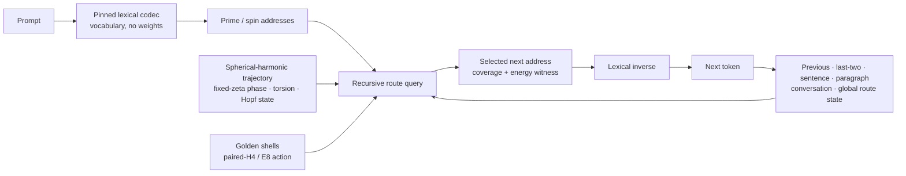

# R⁴ — Route-Native Geometric Intelligence Research

[](https://github.com/UOR-Foundation/uor-r4/releases/latest)
[](LICENSE)
[](rust-toolchain.toml)

R⁴ is a research project pursuing a transformerless local AI agent with
frontier-model-like capability on ordinary machines. The proposed route is not
a smaller transformer: it is a causal language engine in which geometric
location, transport, and lookup replace transformer attention, dense matrix
multiplication, mixture-of-experts gates, and sparse learned routing in the
serving path.

> **This goal is aspirational and unproven.** R⁴ does not currently provide
> real source-free geometric chat, qualified geometric attention, correct
> inference, or reasoning. The repository contains a measured storage/recall
> foundation and several preserved research systems. It is not a frontier
> model or a ChatGPT replacement today.

The authoritative architecture, sequence, and claim boundaries live in the
[Geometric Intelligence Programme](docs/geometric_intelligence_programme.md).
The evidence ledger is [docs/RESEARCH.md](docs/RESEARCH.md).

## The research goal

The project asks a concrete question:

> Can a local language agent understand context, select the next route, produce
> coherent text, answer correctly, and reason by navigating a canonical
> geometric state—without executing a transformer or learned matrix router at
> serving time?

The target system is:

- local and CPU-first;
- source-free at serving time: no Ollama, hosted model, or source-model weights;
- route-native: geometry participates before every next-token choice;
- recursively contextual across the current route, proposed candidate,
  previous route, last two routes, sentence, paragraph, conversation, and
  global accumulated state;
- content-addressed and reconstructable through canonical manifests and kappa;
- bounded, observable, and optimized only after the intended behavior works;
  and
- free of transformer/self-attention, dense matrix intelligence kernels, MoE,
  and sparse learned routers in the final serving path.

Pinned source models may be used offline as teachers, labelers, or comparators.
Their tensors and forward passes are not the product architecture and may not
be substituted for a source-free answer.

## The core hypothesis: the data is the location

R⁴ treats geometry as both the route and the address of the data. A lexical
payload is assigned a factorable location. An ordered path through locations
carries causal context. Local spin, phase, torsion, and radial state change as
the route advances. A bounded least-cost lookup ranks the next admitted route,
whose payload is decoded back through the lexical codec.


```mermaid
flowchart LR
    P["Prompt"] --> L["Pinned lexical codec<br/>vocabulary, no weights"]
    L --> A["Prime / spin addresses"]
    A --> Q["Recursive route query"]
    H["Previous · last-two · sentence · paragraph<br/>conversation · global route state"] --> Q
    S["Spherical-harmonic trajectory<br/>fixed-zeta phase · torsion · Hopf state"] --> Q
    E["Golden shells<br/>paired-H4 / E8 action"] --> Q
    Q --> N["Selected next address<br/>coverage + energy witness"]
    N --> D["Lexical inverse"]
    D --> O["Next token"]
    O --> H
```

The lexical codec supplies stable text boundaries and reversible bytes. It does
not supply intelligence. Kappa supplies canonical identity and serialization
integrity. It is not a tokenizer, embedding, semantic metric, or next-token
policy.

## Working mathematical model

These are implementation hypotheses and declared project bridges, not claims
that the resulting intelligence has already been demonstrated.

### Spherical harmonics, zeta grid, and torsion

Spherical harmonics are the working model for storing and transporting like
spin states. The ordered non-trivial zeta-zero ordinates form a fixed spectral
grid; the grid is an architectural assumption, not a claim to prove the
Riemann hypothesis. Data identity stays fixed while local phase, torsion, spin,
radial shell, and accumulated route state change.

For a prime `p` and fixed ordinate `gamma_j`, a phase channel may be bound as

```text
theta_j(p) = wrap(gamma_j * log(p)).
```

For a transition `p -> q`, the route updates the local delta instead of
recomputing the full history:

```text
delta_theta_j = wrap(gamma_j * log(q / p)).
```

The manifest retains the transported trajectory, session hypersphere vector,
winding/window state, window projection energy, shared-factor retrieval state,
cosine-resonance or its witnessed table form, and accumulated Hopf phase.
These overlapping summaries keep unseen long histories distinct when an exact
route kappa misses.

### Primes, semiprime experts, and ordered n-lets

- A prime is a registered lexical or semantic atom.
- A transition is a semiprime expert `p_(t-1) * p_t`.
- `p^2` is a valid semiprime self-loop when a route repeats.
- Ordered prime n-lets retain direction, repetition, and longer Hamiltonian
  context while the commutative factor product supports inexpensive divisor
  overlap and candidate admission.

Optional distinct-edge charts, such as the 15 square-free `J(6,2)` pairs for
six primes, remain operator fixtures. They do not erase general `p^2` route
self-loops.

### Typed Euler bridge and trigonometric continuation

The project uses

```text
e^(i*pi) + pi^0 =_bridge 0^0
```

as a typed bridge between continuous-null and discrete empty-product behavior:

```text
ContinuousNull(0^0)        = 0
DiscreteEmptyProduct(0^0) = 1.
```

It is not an untyped claim that zero equals one. The bridge mode is part of the
canonical state. Together with `e^(i*pi) = -1` and `pi^0 = +1`, it preserves
the `-1 / 0 / +1` phase landmarks.

The trigonometric collapse is

```text
activation(theta) = sin(theta)^2
(sin = +/-1, cos = 0) -> 1
(sin = 0,    cos = +1) -> 0
theta = atan2(sin(theta), cos(theta)).
```

Chirality and cosine polarity remain explicit because squaring loses
direction. At a tangent pole or typed-null boundary, the route changes to the
complementary chart and carries a declared quarter-turn phase/torsion shift. It
does not divide by zero, invent an angle, or terminate the route.

### R4/S3 compute, Hopf S2/R3 observation, and golden shells

The local non-zero compute state is modeled on `S3` in R4. The Hopf map supplies
an `S2` observation embedded in R3, while the S1 fiber phase remains transport
state. Projection is not deletion: the manifest must retain enough fiber,
route, and radial information to reconstruct what it claims to preserve.

Radial movement uses exact golden shells in `Z[phi]`:

```text
phi = (1 + sqrt(5)) / 2
(a,b) means a + b*phi
(a,b) * phi     -> (b, a+b)
(a,b) * phi^-1  -> (b-a, a).
```

The integer pair update carries the Fibonacci recurrence while leaving route
direction explicit.

### The paired-H4 bridge

The project's conceptual shorthand is:

```text
E8 = H4 x H4.
```

The concrete code and serialization contract realizes that identity through
the golden/Galois-coupled icosian construction `H4 ⊕ phi H4`: an E8 lattice
point is represented as a golden-coupled pair of R4 points with a fixed basis,
glue convention, forward map, and inverse/reconstruction witness. This paired
construction is load-bearing in the proposed route energy; it is not a casual
literal Lie-group product claim.

### Least-cost chart selection

Equivalent route operations may be cheaper in different witnessed charts. The
compiler may choose discrete factor arithmetic, compiled complex phase tables,
R4/S3 transport, or the paired-H4 action only when the selected chart meets a
declared fidelity bound. The cost profile, tie-break, conversions, and witness
are kappa-bound.

The project-defined adapter markers `sqrt(2)` (Euclidean), `2i`
(complex/discrete), and `[0,2]` (normalized Riemannian) name conversion
conventions. They are not a literal equality of mathematical domains.

## Recursive causal geometric attention

The proposed attention mechanism is a recursive bounded route lookup, not a
Q/K dot product or a softmax over the full prefix. Only observed state and
declared persistent memory may enter the query; the actual future route is
never an input.

| Level | Causal context used to evaluate the next candidate |
|---|---|
| `R0` | current route + proposed candidate |
| `R1` | previous route + current route + candidate |
| `R2` | last two ordered routes + candidate |
| `RS` | accumulated sentence route/holonomy + candidate |
| `RP` | accumulated paragraph route + candidate |
| `RC` | accumulated conversation and identity-scoped memory + candidate |
| `RG` | global accumulated route over the admitted knowledge scope + candidate |

Each level combines exact ordered identity with overlapping harmonic and
trajectory summaries. Candidate admission is bounded before least-energy
ranking and may use exact rows, shared factors, n-let overlap, adjacent spin
sectors, window/trajectory overlap, and witnessed resonance.

Every selection must report a global-context coverage witness: which levels
hit or missed, which summaries contributed, how many candidates were admitted
and pruned, which constraints conflicted, the selected payload CID, and the
energy/rebuild trace. Exact corpus replay is labeled recall, not inference.
Held-out histories and matched factor-only, count-only, exact-recall, and
geometry-permuted controls must show that the geometry is causally load-bearing.

## What exists today

Issue [#958](https://github.com/UOR-Foundation/uor-r4/issues/958) established a
source-free foundation:

- algebra fixtures for the typed bridge, prime/semiprime/n-let routes,
  fixed-zeta state, S3/Hopf transport, torsion, and exact golden shells;
- a complete schema-2 spin manifest with route and rebuild witnesses;
- deterministic bounded candidate-query mechanics with matched controls;
- an optional six-prime SpiralCore operator chart; and
- byte-identical one-worker/four-worker artifacts with measured useful
  four-worker occupancy and a 1.484x compile-stage speedup on the bound canary.

Its terminal outcome is **`RETAIN_STORAGE_RECALL_ONLY`**. That is positive
foundation evidence with a strict boundary. The following are **not yet
established**:

- a lexical prompt-to-address-to-payload loop for arbitrary text;
- a separately identified attention artifact and incremental full hierarchy;
- causal recursive geometric attention;
- source-free grammatical generation or real chat;
- correct inference and calibrated abstention;
- multi-step reasoning; or
- frontier-model-like capability or energy superiority.

The #958 product probe and teacher comparison were `NOT_RUN` because there was
no honest lexical generation path to test. Read the
[#958 qualification](docs/prime_route_attention_qualification_958.md) and
[worker record](docs/prime_route_worker_canary_958.md) for the exact evidence.

## Live programme sequence

Work is intentionally ordered as:

```text
#961 -> #952 -> #953 -> #954 -> #955 -> #962 -> #963 -> #964 -> #965
```

| Issue | Decision-bearing stage |
|---|---|
| [#961](https://github.com/UOR-Foundation/uor-r4/issues/961) | Reversible lexical geometry, canonical hierarchy state, attention-artifact identity, paired-H4 bridge, and API-neutral plumbing. No generation. |
| [#952](https://github.com/UOR-Foundation/uor-r4/issues/952) | Qualify full recursive geometric attention with anti-recall causal controls. No product text. |
| [#953](https://github.com/UOR-Foundation/uor-r4/issues/953) | Add source-free grammar, inference/generation, and bounded product text after attention passes. |
| [#954](https://github.com/UOR-Foundation/uor-r4/issues/954) | Establish answer correctness, relevance, contradiction handling, and abstention. |
| [#955](https://github.com/UOR-Foundation/uor-r4/issues/955) | Establish bounded multi-step reasoning with causal intermediate-route traces. |
| [#962](https://github.com/UOR-Foundation/uor-r4/issues/962) | Integrate the accepted engine into identity-scoped hive-memory chat. |
| [#963](https://github.com/UOR-Foundation/uor-r4/issues/963) | Profile and optimize only measured route-native bottlenecks. |
| [#964](https://github.com/UOR-Foundation/uor-r4/issues/964) | Freeze and formalize the serving contract and purity census. |
| [#965](https://github.com/UOR-Foundation/uor-r4/issues/965) | Activate the smallest release QA needed to qualify the bounded product. |

Only #961 is the active implementation stage. Later issues remain blocked in
order. Attention comes before inference; inference before correctness;
correctness before reasoning; product integration and optimization follow
working behavior.

## Preserved research lanes

This repository has substantial earlier work. It remains available at its
measured scope, but it is not the current product architecture.

| Preserved lane | What it established | Current role |
|---|---|---|
| Original `prime-router` | Geometric context, identity-scoped memory, transported trajectory, and retrieval worked alongside Ollama. | Architectural ancestor; its fluent language came from Ollama, not geometry. |
| TLA/R4G1 | A teacher-derived table/graph compiler, packed artifact, allocation-free integer runtime, and real pointwise continuation signal. | Historical runtime and comparator; it did not compose into dependable prompt-responsive chat. |
| Learned four-coordinate mixer (#950/#951) | Support and memory effects were measurable; the operator/token qualification missed its gate. | Negative comparator retained under `REDESIGN_REPRESENTATION`. |
| Existing CLI, HTTP server, dashboard, and chat | Runnable local surfaces, model installation, research-mode generation, routing visualization, and attestation. | Reusable product shells; their historical engines are not the route-native target. |
| Proof, certification, conformance, BDD, and performance apparatus | Reproducibility, format/runtime, and historical claim evidence. | Preserved and dormant until a product or release decision explicitly activates it. |

Historical measurements are not erased or relabeled by the new programme. See
[docs/RESEARCH.md](docs/RESEARCH.md) and the historical
[Geometric Causal Decoder Roadmap](docs/geometric_causal_decoder_plan.md).

## What you can run today

### Current geometric router and dashboard — no model required

```bash
git clone https://github.com/UOR-Foundation/uor-r4.git
cd uor-r4
cargo run --release
```

Open <http://127.0.0.1:8000>. This runs the current geometric router,
visualization, and local server shell. It does **not** demonstrate the planned
source-free attention or intelligence engine.

### Historical v0.1 compiled runtime — research reproduction only

The released artifact is useful for reproducing the earlier TLA/R4G1 product
lane without launching a multi-hour compile:

```bash
cargo build --release
./target/release/r4 install-release --tag v0.1
./target/release/r4 ask --research --model r4 "Tell me a fact about the ocean."
```

`install-release` verifies the release manifest before installing the bundle.
The explicit `--research` flag is required because v0.1 predates the current
production evidence envelope. Its answer may be repetitive, weakly
conditioned, or incoherent. This command reproduces a historical runtime; it
does not exercise #961 or prove route-native chat.

The historical teacher-derived compile/scoring workflow remains documented in
[docs/MODEL_LIFECYCLE.md](docs/MODEL_LIFECYCLE.md). Do not launch it as a step
toward the active programme unless a predeclared decision can actually use its
result.

## Repository map

- `crates/uor-r4-core` — active prime-route/manifest foundation and preserved
  transformerless runtime.
- `crates/uor-r4-router` — geometric memory/router, historical local decoder,
  and dashboard backend.
- `crates/uor-r4-api` — preserved typed facade for the historical R4G1 stack;
  the route-native product API is not defined yet.
- `crates/uor-r4-graph-*` — preserved R4G1 format, compiler, runtime,
  certification, and CLI crates.
- `crates/uor-r4-model-source` — offline teacher/comparator and historical
  source execution.
- `crates/uor-r4-proof-model`, `repo-model`, `repo-conformance` — preserved
  proof and conformance lanes.
- `src/` — current `r4` binary, HTTP server, chat shell, and WASM facade.
- `docs/` — programme authority, research ledger, architecture records,
  explainers, and historical evidence.

UOR standards (`uor-addr` and `UOR-Framework`) are pinned Git dependencies, so
a fresh clone does not need separate standards checkouts. The Rust toolchain is
pinned by `rust-toolchain.toml`.

## Research discipline

Claims are staged. Exact recall, grammatical output, correct inference,
reasoning, frontier-like capability, and energy advantage are different gates.
A missing or skipped fixture is `NOT_RUN` or `UNAVAILABLE`, never PASS.

Testing and QA are dormant by default. A product or release issue activates a
check only when it names the decision, fixture, positive/negative actions, and
resource budget. Existing historical suites remain available but do not replace
the active product experiment.

No run expected to exceed 15 minutes starts without a finite work denominator,
progress, ETA, checkpoint, worker plan, hard wall, and decision-bearing run
contract. Eight hours is a hard kill ceiling, not an estimate. See
[AGENTS.md](AGENTS.md) for the operating rules.

## Read next

- [Geometric Intelligence Programme](docs/geometric_intelligence_programme.md)
  — authoritative architecture, issue sequence, and claim boundaries.
- [Research ledger](docs/RESEARCH.md) — measured positives, negatives, and open
  questions.
- [#958 qualification](docs/prime_route_attention_qualification_958.md) — the
  exact retained foundation and terminal boundary.
- [Geometric context evidence](docs/prime_router_geometric_context_evidence.md)
  — what the ancestor route/context layer actually did.
- [ROADMAP.md](ROADMAP.md) — concise product sequence.
- [CONTRIBUTING.md](CONTRIBUTING.md) and [AGENTS.md](AGENTS.md) — contribution
  and execution rules.
- [Configuration](docs/CONFIGURATION.md) — current environment and artifact
  settings.
- [Historical model lifecycle](docs/MODEL_LIFECYCLE.md) — old
  teacher-derived compile/install/serve workflow.

## Contributing

Work follows the live dependency chain. Assign only the unblocked issue, keep
historical evidence intact, and attach every capability claim to a falsifiable
product result. Do not add broad QA, formal work, or long measurement runs
unless the active decision explicitly requires them.

Read [CONTRIBUTING.md](CONTRIBUTING.md) before opening a pull request and
[AGENTS.md](AGENTS.md) before running experiments.

## License

MIT — see [LICENSE](LICENSE). © 2026 UOR Foundation.
