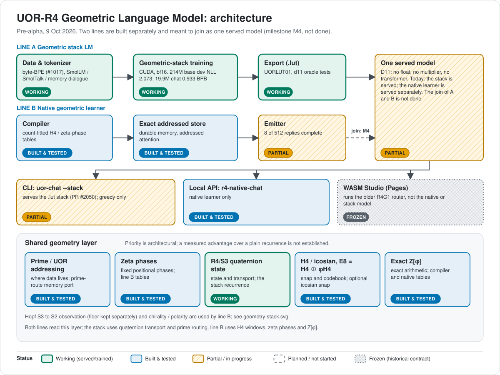
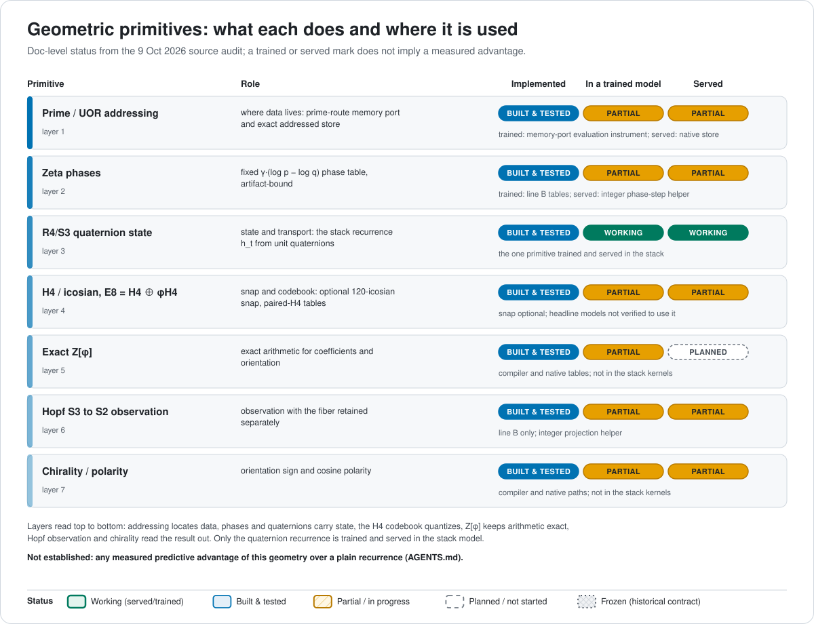
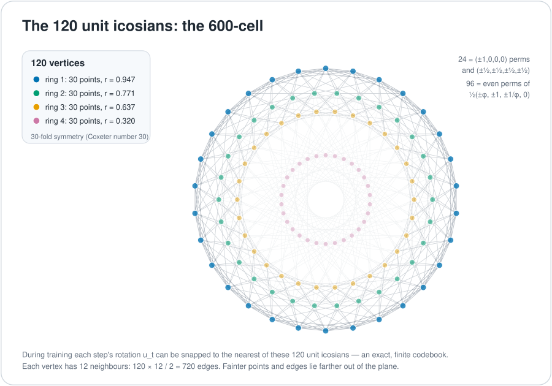
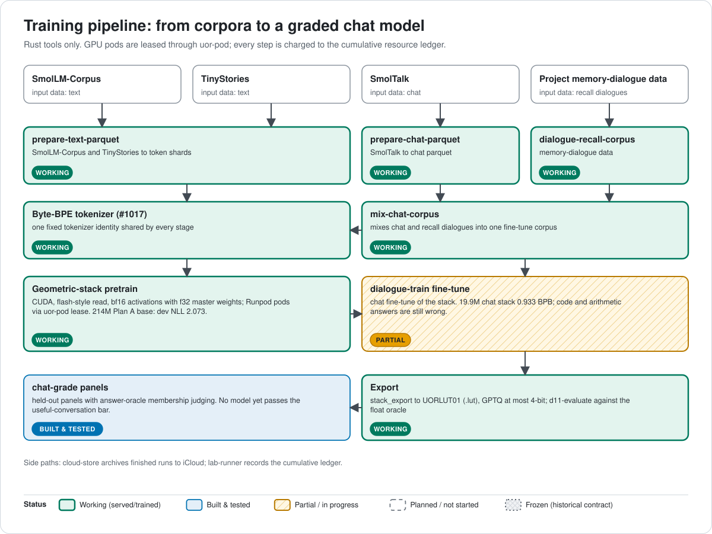
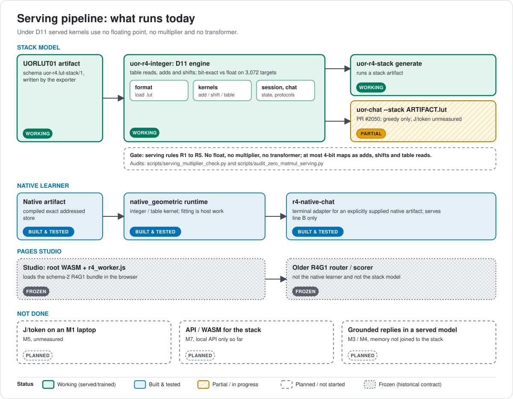
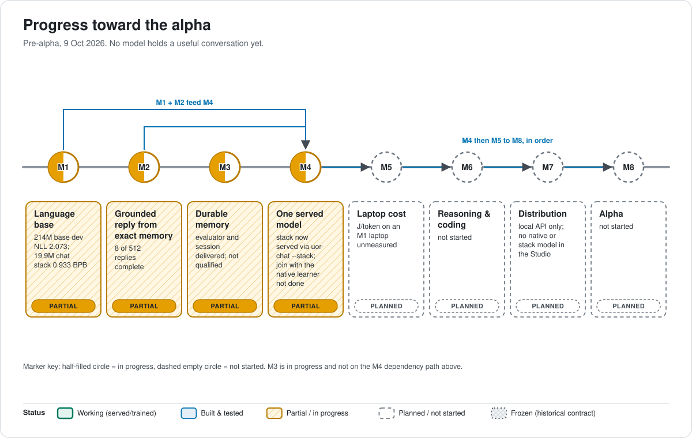

# UOR-R4 Geometric Language Model

*An open research project: can geometry replace a transformer's run-time machinery in a language model that runs on a laptop?*

[](LICENSE)
[](rust-toolchain.toml)
[](STATUS.md)
[](#roadmap)
[](https://github.com/UOR-Foundation/uor-r4/pulls?q=is%3Apr+is%3Amerged)
[](https://github.com/UOR-Foundation/uor-r4/commits/main)
[](https://huggingface.co/caseyallard/uor-r4-geometric-214m)

Updated 10 October 2026. **Status: pre-alpha. No model in this repository holds a useful conversation yet.**

## Goal

**Deliverable.** A useful conversation, memory and coding model that runs on an
M1-class laptop. It is built from geometry instead of a transformer's run-time
machinery, and it is served with no floating point and no multiplier
instruction (the D11 contract), at lower energy than a comparable model.

The geometry is R4/S3/H4 quaternion state and transport, prime (UOR)
addressing, exact `Z[phi]` arithmetic and fixed zeta-zero phases, combined with
exact addressed memory and learned typed operators. Training is offline Rust,
where floating point and matrix multiplication are allowed. Serving is integer
and table lookup only. The project asks whether this combination can reach a
useful model, and records the answer either way. Success is defined by the
eight milestones below; each closes only when its acceptance is met on a saved
model.

## Where we are

**0 of 8 milestones complete; 4 in progress** (M1 to M4). M5 to M8 have not started.

| Milestone | Issue | Status | Latest result |
| --- | --- | --- | --- |
| M1 Language base | [#2029](https://github.com/UOR-Foundation/uor-r4/issues/2029) | in progress | 214M base dev NLL 2.073; 19.9M chat stack 0.933 BPB served at 64 windows (0.877550 float / 0.886838 served matched at 512 windows — [protocol-dependent](docs/labs/criterion2-protocol-pin-2026-10-09/README.md)) |
| M2 Grounded reply from exact memory | [#2030](https://github.com/UOR-Foundation/uor-r4/issues/2030) | in progress | 437/512 complete replies; development target 256 passed; fresh qualification 0/128 (52 required), failed |
| M3 Durable conversation memory | [#2031](https://github.com/UOR-Foundation/uor-r4/issues/2031) | in progress | Evaluator and session delivered (#1568, #1578); not qualified |
| M4 One served model (D11 and CLI) | [#2032](https://github.com/UOR-Foundation/uor-r4/issues/2032) | in progress | D11 engine bit-exact; `uor-chat --stack` serves the stack (#2050, 9 Oct) |
| M5 Laptop cost (D5) | [#2033](https://github.com/UOR-Foundation/uor-r4/issues/2033) | not started | No M1 energy measurement yet |
| M6 Reasoning and coding | [#2034](https://github.com/UOR-Foundation/uor-r4/issues/2034) | not started | Exact arithmetic is the visible gap |
| M7 Distribution (API, WASM, Studio) | [#2035](https://github.com/UOR-Foundation/uor-r4/issues/2035) | not started | Local API only |
| M8 Alpha release | [#2036](https://github.com/UOR-Foundation/uor-r4/issues/2036) | not started | Owner decision |

Tracker: [#2028](https://github.com/UOR-Foundation/uor-r4/issues/2028). Measured position per lab: [STATUS.md](STATUS.md).

**What works today**

| Capability | State | Entry point |
| --- | --- | --- |
| Train, evaluate and export a geometric stack language model | Works, 8M to 214M parameters, offline Rust autodiff | `geometric-stack` example in `uor-r4-training` |
| Serve an exported stack artifact with no float and no multiplier instruction | Works; bit-exact against the float path on a 3,072-target check | `uor-r4-stack generate`, and `uor-chat --stack <ARTIFACT.lut>` (greedy decoding only) |
| Native grounded-reply learner (compiler, exact store, emitter) | Runs; completes 437/512 exposed development replies, 0/128 fresh replies | `crates/uor-r4-core/src/native_geometric/` |
| Native chat CLI | Exists | `crates/uor-r4-api/src/bin/r4-native-chat.rs` |

**What does not work yet**

- **Useful conversation.** The best chat stack is a 19.9M model with a measured
  bits-per-byte score, not a model that holds a conversation.
- **Arithmetic and code.** The 214M base still gets code and math arithmetic wrong.
- **Grounded replies at scale.** The native learner completes 437/512 replies on the exposed frozen panel, passing its 256-reply development target, but fails fresh qualification at 0/128 against 52 required.
- **One model.** The stack (line A) and the native learner (line B) are not yet joined (M4).
- **Browser Studio.** The Pages Studio runs the older R4G1 router, not the native or stack model (M7).
- **Laptop cost.** Full-path energy, RAM and parameter-access cost on an M1 are not measured (M5).

## Architecture overview



*Figure 1. Line A (language base) and line B (grounded reply from exact memory) are meant to join at M4.*

- **Line A, the language base (M1).** A trained geometric stack: quaternion-transport
  recurrence layers with multi-head reads. Code: `crates/uor-r4-training`.
- **Line B, grounded reply from exact memory (M2, M3).** A learned compiler writes facts
  into an exact versioned store; a learned emitter produces the reply. Code:
  `crates/uor-r4-core/src/native_geometric/`.
- **Serving (M4).** `crates/uor-r4-integer` executes exported artifacts under D11.

## How it works

> **Mechanism briefs:** [docs/mechanisms/](docs/mechanisms/README.md) has one page per novel mechanism under test: flock/rank-table reads, exact addressed memory, the identity-keyed pointer, read binding and protected legal construction. Each states the idea, what has been tried, and what a fair test needs.



*Figure 2. The geometric mechanisms and where each is used.*

For an illustrated walkthrough of the geometry, see [docs/geometry.md](docs/geometry.md).

For one token end to end (embedding, quaternion recurrence, Lorentz read, copy head, integer serving), see
[How the next token is predicted](docs/geometry.md#how-the-next-token-is-predicted).

For the 4096-bit VSA hypervectors and their Hamming similarity, see
[VSA hypervectors and Hamming similarity](docs/geometry.md#8-vsa-hypervectors-and-hamming-similarity).
How primes, K6, the icosians, the octonions and Fano plane, E8 and the Hopf map connect, with each link verified: [How the geometric pieces connect](docs/geometry.md#10-how-the-geometric-pieces-connect).



Each mechanism lists its implemented role and its status. Architectural priority
does not imply measured predictive advantage.

- **R4/S3 quaternion state and transport.** The stack's recurrence (`r` layers) moves its
  quaternion state by a learned unit quaternion each step:
  h_t = λ_t (u_t · h_{t−1}) + √(1−λ_t²) a_t. Status: trained and served.
  Hopf observation (S3 to S2) loses fiber information unless it is retained
  explicitly, so R4/S3 compute, Hopf observation and retained fiber stay distinct.
- **H4 / icosian and paired-H4.** `E8 = H4 x H4` is project shorthand for the
  concrete golden/Galois-coupled icosian construction `H4 + phi H4`. Status:
  implemented and unit-tested; used by tables and classifiers in the native learner, and as
  an optional training-time snap of each rotation u_t to the nearest of the 120 unit
  icosians (straight-through gradient). Which headline checkpoints used the snap is not verified.
- **Exact `Z[phi]`.** Icosian coordinates are exact numbers a + bφ (`ZPhi { a, b }`), with no
  rounding. Status: implemented.
- **Prime (UOR) addressing and routing.** An address is a product of primes; the
  prime-route memory port admits records that share a factor (gcd of the prime products > 1)
  or the longest matching ordered n-let of primes. A prime or hash identity is an identifier, not a semantic distance. Status:
  implemented; a measured advantage is not established.
- **Fixed zeta-zero phases.** A fixed table of 512 zeta zeros γ gives each pair of primes
  the phase γ·(log p − log q). The table is not learned and is not part of the stack's
  quaternion recurrence; it is used in the native learner's score tables. It does not
  require solving the Riemann hypothesis.
- **Chirality and polarity** are exact signs of `Z[phi]` coordinates, kept rather than
  dropped. Status: implemented.
- **Exact addressed memory.** An addressed store keyed by entity and relation tokens,
  intended as an index into an exact log of the conversation. Status: inside the native
  learner; not yet in the served stack model.
- **Lorentz and dot-product reads.** The stack's read layers (`a` layers) score earlier
  positions with a Lorentz or dot product plus an age term and a NoRead slot. Status: trained;
  the Lorentz read has its own packed serving contract.

## Training



*Figure 3. Offline Rust data preparation, training, export and grading.*

Training is offline Rust autodiff (floating point, matrix multiplication allowed);
bf16 activations with f32 master weights on CUDA. Final inference does not depend on it.

The native grounded learner's protected/discrete constructor and joint
Context–prototype learning are **reopened by the owner under D22**. The constructor
stopped on an absolute LU-pivot tolerance before native panel scoring; that is a
numerical blocker to fix, not evidence against the mechanism. The earlier joint
24-row/96-update configuration used the loss subsequently replaced by pooled
ranking. The ordered work is to repair the constructor and score a legal
displacement on development512 and fresh128, then train Context and prototypes
with pooled ranking on all512 rows and at least two seeds. Historical source and
reports remain in the [branch archive](docs/history/branch-archive/INDEX.md).

Ordinary complete-answer training of Potential and Generate coefficients has
not improved this learner. A [single full-panel pass](docs/labs/m2-reply-gradient-2026-10-10/README.md)
and a [stratified 24-example fit](docs/labs/m2-stratified-reply-2026-10-10/README.md)
both regress from 8 to 2 complete replies on the unchanged 512 panel. The latter
also reaches only 2/24 on its training examples after 32 exposures each, despite
lower teacher-prefix loss. Both candidates remain rejected. This does not establish
that the native model family cannot fit the task. Context, Generate prototypes,
bridge, Cue and Prefix were fixed in these two interventions.

The learned [cross-state continuation field](docs/labs/m2-pooled-rank-2026-10-10/README.md)
now completes **437/512 replies**, up from saved177: 260 gains, no losses and all
177 parent successes retained. It jointly reads the factual post-bridge state
and independently replayed query/reply-prefix state. Only its 115,200 Q4
coefficients learn; the upstream parent and native scorer stay frozen. Training
now compares the canonical target with the strongest wrong native pooled token,
including all Generate/Copy aliases, and retains the episode log-mean-exp
aggregation over answer tokens and EOS. Four full-panel passes with fresh Adam
moments produced the saved native endpoint, graded under its own prefixes.
Entry correctness reaches 507/512, teacher-prefix correct tokens 6,491/6,664 and
complete swap pairs 186; every prior success in all 11 saved comparators is
retained. This passes the **256/512 development threshold**, on the same exposed
panel used for training, with 75 failures and length8 at 90/128. M2 remains
in progress: [fresh qualification](docs/labs/m2-fresh-437-2026-10-10/README.md)
fails at **0/128 complete replies against 52 required**, on eight new literal-bank blocks (16 role assignments)
using familiar values. The unchanged saved model exactly replays 437/512.
The fresh panel has only 3 correct opening tokens and 4 EOS stops; all four
EOS-ending replies are wrong. D22 records the 437/512 development gain with zero transfer as panel fitting,
not an M2 milestone move. An expanded-bank replay preparation was interrupted
by the owner-directed priority change before any optimizer update; its
[unfinished source and evidence](docs/labs/m2-bank-transfer-interrupted-2026-10-10/README.md)
are preserved without a KEEP or negative verdict. The next work follows the
reopened constructor and joint-learning orders. This establishes no general-chat,
geometric advantage or full-path energy claim.

**Models trained**

| Model | Parameters | Data, tokens | Compute | Key result |
| --- | --- | --- | --- | --- |
| 8M stack (L2 read) | ~8M | chat-v0-p2; token count not recorded | not recorded | 1.1199 BPB held-out; Kneser-Ney 5-gram 1.2803 BPB |
| 19.9M chat stack | 19,929,136 | chat-v0-p2, 150M tokens, 12,207 steps | 1 x RTX 5090, 164k tok/s | 0.877550 BPB float / 0.886838 BPB served multiplier-free (11.9 MB), matched at 512 windows; the earlier 0.933 served was a 64-window number ([pinned protocol](docs/labs/criterion2-protocol-pin-2026-10-09/README.md)) |
| 20M / 29M ladder | 20M / 29M | 300M / 434M tokens | not recorded | Dev NLL 1.388 / 1.286 to 1.299 (like-for-like step) |
| ~96M chat | ~96M | chat plus balanced curriculum | not recorded | Step 7d fine-tune: v4 memory panel 26/40 (`exact` check pass); open panel 20/232 acceptable |
| 214M base (Step 8) | 214M (16 layers, width 1536, 24 heads) | 1.85B tokens: TinyStories 0.7, TinyDialogues 0.1, chat-v0-p2 0.2 | 2 x RTX 5090, about 12 h | TinyStories val NLL 1.032; the base itself has no recorded panel score — its Step 7d fine-tune (arm Q) scores v4 memory 31/40 (`exact` check pass; 27/40 acceptable) and open panel 36/232 acceptable |
| 214M base (Plan A) | 214M, initialised from the Step 8 base | 1.84B tokens (150k steps, batch 32, context 384) from SmolLM-Corpus (FineWeb-Edu and Cosmopedia-v2 shards) | 1 x RTX PRO 6000, 11.8 h | FineWeb dev NLL 2.90 to 2.073 |

NLL rows use different corpora and are not one curve; the 20M to 29M step is the
only like-for-like comparison. BPB and NLL are different metrics. The 214M models
gain on recall panels, not on code or arithmetic.

**Data sources and licenses** (checked against each source's Hugging Face card, 9 October 2026):

| Source | Used for | License |
| --- | --- | --- |
| [SmolLM-Corpus](https://huggingface.co/datasets/HuggingFaceTB/smollm-corpus) (FineWeb-Edu, Cosmopedia-v2) | Plan A pretraining | ODC-BY |
| [TinyStories](https://huggingface.co/datasets/roneneldan/TinyStories) | 8M–214M ladder pretraining | CDLA-Sharing-1.0 |
| [TinyDialogues](https://huggingface.co/datasets/styfeng/TinyDialogues) | 214M Step 8 pretraining | MIT |
| [SmolTalk](https://huggingface.co/datasets/HuggingFaceTB/smoltalk) (magpie-ultra) and [UltraChat 200k](https://huggingface.co/datasets/HuggingFaceH4/ultrachat_200k), prepared as `chat-v0-p2` | chat pretraining share and fine-tunes | Apache-2.0 (new SmolTalk subsets; others follow their sources), MIT |
| Project-generated memory dialogues (`mw-balp`, `mw-orcp`, dialogue-recall) | memory fine-tunes, recall panels | MIT (this project) |

SmolLM2 weights (Apache-2.0) were used only as an offline comparator, never on a serving path.
Third-party text is not republished; the project-generated sets are. See [Models and data](#models-and-data).

**Compute.** GPU pods through `scripts/pod/uor-pod` only: 2 x RTX 5090, RTX 4090 and RTX PRO 6000,
under caps of 4 pods and $8 per hour for all labs together. Total GPU-hours and cost are not
recorded in one place (a cumulative ledger is kept per [AGENTS.md](AGENTS.md)).

## Serving



*Figure 4. An exported artifact is loaded and run with add, subtract, shift, compare and table reads.*

**The D11 contract.** Served kernels use integer and table lookups only: add, subtract, shift,
compare and table reads. No floating point and no multiplier instruction; products of runtime
values use tables or exact geometric structure. Weights are 4-bit, trained quantization-aware.
There is no transformer backbone; converted open-weight transformers are offline teachers or
comparators only. Costs stay honest: dense layer maps and the vocabulary head still read their
weights for every token, and a measured product-table emulator used 4.3 times the energy of its
float comparator, so no general energy advantage is established.

```sh
# Serve an exported stack artifact (multiplier-free engine)
cargo build --release -p uor-r4-integer --bin uor-r4-stack --bin uor-chat
uor-r4-stack generate ARTIFACT PROMPT_IDS NEW_TOKENS   # PROMPT_IDS: comma-separated token ids
uor-chat --stack ARTIFACT.lut                          # interactive, greedy decoding only
uor-chat --bundle <dir>                                # the earlier integer model
```

## Results so far

Every row holds at its exact artifact, data, operator and budget.

| Result | Value | Scope |
| --- | --- | --- |
| 19.9M chat stack | 0.877550 BPB float / 0.886838 BPB served multiplier-free, matched at 512 windows (196,608 positions, byte basis 2.837427 B/token) | 11.9 MB artifact; lab chat evaluation; the earlier 0.933 served was a 64-window number, so the pair is quoted with its [pinned protocol](docs/labs/criterion2-protocol-pin-2026-10-09/README.md) |
| Sealed 8M stack | 1.1199 BPB | Sealed report; Kneser-Ney 5-gram 1.2803 BPB |
| 214M Plan A base | FineWeb dev NLL 2.90 to 2.073 | Open development split; rewrite and summarize usable, code and math wrong |
| v4 memory panel (frozen `exact` check pass) | 31/40 at 214M, 26/40 at 96M | 40 memory rows of `conversational-v4*`; Step 7d fine-tunes, one seed; chat-grade `acceptable` is 27/40 at 214M |
| Native grounded learner | **437/512 complete replies**, up from177; 260 gained, none lost, 177 retained | [Native pooled-token ranking](docs/labs/m2-pooled-rank-2026-10-10/README.md), frozen exposed 512-episode panel; development threshold 256 passed, fresh qualification 0/128 (52 required), failed; panel fitting under D22, not an M2 move |
| D11 serving engine | Bit-exact with the float path | NLL equal on 3,072 targets |
| MQAR toy (1.37M) | 0.99919 in-class vs 0.2534 control | Synthetic task; advantage confined to a learning-rate band |

**Negatives and retractions (kept as evidence)**

- D0 stack vs matched transformer control: 1.998 vs 2.011 NLL, parity. No tested
  geometric mechanism has yet beaten a matched ordinary control.
- Larger is not always better: a 214M SmolTalk-mixture stack scored 1.0966 BPB against 0.9607
  for the 7.16M chat-only stack on that panel.
- Fine-tune levers in Steps 5 to 12 (knowledge corpus, dialogue recall, gate supervision,
  phase binding, constant learning rate, abstention) were null or rejected.
- Earlier native child fits lowered cross-entropy without moving the then-accepted 8/512; those negatives remain preserved despite the later cross-state gain.
- Track A1 stopped (D18); the transformer-conversion track is parked after the parity failure
  in #1518. DeepSeek's VSA codebook nulls were re-scoped as a frozen-artifact effect: retrained into the native learner, the VSA term improves held-out BPB by 0.014–0.023, while icosian-root codes do not, because they collapse token identity (#2077, [record](docs/labs/vsa-native-test-2026-10-09/README.md)); the LUT-4 shortlist was retracted; the broad-prose and
  complete-roadmap claims of 8 September were retracted by audit.
- `uor-chat --stack` (#2050) records a measured negative for the bundle route.

Sources: [current state](docs/integration/current-state.md), [evidence index](docs/integration/EVIDENCE.md),
[decisions](docs/integration/DECISIONS.md), [mechanism admissibility](docs/integration/mechanism-admissibility-2026-10.md).

## Roadmap



*Figure 5. Milestones M1 to M8. The status table is in [Where we are](#where-we-are).*

Plan of record: [project-track.md](docs/integration/project-track.md). Dependency view: [ROADMAP.md](ROADMAP.md).
Compute board: [#2037](https://github.com/UOR-Foundation/uor-r4/issues/2037).

**Experiments in flight (pre-registered with thresholds fixed in advance):**

| Experiment | Milestone | Status | Question |
| --- | --- | --- | --- |
| Native VSA retraining (4 arms × 2 seeds) | M1 [#2029](https://github.com/UOR-Foundation/uor-r4/issues/2029) | **done: KEEP** ([record](docs/labs/vsa-native-test-2026-10-09/README.md)) | Trained VSA (fixed codes) improves held-out BPB by 0.014–0.023. Icosian-root codes don't: they collapse token identity. Mode 2 (root + per-token residual) is worse than fixed codes on all 4 cells: not KEEP |
| Softmax-free reads: soft (A), flock rank (B), B + prime-route copy (C), Hamming-rank (D) | M4 [#2032](https://github.com/UOR-Foundation/uor-r4/issues/2032) | pre-registered | Can served reads drop the table-emulated softmax with no loss? |
| Route-holonomy read | M1 #2029 | pre-registered | Can the angle of h_j⁻¹·h_t rank earlier positions, order-aware and softmax-free? |
| Exact icosian holonomy lanes (E1) | M1 #2029 | pre-registered | Does an exact 2I group product beside the r-layer help, beyond a shuffled-geometry control? |
| Octonion-signed binding, then transport | M1 #2029 | pre-registered | Does a Fano-signed XOR keep order and grouping that plain XOR loses? |
| Shared `BitCode` primitive | M4 #2032 | planned (engineering) | One Hamming/popcount type for the native learner, R4G1 and the integer engine |

Pictures of the pre-registered mechanisms are in [docs/geometry.md § 11](docs/geometry.md#11-pre-registered-mechanisms-not-yet-measured); none of them has a measured result yet.

## Quick start

Rust 1.97.1 is pinned by `rust-toolchain.toml`. Training data and trained artifacts are not in
the repository; see [Models and data](#models-and-data).

```sh
git clone https://github.com/UOR-Foundation/uor-r4 && cd uor-r4
# Train / evaluate / export geometric stacks. Run with no arguments to list modes.
cargo build --release -p uor-r4-training --example geometric-stack
# Focused tests for the stack
cargo test -p uor-r4-training --lib geometric_stack
# Claim-wording check used before editing capability claims
python3 scripts/check_claim_wording.py
```

GPU work goes through `scripts/pod/uor-pod` under [docs/labs/compute.md](docs/labs/compute.md);
do not rent compute by hand. From your own Runpod account: [docs/compute/pods-quickstart.md](docs/compute/pods-quickstart.md). New contributors: read [CONTRIBUTING.md](CONTRIBUTING.md).

## Models and data

Released publicly on Hugging Face (9 October 2026). The labs' working store stays private.

**[caseyallard/uor-r4-geometric-214m](https://huggingface.co/caseyallard/uor-r4-geometric-214m)**: four 214M geometric-stack checkpoints, with configs, sanitized run reports and the byte-BPE tokenizer.

| Checkpoint | What it is | Result |
| --- | --- | --- |
| `base-tinystories/` | Step 8 base: TinyStories, TinyDialogues and chat-v0-p2 | TinyStories val NLL 1.032; the checkpoint itself has no recorded panel score — its Step 7d fine-tune scores v4 memory 31/40 (`exact` check pass) |
| `base-planA/` | The base above, continued for 1.84B SmolLM-Corpus tokens | FineWeb dev NLL 2.90 to 2.073 |
| `chat-planA-b8/` | Plan A base plus an assistant fine-tune (173M-token mix, 8k steps) | Rewrite and summarize usable; code and arithmetic wrong |
| `chat-smoltalk-b16/` | Step 8 base plus the same fine-tune mix (16k steps) | Rewrite and summarize usable |

**[datasets/caseyallard/uor-r4-data](https://huggingface.co/datasets/caseyallard/uor-r4-data)**: the project-generated data.
- The tokenizer.
- Memory-dialogue sets (`mw-balp`, `mw-orcp`), plus a manifest describing the full fine-tune mix.
- The dev split.
- The project-authored conversational panels.
- The TinyStories training split tokenized for the native prose learner (`tinystories/`, CDLA-Sharing-1.0, inherited from the source).

Other third-party corpora are linked above, not republished. The dataset card's "Start here" section trains and scores a small native model on a laptop in a few minutes. Weights are MIT; the data each checkpoint saw keeps its source license.

## How the project is run

- **Labs.** Claude, Codex and DeepSeek work as autonomous labs under the owner's direction;
  any lab may join, leave and return ([docs/labs/README.md](docs/labs/README.md)).
- **One source of truth.** `origin/main` is authoritative. Work is claimed on a milestone issue,
  delivered by short-lived branch and protected PR, merged, and the branch and worktree deleted.
  Negative or unmerged work lands as an archive patch.
- **Evidence.** Numbers come from committed code run into sealed report directories; experiments
  state a gate before running; a kill ends an experiment, not a mechanism family (D12).
- **Decisions.** D0-b to D20 in [DECISIONS.md](docs/integration/DECISIONS.md).

The full procedure is in [CONTRIBUTING.md](CONTRIBUTING.md); the rules for agents are in [AGENTS.md](AGENTS.md).

## Project statistics

As of 9 October 2026 (activity, mostly multi-agent lab work, not a count of human contributors):
1,752 commits since 9 June 2026; 1,520 merged PRs (745 in the last 30 days, from the same
squash-merge flow); about 1.17M lines of Rust across 20 workspace members; 5,939 `#[test]`
functions; 22 decision records; 14 open issues; MIT license.

## Repository map

Cargo workspace members:

| Path | Purpose |
| --- | --- |
| [`crates/uor-r4-core`](crates/uor-r4-core) | Core engine: R4/S3/H4, exact `Z[phi]`, prime addressing, the native learner in `native_geometric/`, sealed report output |
| [`crates/uor-r4-training`](crates/uor-r4-training) | Offline Rust autodiff and evaluation: the geometric stack, memory, export, experiment drivers |
| [`crates/uor-r4-integer`](crates/uor-r4-integer) | Integer (D11) execution; the `uor-r4-stack` and `uor-chat` binaries |
| [`crates/uor-r4-lut`](crates/uor-r4-lut) | Frozen table-driven 4-bit serving comparator and artifact format |
| [`crates/uor-r4-simd`](crates/uor-r4-simd) | Audited vector kernels for the multiplier-free 4-bit table GEMV |
| [`crates/uor-r4-tokenizer`](crates/uor-r4-tokenizer) | Byte-level BPE engine and tokenizer identity |
| [`crates/uor-r4-api`](crates/uor-r4-api) | Typed compile and engine APIs; the `r4-native-chat` CLI |
| [`crates/uor-r4-router`](crates/uor-r4-router) | R4 Tangent Space Router: reusable routing plus historical paths |
| [`crates/uor-r4-graph-format`](crates/uor-r4-graph-format) | R4G1 packed graph artifact container (frozen) |
| [`crates/uor-r4-graph-compiler`](crates/uor-r4-graph-compiler) | Compiler to the frozen R4G1 artifact |
| [`crates/uor-r4-graph-runtime`](crates/uor-r4-graph-runtime) | Frozen R4G1 runtime |
| [`crates/uor-r4-graph-certify`](crates/uor-r4-graph-certify) | Certifier for R4G1 artifacts |
| [`crates/uor-r4-graph-cli`](crates/uor-r4-graph-cli) | Command line for the graph stack (frozen scope) |
| [`crates/uor-r4-proof-model`](crates/uor-r4-proof-model) | Executable proof specification for the graph compiler |
| [`crates/uor-r4-workbench`](crates/uor-r4-workbench) | Opt-in host for the bounded Four-fact research reference |
| [`crates/uor-r4-naf`](crates/uor-r4-naf) | UOR-NAF interchange slice (draft) |
| [`crates/repo-model`](crates/repo-model) | Typed conformance-claim registries; build and CI only |
| [`crates/repo-conformance`](crates/repo-conformance) | BDD runner and honesty meta-gate; development and CI only |
| [`xtask`](xtask) | Repository gates, `cargo xtask <task>` |
| [`tools/lab-runner`](tools/lab-runner) | Tooling for the labs' job runs |

Outside the workspace: [`crates/uor-r4-model-source`](crates/uor-r4-model-source) (exact CPU
reference for teacher models), [`docs/`](docs), [`scripts/`](scripts), [`research/`](research),
[`prototypes/`](prototypes). The [project map](docs/PROJECT_MAP.md) covers every crate.

## Acknowledgements

- **Alex Flom** (UOR Foundation, [@afflom](https://github.com/afflom)): the upstream UOR framework, addressing and Lean sources this project builds on, and review of its early design.
- **Ari** (UOR, [@auser](https://github.com/auser)): migrated the transformerless engine into this workspace and authored the R4G1/graph-compiler design and early certify measurement work (July to August 2026, 154 commits).
- **Maura** (UOR, [@maurathat](https://github.com/maurathat)): UOR contributions including uor-addr, and a README correction here (PR #235).
- **Mark (N3mesis)**: geometry research in [NEMESIS-Theory](https://github.com/markrnd87-cmd/NEMESIS-Theory), whose structure-carrying criteria (bijective state representation, transition fidelity, native primitive interpretation) frame the lowering contract, and an octonion/Fano and integer XOR/Hamming state sketch (NEMESIS-Theory) that motivates the pre-registered Hamming-rank read and octonion-signed binding (ideas only; no text copied).
- **Matthew**: author of SpiralCore (v63 Cl(0,6) octonion operator convention, reproduced in `crates/uor-r4-core/src/spiralcore_operator.rs` as a geometric control, and the v68 schema in `research/spiralcore-v68/`). SpiralCore v69: the verified binary-icosahedral (2I) peer-shell catalogue and the K6 ↔ half-turn-axis correspondence behind the pre-registered exact icosian holonomy lanes (E1, M1 #2029).
- **DarkUnicorn**: author of GoldSnnail and goldworm-coder, reviewed as external sources whose state-layout patterns and evaluation ideas (contamination canary, Goodhart audit set, hash-chained gate log, score-then-verify coding loop) inform the gate and coding-loop plans.
- **The AI research labs** (Claude, Codex, DeepSeek), which do most implementation under the owner's direction; owner and principal investigator Casey Allard.

## Citation

See [CITATION.cff](CITATION.cff). GitHub's "Cite this repository" button reads it. No paper is
claimed; cite the software as pre-alpha, version of 9 October 2026.

## License

[MIT](LICENSE). Third-party research and dependencies keep their own licenses.
