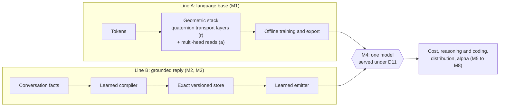

# UOR-R4 Geometric Language Model

UOR-R4 is an experimental language model written in Rust. It asks whether
geometry can do the run-time work that a transformer does with dense attention
and MLP blocks. The geometry is R4/S3/H4 quaternion state and transport, prime
(UOR) addressing, exact `Z[phi]` arithmetic and fixed zeta-zero phases. It is
combined with exact addressed memory and learned typed operators. Training is
offline Rust, where floating point and matrix multiplication are allowed.
Serving follows one contract (D11): no floating point, no multiplier
instruction and no transformer backbone. The target is useful conversation,
memory, coding and reasoning on an M1-class laptop at lower energy.

**Status: pre-alpha research. No model in this repository holds a useful
conversation yet.** General prose, reasoning, coding and energy savings are
not established. No geometric mechanism has yet beaten a matched ordinary
control (see [Results](#results-so-far), including the negatives).

- Tracker: [#2028 UOR-R4 roadmap](https://github.com/UOR-Foundation/uor-r4/issues/2028).
- `origin/main` is the single source of truth for every contributor.
- Measured position of each lab: [STATUS.md](STATUS.md).

## What works today

| Capability | State | Command or entry point |
| --- | --- | --- |
| Train, evaluate and export a geometric stack language model | Works (8M to 214M parameters trained; offline Rust autodiff) | `geometric-stack` example in `uor-r4-training` |
| Serve an exported stack artifact with no float and no multiplier instruction | Works; bit-exact against the float path on a 3,072-target check | `uor-r4-stack generate` in `uor-r4-integer` |
| Native grounded-reply learner (compiler, exact store, emitter) | Runs; completes 8 of 512 frozen-panel replies | `crates/uor-r4-core/src/native_geometric/` |
| Native chat CLI over the native model path | Exists | `crates/uor-r4-api/src/bin/r4-native-chat.rs` |
| Interactive chat on the older integer model | Works for that model only | `uor-chat --bundle <dir>` |

What does **not** work yet:

- **Useful conversation.** The best chat stack is a small model with a
  measured bits-per-byte score, not a model that holds a conversation.
- **Serving the best chat stack through the shipped CLI.** `uor-chat` serves
  the older integer model, and its stack profile is not built.
- **Arithmetic and code.** The 214M base still gets code and math arithmetic
  wrong.
- **Grounded replies at scale.** The native learner completes 8 of 512 replies
  on the frozen panel.
- **Browser Studio.** There is no deployment of the native model in the
  browser; the Studio is future work (milestone M7).
- **Laptop cost.** Full-path energy, RAM and parameter-access cost on an M1
  have not been measured (milestone M5).

## Quick start

Rust is pinned by `rust-toolchain.toml` (1.97.1) and rustup selects it
automatically. Training data and model artifacts are not in the repository.
Labs keep them in a private store (`caseyallard/uor-r4-store` on Hugging Face)
and on the shared compute volume, so a fresh clone can build and run the tests
but cannot reproduce a trained model without that material.

```sh
# Train / evaluate / export geometric stacks. Run with no arguments to list modes.
cargo build --release -p uor-r4-training --example geometric-stack

# Multiplier-free serving of an exported artifact.
cargo build --release -p uor-r4-integer --bin uor-r4-stack
uor-r4-stack generate ARTIFACT PROMPT_IDS NEW_TOKENS   # PROMPT_IDS: comma-separated token ids

# Focused tests for the stack.
cargo test -p uor-r4-training --lib geometric_stack
```

- `geometric-stack` trains, evaluates and exports stacks. The `export` mode
  writes the artifact that `uor-r4-stack` reads.
- `uor-chat --bundle <dir>` serves the earlier integer model only.
- The native chat CLI source is `crates/uor-r4-api/src/bin/r4-native-chat.rs`.
- GPU work goes through `scripts/pod/uor-pod` under the rules in
  [docs/labs/compute.md](docs/labs/compute.md). Do not rent compute by hand.

## How it works

The model keeps a recurrent geometric state and reads an exact addressed
memory. Learned operators update the state and select memory pages.


```mermaid
flowchart LR
  subgraph A["Line A: language base (M1)"]
    T[Tokens] --> S["Geometric stack<br/>quaternion transport layers (r)<br/>+ multi-head reads (a)"]
    S --> E[Offline training and export]
  end
  subgraph B["Line B: grounded reply (M2, M3)"]
    F[Conversation facts] --> C[Learned compiler]
    C --> X[Exact versioned store]
    X --> M[Learned emitter]
  end
  E --> J{{"M4: one model<br/>served under D11"}}
  M --> J
  J --> K["Cost, reasoning and coding,<br/>distribution, alpha (M5 to M8)"]
```

**Geometry (primary mechanisms).**
- **R4/S3/H4 state and transport.** Quaternion (unit S3) state, directed
  transport between states, and H4/icosian structure. R4/S3 compute, the Hopf
  observation S3 to S2, retained fiber and torsion, and paired-H4 are kept
  distinct. Hopf observation loses fiber information unless it is retained
  explicitly.
- **Prime and UOR addressing.** Ordered n-lets of primes address memory.
  A prime or hash identity is an identifier, not a semantic distance.
- **Exact `Z[phi]`.** Golden-ratio arithmetic is exact. `E8 = H4 x H4` is
  project shorthand for the concrete golden/Galois-coupled icosian construction
  `H4 + phi H4` with a fixed basis and inverse witness.
- **Zeta phases.** Fixed finite zeta-zero phases are bound to each artifact.
  They do not depend on solving the Riemann hypothesis.
- **Chirality and polarity** are preserved rather than dropped.

**Exact addressed memory.** An addressed store with entity and relation token
keys, intended as an index into an exact log of the conversation. It exists
today as a probe and inside the native learner. It is not yet in the served
stack model.

**Geometric stack** ([`geometric_stack.rs`](crates/uor-r4-training/src/geometric_stack.rs)).
Quaternion-transport recurrence layers interleaved with multi-head reads that
use a Lorentz or dot score, each followed by a SwiGLU MLP. An ordinary
transformer control runs on the same kernels. Native context access does not
make the model a transformer, but the historical dense references remain
transformers and are kept as comparators.

**Serving contract (D11).**
- Integer and table lookups only: add, subtract, shift, compare and table
  reads. No floating point and no multiplier instruction in served kernels;
  products of runtime values use tables or exact geometric structure.
- 4-bit weights, trained quantization-aware so training reads the values the
  export writes. The engine ([`uor-r4-integer`](crates/uor-r4-integer/README.md))
  is audited at the instruction level.
- No transformer backbone. Converted open-weight transformers are offline
  teachers or comparators only, never serving paths.
- Honest costs: dense layer maps and the full vocabulary head still read their
  weights for every token. A measured product-table emulator used 4.3 times the
  energy of its float comparator, so no general energy advantage is established.

**Training.** Offline Rust autodiff with floating point. Final inference does
not depend on it.

## Results so far

Scopes matter: each row holds at its exact artifact, data, operator and budget.
Self-reported, independently read and independently rerun evidence are labelled
separately in the linked records.

| Result | Value | Scope |
| --- | --- | --- |
| 19.9M chat stack | 0.877 BPB float, 0.933 BPB served multiplier-free | 11.9 MB served artifact; bits per byte on the lab's chat evaluation |
| Sealed 8M stack | 1.1199 BPB | Sealed report; compared with a Kneser-Ney 5-gram at 1.2803 BPB |
| 214M "Plan A" base | Dev NLL 2.073 (kept) | Open development split; rewrite and summarize work, code and math arithmetic wrong |
| Memory recall | 31 of 40 at 214M, 26 of 40 at 96M | Recall panel; one training family |
| Native grounded learner | 8 of 512 complete replies; best conditional gate 9 of 15 | Frozen 512-episode panel; about 40 later candidates kept 8 and gained none |
| D11 serving engine | Bit-exact with the float path | NLL equal on 3,072 targets |
| D0 stack vs transformer control | 1.998 vs 2.011 NLL (parity) | Matched kernels; no geometric advantage shown |

**Negatives and retractions (kept as evidence):**
- No tested geometric mechanism has beaten a matched ordinary control.
- Track A1 was stopped (D18). Track B, converting transformers, is parked after
  the parity failure in #1518. New transformer baselines are not used.
- Claude Steps 9 to 12 (phase binding, constant learning rate, abstain scale)
  were rejected.
- VSA codebooks were inert. The LUT-4 shortlist was retracted.
- The broad-prose and complete-roadmap claims of 8 September were retracted
  by audit.

Sources: [current state](docs/integration/current-state.md),
[evidence index](docs/integration/EVIDENCE.md),
[October evidence review](docs/integration/grounded-memory-evidence-2026-10-01.md),
[geometric toolbox](docs/integration/geometric-toolbox-2026-09-28.md) and
[mechanism admissibility](docs/integration/mechanism-admissibility-2026-10.md).

## Roadmap

Tracker: [#2028](https://github.com/UOR-Foundation/uor-r4/issues/2028). Line A
(language base) and line B (grounded reply from exact memory) join at M4.

| Milestone | Issue | Status | Latest result |
| --- | --- | --- | --- |
| M1 Language base | [#2029](https://github.com/UOR-Foundation/uor-r4/issues/2029) | in progress | 214M base dev NLL 2.073; 19.9M chat stack 0.933 BPB served |
| M2 Grounded reply from exact memory | [#2030](https://github.com/UOR-Foundation/uor-r4/issues/2030) | in progress | 8/512 complete replies; gate 9/15 |
| M3 Durable conversation memory | [#2031](https://github.com/UOR-Foundation/uor-r4/issues/2031) | in progress | Evaluator and session delivered; not qualified |
| M4 One served model (D11 and CLI) | [#2032](https://github.com/UOR-Foundation/uor-r4/issues/2032) | not started | D11 engine bit-exact; CLI cannot serve the stack yet |
| M5 Laptop cost (D5) | [#2033](https://github.com/UOR-Foundation/uor-r4/issues/2033) | not started | No M1 measurement yet |
| M6 Reasoning and coding | [#2034](https://github.com/UOR-Foundation/uor-r4/issues/2034) | not started | Exact arithmetic is the visible gap |
| M7 Distribution (API, WASM, Studio) | [#2035](https://github.com/UOR-Foundation/uor-r4/issues/2035) | not started | Local API only |
| M8 Alpha release | [#2036](https://github.com/UOR-Foundation/uor-r4/issues/2036) | not started | Owner decision |

A milestone closes only when its acceptance is met on the saved model. The
compute board is [#2037](https://github.com/UOR-Foundation/uor-r4/issues/2037).
The plan of record is [project-track.md](docs/integration/project-track.md) and
the dependency view is [ROADMAP.md](ROADMAP.md).

## How the project is run

- **Labs.** Claude, Codex and DeepSeek work as autonomous labs; any lab may
  join, leave and return. Work is a renewable claim, not a fixed assignment.
  The owner keeps the mission, evidence integrity, unique-material and
  spending boundaries. See [docs/labs/README.md](docs/labs/README.md).
- **One source of truth.** `origin/main` is authoritative. Finish and verify
  the protected merge of a deliverable before starting its successor, then
  delete its branch and worktree. Unmerged or negative work lands as an indexed
  patch under `docs/history/branch-archive/`, not as a standing branch. The
  only standing branch is `codex/lab-state`, the coordination record.
- **Issues and labels.** Work happens on the milestone issues M1 to M8 under
  the tracker. Status uses `status:in-progress`, `status:not-started` and
  `status:blocked`; claims use `lab:claude`, `lab:codex` and `lab:deepseek`.
  Heartbeats and lease renewals go to the compute board and lab-state, not the
  tracker.
- **Compute.** GPU pods only through `scripts/pod/uor-pod`, with leases per
  lab and session. Caps for all labs together: at most 4 running pods and at
  most $8 per hour. See [docs/labs/compute.md](docs/labs/compute.md).
- **Evidence.** Numbers come from committed code run into sealed report
  directories. Experiments are pre-registered with a gate; a kill ends an
  experiment, not a mechanism family (D12). Negative results keep their exact
  scope. Claims follow the [formal vocabulary](docs/formal_vocabulary.md).
- **Delivery.** Protected pull requests with exact-head review and the checks
  run at that head. Completed work is merged to `main`; a branch or PR is not
  completion.
- **Reference.** [AGENTS.md](AGENTS.md) (rules for every contributor and
  agent), [DECISIONS.md](docs/integration/DECISIONS.md) (D0-b to D20),
  [current state](docs/integration/current-state.md) and
  [CONTRIBUTING.md](CONTRIBUTING.md).

## Repository map

Cargo workspace members:

| Path | Purpose |
| --- | --- |
| [`crates/uor-r4-training`](crates/uor-r4-training) | Offline Rust autodiff and reference evaluation: the geometric stack, memory, training worlds, export and the experiment drivers in `examples/` |
| [`crates/uor-r4-integer`](crates/uor-r4-integer) | Standalone integer execution of retained recurrent models; the `uor-r4-stack` and `uor-chat` binaries |
| [`crates/uor-r4-core`](crates/uor-r4-core) | Core R4 engine: geometric mathematics (R4/S3/H4, exact `Z[phi]`, prime addressing), the native geometric learner in `native_geometric/` and sealed report output |
| [`crates/uor-r4-lut`](crates/uor-r4-lut) | Integer-only table-driven 4-bit serving and the serving artifact format |
| [`crates/uor-r4-simd`](crates/uor-r4-simd) | Audited vector kernels (AVX2, NEON, portable) for the multiplier-free 4-bit table GEMV |
| [`crates/uor-r4-tokenizer`](crates/uor-r4-tokenizer) | Shared byte-level BPE engine and stable tokenizer identity |
| [`crates/uor-r4-api`](crates/uor-r4-api) | Typed compile and engine APIs for library consumers, and the `r4-native-chat` CLI |
| [`crates/uor-r4-router`](crates/uor-r4-router) | The R4 Tangent Space Router: manifold indexing, geometric generation and thought streams (reusable routing plus historical paths) |
| [`crates/uor-r4-graph-format`](crates/uor-r4-graph-format) | R4G1 packed graph artifact container: `no_std`-compatible types, two-stage validation, canonical serializer |
| [`crates/uor-r4-graph-compiler`](crates/uor-r4-graph-compiler) | Compiler to the frozen TLA/R4G1 graph artifact |
| [`crates/uor-r4-graph-runtime`](crates/uor-r4-graph-runtime) | The frozen R4G1 runtime (XOR, shift and table-read kernel under its own contract) |
| [`crates/uor-r4-graph-certify`](crates/uor-r4-graph-certify) | Certifier for R4G1 graph artifacts (frozen scope) |
| [`crates/uor-r4-graph-cli`](crates/uor-r4-graph-cli) | Command-line front end for the graph stack: cross-compilation of a transformer into a table-native, certifiable artifact (frozen scope) |
| [`crates/uor-r4-proof-model`](crates/uor-r4-proof-model) | Executable proof specification and verification harness for the graph compiler |
| [`crates/uor-r4-workbench`](crates/uor-r4-workbench) | Opt-in native host for the bounded Four-fact research reference |
| [`crates/uor-r4-naf`](crates/uor-r4-naf) | UOR-NAF interchange slice (draft); never a dependency of a shipped crate |
| [`crates/repo-model`](crates/repo-model) | Typed registries of conformance claims parsed from `model/*.toml`; build and CI only |
| [`crates/repo-conformance`](crates/repo-conformance) | The BDD runner and honesty meta-gate; development and CI only |
| [`xtask`](xtask) | Repository gates, run as `cargo xtask <task>` |
| [`tools/lab-runner`](tools/lab-runner) | Tooling for the labs' job runs (admitted-runner deployment status is tracked in the lab docs) |

Outside the workspace:
[`crates/uor-r4-model-source`](crates/uor-r4-model-source) is the exact CPU
reference for teacher models (Llama/SmolLM2, GPT-2) and the attention-replacement
seam. Other top-level directories: [`docs/`](docs) (plans, decisions, results
and history), [`scripts/`](scripts) (including `pod/uor-pod`),
[`research/`](research) and [`prototypes/`](prototypes). The
[project map](docs/PROJECT_MAP.md) covers every crate and historical engine.

## History

The research began with exact geometric memory and a transformerless prose
learner, then moved to learned recurrent models with integer serving. The
[README as of 29 September 2026](https://github.com/UOR-Foundation/uor-r4/blob/0fb03372/README.md)
keeps the dated results log. The [evidence index](docs/integration/EVIDENCE.md)
and the [research ledger](docs/RESEARCH.md) cover the full history.

## License

[MIT](LICENSE). Third-party research and dependencies keep their own licenses.
