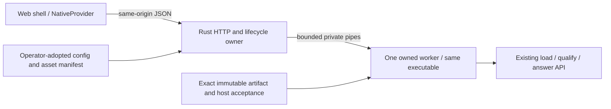

# ADR-0006: One Rust service for the bounded four-fact reference

**Status:** Independently accepted as `SERVICE_API_CONTRACT_SPECIFIED` in #1105, a child of
[#1084](https://github.com/UOR-Foundation/uor-r4/issues/1084).
**Date:** 2026-09-03. **Decision owner:** Casey-allard through protected review.
**Base:** `85d9eb8beca2a59ccda47e290afd483f7838982c`.

This ADR and its [machine contract](../r4_service_contract_1105.json) specify
the next implementation. They contain no executed service, browser, build or
model result. **Definition:** the interfaces, states and transition rules below
are architectural definitions. Their implementation guarantees are **Unproven**
until the separately admitted host and product checks have run.

## Context and decision

The accepted #1102 result is `NATIVE_REFERENCE_PRESERVED` for the exact artifact,
binary/runtime and known authoring fixtures. It preserved the unchanged learned
reader/core, known vocabulary/query forms and four-fact context. Its ordinary
`qualify()`/`answer()` serving path is `NOT_RUN`. The measured CLI accepts
metadata, loader-gate and fixed comparison campaigns; it is not a request server.
Its build and comparison envelopes are consumed. The older #1094 envelope is
also consumed and its withheld population remains resealed.

**Decision:** implement one new, opt-in, loopback Rust service with a small
same-origin web shell and one internal, long-lived native worker. The worker is
the **same new executable** launched in an internal worker mode, with no listening
socket. The parent owns HTTP, model/job state, the approved configuration and
static assets. The worker owns verified immutable artifact bytes and the
`LoadedResearchReference`; it calls the existing
`uor_r4_api::learned_reference` API. Only that API's qualified `answer()` path may
serve public requests. There is no public route to `compare()`.

The first operation is exactly `answer_four_fact_raw_text/v1`. It returns the
actual task token or original typed parser refusal, without explanation text,
chat wrapping, history assembly, retrieval, tools or answer templates. A token
spelled `unknown` remains a task token; it is not promoted to a general abstention
policy. Previous #1017/#1041 raw continuation is a different capability and is
not advertised by this initial host.

The service is an explicit research-reference application. It does not replace
the root server, alter historical `/v1/*` or `/uor/v1/status` semantics, or satisfy
the final integer/table kernel. The proposed new host target is `r4-workbench`
in a dedicated `uor-r4-workbench` crate, with the existing API dependency selected
using `default-features = false, features = ["learned-reference"]`. That target
and crate are **not implemented by this ADR**. Its implementation must pin its
actual dependency closure before the separately admitted build; this ADR does
not authorize a dependency update.

## Options considered

| Option | Benefit | Cost or incompatibility | Decision |
|---|---|---|---|
| Reuse the measured #1102 CLI as a subprocess | Already measured bytes | It binds a fixed 320-row/16-refusal campaign, emits diagnostics, uses `compare()`, and has a consumed admission. A new request mode would produce a new binary anyway. | Reject. Keep it as immutable evidence. |
| Add another path directly to the large existing server | Existing HTTP infrastructure | Inherits unrelated model aliases, configuration and lifecycle; synchronous `answer()` has no cancellation hook. A visual port would become a broad serving migration. | Defer. Preserve existing routes. |
| Small Rust host, inference in the HTTP process | Few processes and easy warm reuse | Dropping an HTTP future cannot interrupt synchronous arithmetic. Claiming compute cancellation would require a new kernel cancellation seam or a weaker public operation. | Reject for the declared stop behavior. |
| Small Rust host plus one same-executable worker | One API owner; one immutable model slot; actual process termination can stop work without editing numerical operators | IPC, child reaping and reload after cancellation must be implemented and checked. New host qualification is required. | Select. |
| Browser teacher or second model runtime as fallback | Could produce broader text | Different artifact, execution and evidence; obscures native failure. | Exclude from this first flow. A future explicit provider remains separately owned. |

The worker split is for lifecycle ownership, not a performance claim. No
parallel-worker, throughput or latency advantage has been measured. One worker,
one loaded model and one active job prevent concurrent model mutations; HTTP
status/cancel handling remains responsive in the parent. No inference HTTP hop
occurs inside a token/operator loop.

## Identity and local asset ownership

The configured artifact is the retained 2,172,252-byte `.r4lr` with SHA256
`2c209590a64cae16a4140fd43adc1cb1f87b357c02e3d4959f1e37f4ab8cd5ab`.
Its native-state SHA256 is
`4f453da12a9346356e64b6c16abfbaad1ca99e3966173cd79e9ddbc8c2d9341b`.
The loader's accepted binding, original export-release identity, codec, policy,
reader/core and frame identities remain exactly those in the
[#1102 handoff](../r4_native_bridge_1102_evidence/qualification-handoff.json).
The service must use that `ExpectedBinding`, never reconstruct it from untrusted
artifact declarations or browser fields.

**Definition:** `model_id` is `r4lr:sha256:` followed by the complete lowercase
artifact SHA256. It identifies artifact bytes, not host qualification. Artifact,
native state, codec, policy, export provenance, host binary, runtime receipt,
qualification receipt and web assets are separate typed identities. No generic
“kappa” field replaces them, and no digest-distance or arithmetic interpretation
is introduced. Typed UOR integration remains #1083.

An operator-owned local configuration selects one artifact path, the original
trusted binding, a host acceptance bundle and an explicit web-asset manifest.
The startup path/bytes and configuration digest are retained locally. The
browser selects only the published model ID; it cannot submit paths, URLs,
digests to trust, proof/qualification records, executable arguments or environment
variables. There is no downloader, registry mutation, cache purge or arbitrary
file API in this first version. Existing evidence is read without moving,
rewriting, changing permissions or evicting it.

The companion defines exact `LocalConfiguration`, `HostAcceptance`,
`FileIdentity` and `AssetManifest` field sets. Their identities hash exact UTF-8
JSON file bytes; duplicate keys are rejected and no silent reserialization
changes the adopted digest. Original #1086 qualification uses its own canonical
no-LF encoding. A missing host acceptance path and digest are both null; an
incomplete pair or a mismatch leaves the operation unavailable.

Intake is finite: configuration and host-acceptance files are at most 64 KiB
each; qualification at most 64 KiB; runtime receipt, fresh release and result
review at most 1 MiB each; comparison result at most 8 MiB. The asset manifest
is at most 128 KiB with at most 128 files, each at most 4 MiB and at most 16 MiB
in total. Exact limits, path lengths, JSON nesting and startup failure handling
are frozen in `file_intake_limits`. These are admission caps, not measured
resource use. Check bounds before allocation and never follow arbitrary
recursive evidence references. Full scientific tensors stay in their evidence
store; they are not service-startup inputs.

Every worker start verifies its exact executable identity and runtime against
the host acceptance bundle, reads the selected artifact into owned bytes, checks
the exact length/hash and calls `load()`, then `qualify()`. The retained worker
is the warm path; it does not reload the model per request. A restarted worker
must repeat intake. A disk cache hit, a configured file path and a qualified
loaded engine are distinct states. Published `configured_artifact` is a catalog
assertion from trusted configuration; `verified_artifact` is null until that
worker's successful intake. Replacing on-disk bytes cannot retarget an already
loaded worker. Configuration/asset changes require an explicit service restart.
The model snapshot's qualification digest means installed qualification in its
current worker: null before accepted `WorkerReady` and after confirmed removal,
equal to the adopted receipt while ready/running, and retained during
unloading/stopping until reap. The host identity's receipt instead describes the
accepted bundle even while unloaded; neither field alone enables inference.

## Actual host qualification and the separate empirical decision

The #1102 receipt SHA256
`61d29aa80e6bcd3d163b2ff2a6da4faab04414ea9f4284d80b798c4e46cf5369`
binds measured binary SHA256
`d423d8d3c3acd2d1c6215c21206e1bec7583e4dd37e84f30f70f79e77c40d53f`.
It is retained reference evidence, **not a receipt for the new host**. Supplying
that digest as the new host's identity is forbidden. `RuntimeIdentity` is a
caller-supplied value; the existing API does not measure its own executable or
read/accept the result-review documents behind the digest.

The parent and worker must bind the final executable bytes after linking and
packaging, the source/lockfile/build flags, target and runtime dependencies,
hardware/OS, exact worker invocation, floating-point environment and fixed
`cpu-scalar-f32-f64-1086/1` profile. This is a local trusted-operator identity
check, not hardware attestation or proof against a malicious local administrator.
The implementation/review must establish that the file measured is the actual
executable launched, and prevent a replacement between verification and worker
startup. An unestablished platform mechanism leaves native serving unavailable.

A separately approved host acceptance bundle is external to the artifact and
browser. It binds these identities, the approved service contract, original
export/binding identities, a **new** independently accepted comparison result
and result review, a canonical 12-field native qualification receipt, and the
supported platform/profile. The original qualification schema is not extended
with ad hoc service fields; new host/application evidence belongs in this outer
bundle. Trust is supplied by explicit operator adoption of its content digest,
not by a self-asserted `accepted` string or a browser action.
Independent operator review evaluates the result/review semantics, numerical
criteria and source/runtime/release bindings **before** adopting that bundle
digest. Runtime uses the adopted digest as transitive authority: it verifies
exact referenced bytes/lengths/hashes and parses/cross-checks only the specified
host-acceptance and canonical qualification schemas. Other evidence documents
are opaque adopted content, without an invented semantic parser or recursive
proof search at startup.

The later owner must execute these distinct gates in order:

1. **Source/build admission.** Freeze the actual new source, build plan, target,
   dependencies, output locations, exact permissions and finite build/resource
   budget. Independently review them before building or accessing model payloads.
   The #1102 dependency-cache recovery does not authorize changing pins.
2. **Private new-host numerical comparison.** Freeze a fresh execution release,
   input/reference owner, exact known authoring row identities, all four full
   tensor criteria (`atol = 1e-5`, `rtol = 0`), discrete answers/roles/refusals,
   within-host fresh replay, file identities and finite load/forward/time/RSS/byte
   caps **before outcomes**. Reuse unaffected retained reference evidence only
   after its source/input/runtime bindings are shown unchanged. A changed or
   unreproducible reference is unavailable, not a candidate mismatch. No new
   training, threshold, population or language claim is implied.
3. **Separate execution permission from export provenance.** Current `compare()`
   matches its admission digest to the artifact's *original export-release*
   digest. Any new private host-comparison adapter must validate the fresh host
   release independently, then use the original digest only as the immutable
   export identity required by that API. It must not launch the old CLI or
   coordinator, reuse their budget/consumption markers, reinterpret their release
   as permission, or expose a public comparison route. If this separation cannot
   be implemented honestly, revise that adapter contract before a model run.
   The **exact final service executable** must already contain this private,
   separately invoked comparison mode in the frozen source/build. It has no
   listener and is not a public-worker IPC command. Its command name is fixed by
   the successor's build admission. Comparing a different harness executable or
   adding the mode after comparison cannot qualify the final binary. This private
   mode uses freshly admitted `compare()`; ordinary serving still uses only the
   qualified `answer()` path.
4. **Independent acceptance.** Retain full outputs, failures and accounting.
   Only a passing, independently accepted new result can produce a new canonical
   qualification receipt bound to the actual host binary/runtime. Never invent a
   provisional receipt to make ordinary `answer()` callable before acceptance.
5. **Ordinary service integration.** With the accepted receipt, separately
   exercise actual `load()` → `qualify()` → `answer()` through the public route,
   and the named lifecycle/browser checks. Numerical preservation does not prove
   HTTP, cancellation, static assets or UI correctness. These checks need their
   own exact fixtures, outcome actions and caps before execution.

The fifth gate is an **external delivery gate**, separate from startup and the
12-field numerical receipt. A candidate already numerically qualified may enter
`ready` during the separately admitted integration check; that state means
loaded and numerically qualified, not accepted HTTP/lifecycle/browser behavior.
Before ordinary-use adoption, independently accept an immutable behavior result
and review binding the exact contract, source/build, binary/runtime, host
acceptance, assets, admitted input/release and retained output identities. Record
that promotion in the implementation issue, delivery record and claim ledger.
It is not a provisional qualification or a prerequisite that prevents measuring
the public path. No such service acceptance exists in #1105.

The numerical criteria remain a bounded empirical comparison. The concrete
future binary, release/input manifests and resource ceilings do **not** exist
in #1105; this ADR provides admission requirements, not an executable release.
If qualification is absent, stale, mismatched or unavailable, discovery remains
usable but model load/inference is unavailable. On a numerical mismatch retain
the existing reference and repair the new host in a separately scoped decision.
An integrity, budget or reference failure retains evidence without promotion.

## HTTP and provider boundary

The [machine companion](../r4_service_contract_1105.json) is normative for exact
field sets, methods, status codes and limits. Prose governs ownership, races and
evidence meaning. Any conflict is a specification defect to resolve before
implementation; neither document silently overrides the other.

The new service binds only literal `127.0.0.1`, using one explicit actual port.
It serves `/` plus manifest-listed assets and the namespace
`/uor/v1/workbench/`. There is no forwarding into old root-server APIs and no
new claim of OpenAI chat compatibility. API paths never fall through to an HTML
SPA response. All initial API responses are JSON snapshots, not token streams.

The port is explicitly selected in `1024..65535`; startup fails if unavailable
without killing another process or switching ports. HTTP headers are capped at
8,192 bytes, request reading at five seconds and concurrent connections at 16.
Reject duplicate/conflicting Content-Length, Transfer-Encoding and pipelining;
cap lengths before allocation and close after one request. These are declared
resource/control limits, not measured performance results.

| Method and route | Purpose |
|---|---|
| `GET /uor/v1/workbench/capabilities` | Protocol/instance identity, configured artifact, verification/qualification state, exact supported operation and limits. Works while no model is loaded. |
| `GET /uor/v1/workbench/model` | Current model lifecycle snapshot. |
| `POST /uor/v1/workbench/model/load` | Start one verified load/qualification job for the configured model ID. |
| `POST /uor/v1/workbench/model/unload` | Start unloading an idle worker; never implicitly cancels an answer. |
| `POST /uor/v1/workbench/requests` | Submit one exact raw-byte four-fact operation against an expected model generation. |
| `GET /uor/v1/workbench/jobs/{job_id}` | Poll the identified load/unload/answer job and its immutable terminal result. |
| `POST /uor/v1/workbench/jobs/{job_id}/cancel` | Request termination of the active load/answer worker job under the race rules below. |

All request JSON rejects duplicate/unknown fields and wrong types. Schema and
operation values are versioned. Raw input is **canonical padded standard base64**
inside the versioned request; decoding must round-trip to the same encoded text.
No case folding, newline normalization, trimming, segmentation or history joining
is performed by the host/provider. Its decoded buffer is passed unchanged to
`RawRequest { schema, text }`. The core's 4,096-byte input policy and grammar are
unchanged. The separate 8,192-byte decoded transport cap allows over-policy
requests to reach the original typed length refusal; still larger requests get
a transport `413`, not a fabricated model refusal. HTTP body cap is 16,384 bytes.

Results carry the original `TextResult` object unchanged under `result`, with
host/artifact/qualification/job identity outside it. A model token uses
`uor-r4.text-binding-result/1`; a refusal uses
`uor-r4.text-to-clauses-result/1`. A refusal is a completed supported operation,
not a service crash. Native failures retain the original `NativeError` tag,
component and offset under a typed service error. Full diagnostic tensors and
parser internals are not returned to the browser. Public usage reports only
known work: a completed token implies one forward, a parser refusal zero, and
interrupted or failed execution reports unknown work with a one-forward upper
bound rather than invented token counts.

Private IPC has exact `IPCRequest`/`IPCResponse` tagged records. Each frame is a
u32 little-endian length followed by that many UTF-8 JSON bytes, capped at
65,536 bytes before allocation. Every message binds instance, job and a separate
monotonic worker-generation ID. Canonical base64 preserves the raw bytes across
HTTP and pipes; validation at either boundary must not normalize them. The
worker's verified readiness handshake precedes public readiness. Unsolicited,
oversized or mismatched messages fail the worker and cannot produce a partial
answer. Only current-job bounded progress messages are allowed.

Discovery, job polling and cancellation do not require a ready/qualified model;
otherwise a qualification failure could prevent cleanup. The companion gives
route-specific error precedence. Load and answer require the accepted host
binding. Wrong service/input schema or transport framing is a service error;
validly transported raw-byte syntax, lexeme and length failures retain the
core's exact `UNSUPPORTED_SYNTAX`, `UNKNOWN_LEXEME` and `INPUT_LIMIT` refusal tags.

## Model/job lifecycle and cancellation

The parent serializes every admission and terminal transition. The single slot
admits one load, answer or unload job at a time and has no waiting queue. A busy
request gets `409 BUSY`; it does not create a job or execute later. Request IDs
are service-issued, instance-scoped monotonically increasing integers encoded
as strings. The service instance ID is fresh at startup and independent of
model identity. Completed jobs are retained in memory as a bounded FIFO of 64;
unknown/evicted IDs return `404 JOB_NOT_FOUND`. A service restart discards jobs
and selection state; durable sessions are not claimed.
Admission atomically assigns the active job and reserves the corresponding
model state. The job may first be observed as `accepted`, then `loading`,
`running` or `unloading` by kind. Stops and terminal states follow the explicit
machine transitions. A terminal commit clears the active job atomically;
model-only stopping for an idle worker failure creates no job. The companion's
`job_state_rules` and `progress_rules` fix these correlations and the monotonic
subsequences of actual reported stages.

`model_generation` is a monotonically increasing integer for this service
instance. It advances on every successful worker readiness and once when a
spawned worker is invalidated; confirming its removal does not increment again.
Failure before a child is spawned leaves this generation unchanged.
The private worker-generation counter separately advances on each child spawn.
An answer must echo the current ready model generation and
model ID. Stale generations get `409 STALE_MODEL`; they cannot run against a
replacement worker. A POST accepted by the service returns `202` and a job ID
even if the job has already completed before the HTTP response is delivered.
A browser connection loss does not cancel or re-submit that job automatically.
The model snapshot exposes active and most-recent job IDs. After a lost POST
response the client may fetch those jobs and compare input digest/generation;
if correlation is uncertain it reports uncertainty rather than issuing another
request. A failed job is still fetched with HTTP 200; its typed job error is
separate from a pre-admission HTTP rejection.
An accepted answer's `raw_text_sha256` hashes the decoded raw bytes, and must
match the completed model token's raw hash; load/unload use null. A completed
load retains its pre-load `admitted_generation`, while the model snapshot's
new ready generation is that value plus one.

States distinguish `unavailable`, `unloaded`, `loading`, `ready`, `running`,
`stopping`, `unloading` and `error`. A startup without an accepted host bundle
is `unavailable`, not `ready`. Valid trusted metadata permits `unloaded`;
actual artifact verification and successful qualification are required for
`ready`. Artifact/load/worker failures are typed `error`; another load is an
explicit user request, not an automatic retry. A completed answer/refusal leaves
the same worker ready. The initial service does not persist mutable model state.
An unexpected failure during loading or answering first enters `stopping` until
the child is confirmed reaped, then fails that active job. An idle ready worker
failure follows model-only `ready → stopping → error` with no active job and
does not mutate its already completed load or answer job. A load failure with
no spawned child enters `error` directly. Every spawned-child failure passes
through `stopping`, even if confirmed reaping then permits immediate failure.
Each job's `artifact` is the configured admission identity; only the model's
`verified_artifact` and the private `WorkerReady` receipt assert intake verification.

Private IPC admits one command at a time. Load/answer/unload each permit zero or
more progress replies followed by exactly one corresponding terminal reply:
`ready`/`result`/`unloaded`, or `failure`. Extra or unsolicited replies are
protocol failures. Unload succeeds only after both its valid acknowledgment and
confirmed child reap before deadline; exit without acknowledgment is
`WORKER_FAILURE`. A native failure reply may leave a child alive, so it also
requires termination and reaping before terminal failure. All mapped native,
loader, numerical, protocol and crash failures retain their exact causal error
under `stop_reason=worker_failure`; an earlier winning cancellation/deadline
remains authoritative.

**Cancellation:** if the terminal result was committed first, cancel returns
`409 ALREADY_TERMINAL` and that result remains authoritative. If cancellation
wins while a load/answer job has a spawned child, the parent commits `stopping`, prevents
any later answer publication, terminates that owned worker process and confirms
its exit by reaping it. Only then is the job terminal `cancelled` and the model
`unloaded`. Cancellation of an unloading job is unsupported (`409
NOT_CANCELLABLE`). Repeat cancel while already stopping returns the same active
snapshot and does not launch another action.

If an accepted load is stopped before its child spawns, there is no process to
reap: user cancellation directly commits `cancelled / unloaded`, and a load
deadline directly commits `failed / DEADLINE_EXCEEDED` with model `error`.
Both leave model generation unchanged and record zero forwards. The reaping
requirements below apply when a child exists.

Cancellation after dispatch may have performed part or all of one forward. It
must not report zero computation. A new model load is required after cancelled
work; restart/load/qualification is explicit. No new job is admitted until the
old worker is confirmed gone. Unconfirmed termination leaves `stopping` with a
typed termination failure and blocks the slot; it is never reported as completed
cancellation. The implementation must use only its owned child/process handle,
not a PID name search or a broad kill. Parent shutdown follows the same reaping
obligation. A cancelled public job is not a retryable scientific campaign.

Graceful termination waits at most two seconds, then force termination waits
at most two seconds for confirmed reaping. If confirmation is still absent,
the slot remains blocked in `stopping`; elapsed time does not prove termination.
Load/answer/unload work deadlines are respectively 30/10/4 seconds, followed
by the termination procedure when needed. A deadline is a failure, not a user
cancellation; report `failed / DEADLINE_EXCEEDED` only after reaping. These
rules also apply to unload: reaping before its deadline completes unloading;
a deadline that wins first commits `stopping` and later fails the unload job
after confirmed reap. Its model generation was already invalidated at unload
admission and does not increment again. These
deadlines are control policies, not an assertion that all work completes within
them. An OS crash/orphan guarantee needs a separately implemented platform
mechanism and is not claimed by this specification.

The machine contract's `state_error_rules` fixes null/error combinations. During
stopping, model and active-job errors show the winning cause (null for user
cancel). Unconfirmed reaping temporarily places `TERMINATION_UNCONFIRMED` in
both, retaining the cause privately. Later confirmed cancellation clears it;
deadline/failure restores the original causal error in the terminal job and
model. Idle failure never changes a completed job. Normal completion has null
error, and only a completed answer has a result.

Progress reports real stages and optional measured denominators. Artifact reads
may report bytes read and verified against the exact fixed size. Validation,
qualification, inference and reaping have null totals. This version keeps all
fractions and ETA null; new percentage claims require an explicit contract
revision. No fake token stream, progress percentage or throughput is synthesized.
Snapshots use a monotonic `revision`; compare it within the same instance and
resource identity so a newer model snapshot cannot suppress an older job's
legitimate terminal result.

The parent retains at most 65,536 bytes of sanitized worker stderr per worker
lifetime, marks truncation, and continues draining and discarding excess bytes
until pipe closure. The retention cap must not stop pipe reads and stall the
child. Framed stdout has its separate IPC message limit.

## Browser and static assets

The first flow is a page titled **Four-fact research reference** with the actual
artifact label, availability/load state, one raw-text input, Answer/Stop controls
when supported, the returned token or refusal, and a visible error. It does not
present this operation as chat, reasoning or code generation. The provider is
explicitly `native`; a missing or failed service does not switch providers.
`NativeProvider` maps the routes above into typed capabilities, model/job
snapshots and results. It keeps the selected model ID through failures and
ignores snapshots from another instance or lower revision. It never adds prior
turns, attachments, fetched pages or hidden context to the raw input.

The MIT donor contributes selected layout/style/composer/status patterns with
its license retained. Provider execution, model aliases, caches, progress,
answer rendering and failure handling are rewritten at this boundary. The first
renderer uses text nodes for input/output/refusal; Markdown/code execution is
unneeded. Sessions, Monaco/diff/save, preview, Git writes, search grounding,
geometry visualization and browser-teacher execution remain later #1084/#1088
work. A future `BrowserTeacherProvider` must be explicitly selected and expose
its own actual model and operations; its output never fills native results.

Static files are bundled from an explicit manifest of relative paths, byte
lengths, SHA256 and MIME types. Reject traversal, encoded separators, symlink
escapes and non-listed paths; never expose the artifact/config/evidence/workspace
directory as a static root. Pin/bundle JS/CSS/fonts used by the first page; no
runtime CDN or teacher download is part of native startup. Model and web-asset
identities remain separate. HTTP responses use `Cache-Control: no-store` for
API/state and the HTML entry, and content-addressed immutable caching only for
verified static asset paths.

The local trust boundary accepts the exact startup Host authority. Mutations
require the exact same-origin `Origin` and JSON content type; absent, `null` or
foreign mutation origins are rejected. GETs permit absent or exact Origin and
reject a foreign Origin. No permissive CORS, external bind or browser-supplied
path/configuration is allowed. These rules protect the chosen local browser
boundary; they do not authenticate against arbitrary trusted-user processes or
claim multi-user/remote service security. Logs omit raw prompts and secrets by
default; local diagnostic records can retain identity, stages and typed errors.

## Evidence, consequences and handoff

The [source audit](../r4_service_contract_1105_sources.md) records original donor,
NEMESIS, W33 and UOR sources. NEMESIS carrying criteria motivate explicit state,
encoding, update, operation and readout obligations; W33 CAS/receipt examples
motivate immutable payload/lineage separation. Neither establishes this service
or the native model's behavior. NEMESIS material is linked/attributed, not
vendored. Existing UOR content/structural/derivation meanings remain distinct.
No research algebra or numerical operator is changed by this specification.

The selected boundary makes capability discovery and one operation reviewable
without migrating the old server or adding a second model implementation. It
costs a controlled worker, IPC and explicit reload after cancellation. It still
requires actual executable/launch binding and separate empirical qualification;
an unavailable label is the correct state until those obligations are met.

Named #1105 checks are source digests, JSON/identity/cross-reference consistency,
claim wording, diff hygiene and independent specification review. There is no
service, browser or mathematical proof result. Preserve #1102's finite empirical
result, #1079's weak control, #1082's descriptive result and all unavailable
preparation history. #973 stays open and #954 blocked; #1083/#1087 and
#954/#955/#962 retain their own obligations.

The [metadata checker](../r4_service_contract_1105_check.py) reads only source
files and JSON, using the original paths/pins in the
[source manifest](../r4_service_contract_1105_source_manifest.json). Its
[receipt](../r4_service_contract_1105_checks.json) establishes source identities,
field/reference consistency and illustrative object shapes, not transition
implementation or a model result. The
[independent review](../r4_service_contract_1105_review.md) records the corrected
lifecycle and qualification findings. The
[storage review](../r4_service_contract_1105_storage.json) retains source,
models, sealed inputs and unique evidence; no cleanup ran.

After protected acceptance, close only #1105 with
`SERVICE_API_CONTRACT_SPECIFIED`. The next action under #1084 is to implement this
small host/worker and first shell in one owned bounded child, binding its exact
source/build and private qualification release before any model work. Public
readiness and one real operation are accepted only after the separate gates
above. #1084 remains open until its actual implementation DoD is met.
