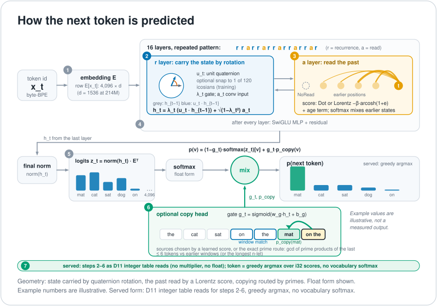
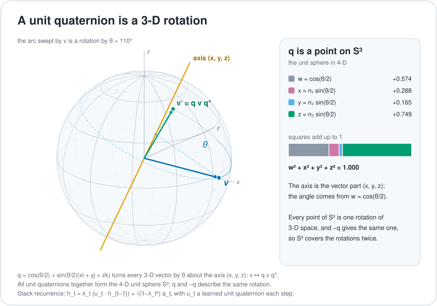
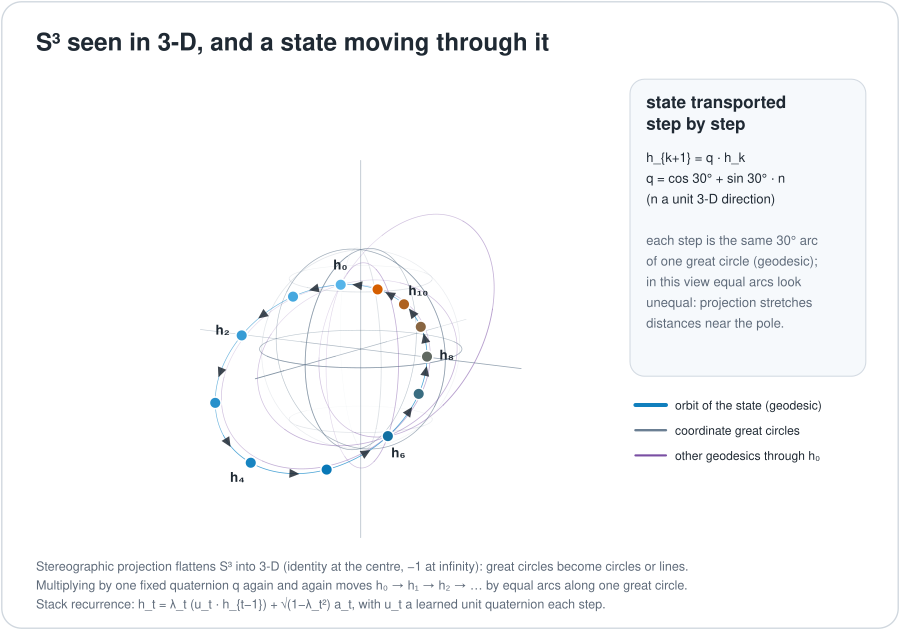
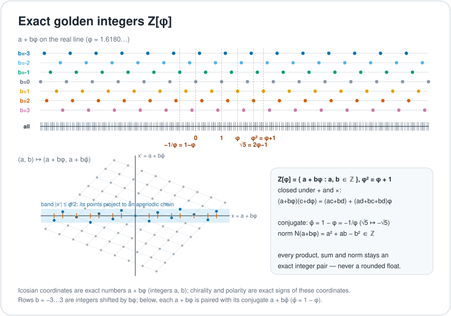
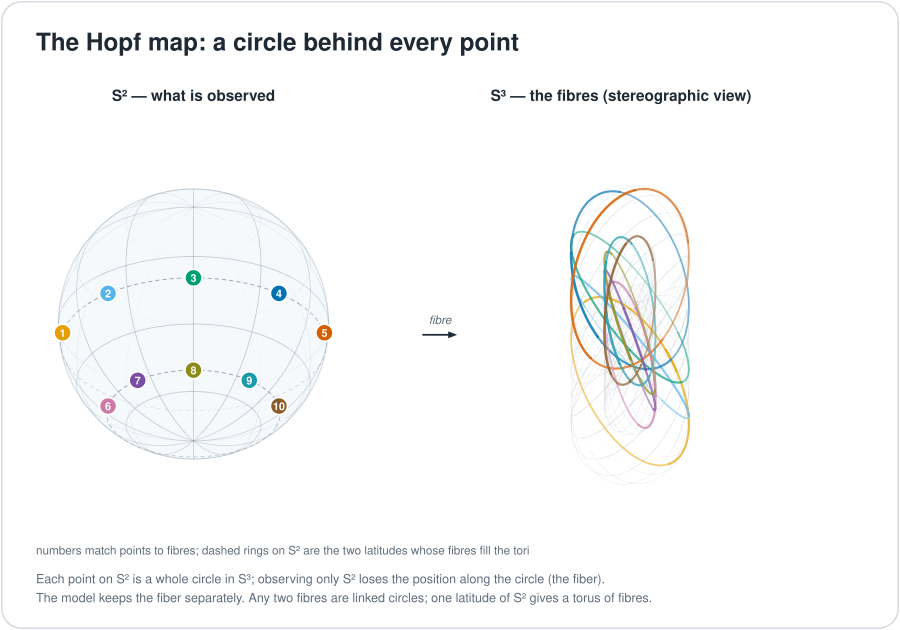
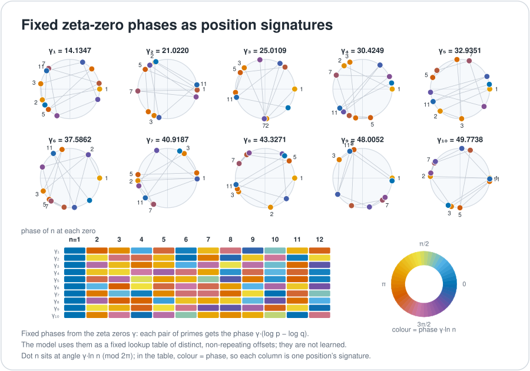
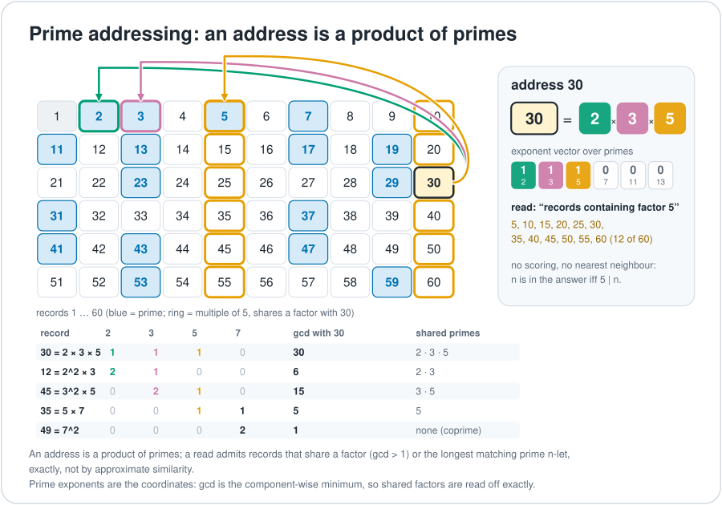
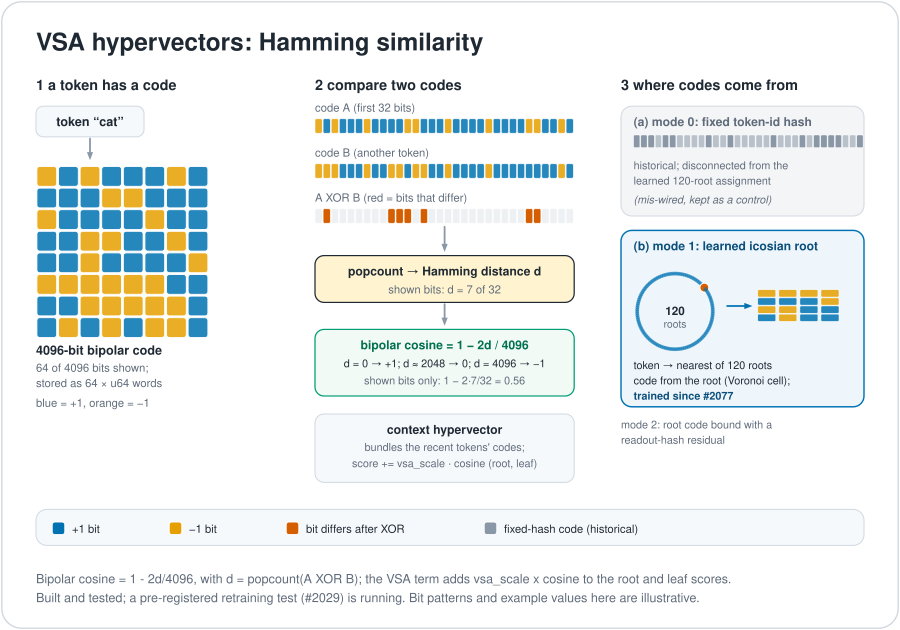

# The geometry, illustrated

This page is a picture-first tour of the geometric objects the UOR-R4 Geometric Language Model is
built from. "Geometric" here means that the model's state and memory live on exact geometric
objects (unit quaternions, a fixed 120-element icosian table, exact golden-ratio integers, prime
addresses) rather than on a transformer's dense attention and MLP blocks at run time. The target
serving path (decision D11) uses no floating point and no multiplier instruction. Everything below
describes the mechanisms as built; a measured advantage over ordinary controls is not yet
established (see [README, Results](../README.md#results-so-far)).

Two overview figures first: the [architecture](figures/architecture.svg) and the stack of geometric
mechanisms.

Two code paths use these objects. The **geometric stack** (`crates/uor-r4-training/src/geometric_stack.rs`)
is the trained language model. The **native learner** (`crates/uor-r4-core/src/native_geometric/`)
is the exact addressed-memory path. They share ideas but not all mechanisms; each section says which.

## How the next token is predicted

This is the path of the trained **geometric stack** (`crates/uor-r4-training/src/geometric_stack.rs`)
for one token. The numbers match the figure's badges. Section 2 and the later sections draw the
geometric objects in detail; [Life of one token](#life-of-one-token) lists the same path step by step.

1. **Embed.** The byte-BPE id x_t selects one row of the learned embedding matrix E (vocabulary 4,096,
   width d; d = 1536 at 214M). Formula: h⁰_t = E[x_t].
2. **Carry the state by rotation (`r` layers).** For each 4-channel lane, projections give a unit
   quaternion u_t, a gate λ_t and an input a_t (a width-4 causal convolution). The previous state is
   rotated by u_t and blended with the new input: h_t = λ_t (u_t · h_{t−1}) + √(1−λ_t²) a_t. In
   training, u_t can optionally be snapped to the nearest of the 120 unit icosians (straight-through).
3. **Read the past (`a` layers).** The layer scores earlier positions with a Dot or a Lorentz
   (hyperbolic) score, −β·arcosh(1+e), adds an age term and a NoRead slot, and a softmax mixes the
   earlier states: h_t ← Σ_s softmax(score)_s · h_s.
4. **MLP and residual.** Every layer ends in a SwiGLU MLP with a residual connection. The 16 layers
   follow the pattern `rrarrarrarrarrar` (r = recurrence, a = read).
5. **Logits.** A final norm, then z_t = norm(h_t) · Eᵀ, with the output head tied to the embedding E
   (float form; the served form has its own head). In the float form a softmax over the 4,096 tokens
   gives p_soft = softmax(z_t).
6. **Optional copy head.** A gate g_t = sigmoid(w_g·h_t + b_g) mixes in a copy distribution:
   p(v) = (1−g_t)·softmax(z_t)[v] + g_t·p_copy(v), where p_copy sums attention over earlier positions
   that hold token v. The sources are chosen by a learned score or by the exact prime route: gcd of the
   prime products of the last ≤ 6 tokens against earlier windows, or the longest n-let
   ([section 7](#7-prime-uor-addressing-and-exact-memory)).
7. **Serving.** Steps 2–6 run in fixed point through the D11 integer table kernels (4-bit weights, no
   multiplier instruction, no floating point). The integer path is bit-exact with the float path on a
   3,072-target check.

**What it does not use.** The stack's prediction path uses no Hamming distances, no spin and no
spherical harmonics. Hamming/popcount and H4 codes appear in the native learner (the exact
addressed-memory path) and in the frozen R4G1 runtime. Spherical harmonics appear only in
`native_geometric/learner/geometric_attention.rs`. The "R4/Spin" models in the project history were
transformers. The output softmax is standard: the geometry is in how state is carried (quaternion
rotation), how the past is read (Lorentz score) and how exact copying is routed (primes).

### Softmax at runtime: where it is gone and where it is still emulated

| Place | What the served engine does | Status |
|---|---|---|
| Next-token choice | Greedy argmax over integer i32 scores (`stack_argmax`, `crates/uor-r4-integer/src/stack/chat.rs:296`) | No softmax for token choice. Sampling would need one and is not implemented. |
| Read-layer weights | exp(−d) read from a sealed lookup table (`stack_exp_neg`, `crates/uor-r4-integer/src/stack/kernels.rs:350–375`; table spec `format.rs:228`), then integer normalization. No float, no multiplier instruction. | Table-emulated softmax, not yet designed out. |
| Flock selection | Fixed rank weights w_i ∝ 1/(i+1) from a table (`crates/uor-r4-integer/src/stack/flock.rs:356–436`) | A softmax-free alternative already in the engine. |
| Copy-head mixture | Computed in fixed point by the integer engines | Softmax-shaped, through the same tables. |

## 1. Quaternions and rotation

**What it is.** A quaternion is a four-number value that can encode a rotation in 3D. A *unit*
quaternion (length 1) is a pure rotation, and multiplying two of them composes the rotations. The set
of unit quaternions is the 3-sphere S³.

**What the model does with it.** In the stack, every recurrent layer treats each lane of 4 channels as
one quaternion state. The update is a left-multiplication by an input-dependent unit quaternion
(a rotation of the previous state, not a conjugation q h q*), mixed with new input; see the next
section for the formula. The quaternion algebra is fixed; the rotation the model chooses is learned.
Code: `crates/uor-r4-training/src/geometric_stack.rs` (`quaternion_scan`).

**Status.** Trained and served (the integer engines run the exported stack).

## 2. The state lives on S³ and moves step by step

**What it is.** Think of the state as a point on a sphere. Each new token turns the sphere a little
(the rotation) and pulls the point partly toward the new input. A decay gate decides how much of the
old position survives.

**What the model does with it.** The `r` layer recurrence, per 4-channel lane:

    h_t = λ_t (u_t · h_{t−1}) + √(1−λ_t²) a_t

Here u_t is an input-dependent unit quaternion (near identity at initialisation), λ_t in (0,1) is a
gated decay, and a_t is the input after a width-4 causal convolution. One exact scan runs the
recurrence; the backward pass is the reverse scan. The `a` layer is the other temporal mixer: a
multi-head read over positions up to t, scored by a Lorentz (hyperbolic) or Dot score, with a learned
age term per head and distance, and a NoRead slot whose value is zero. The layer pattern letters
(for example `rrarrarr…`) choose the mixer per layer; every layer ends with a SwiGLU MLP and a
residual connection. Code: `geometric_stack.rs` (header; `layer_kind`, `fused_read`).

**Status.** Trained and served.

## 3. The 120 icosians and the 600-cell codebook

**What it is.** Among all unit quaternions there is a special finite set of 120 (the binary
icosahedral group 2I). They are the vertices of the 600-cell, a 4D analogue of the icosahedron, and
they are closed under multiplication: any product of two is again one of the 120.

**What the model does with it.** `TransportSnap::Icosian` replaces u_t (before the λ scaling) by the
nearest of the 120 elements, so every transport is an exact member of 2I. During training the snap
uses a straight-through gradient: `u + (snap(u) − u).detach()`, so the forward pass sees the snapped
rotation and the backward pass sees the continuous one. It is applied inside the fused recurrence
core and is off unless set (`set_transport_snap`). Separately, the native learner indexes the same
120 elements as a table (product, inverse and rank lookups) in
`native_geometric/addressed_attention/artifact.rs`. `E8 = H4 × H4` is project shorthand for the
concrete golden/Galois-coupled icosian construction `H4 ⊕ φH4`; the typed paired representation is in
`native_geometric/anchors.rs`, and the stack does not use it.

**Status.** Icosian table: built and tested, used by the native learner. Snap: implemented for
training; whether any trained, shipped model uses it has not been verified. Paired-H4 integration is
marked unfinished in the artifact header.

## 4. Exact golden integers

**What it is.** The golden ratio φ ≈ 1.618 satisfies φ² = φ + 1. Numbers of the form a + b·φ with
integer a and b add and multiply exactly, with no rounding, and the coordinates of the 120 icosians
live in this set.

**What the model does with it.** `ZPhi { a, b }` is checked exact integer arithmetic
(`crates/uor-r4-core/src/prime_route_attention.rs`; separate copies in `native_geometric/guarantees.rs`
and `canonical_lexical_ingestion.rs`). `compile_anchor_table` (`native_geometric/anchors.rs`) uses it
to compute, for each of the 120 icosian roots, an exact sign of the sine part (chirality) and of the
cosine part (cosine polarity), each in {−1, 0, 1}, with no float comparison. These combine into an
orientation class in 0..8 and a squared projection radius in Z[φ]. The antipode flips chirality. These
are fixed tables.

**Status.** Built and tested. Which `ZPhi` operations a trained forward pass uses has not been
verified.

## 5. Hopf observation and the kept fiber

**What it is.** The Hopf map squashes S³ onto an ordinary sphere S². Many points of S³ land on the
same point of S²: they form a circle (the fiber). Rotating a point along its fiber changes the S³
point but not its S² image, so the S² picture alone forgets exactly that phase.

**What the model does with it.** For a unit quaternion (a, b, c, d), `UnitS3Q30::hopf` returns
`(2(ac+bd), 2(bc−ad), a²+b²−c²−d²)` in Q30 fixed point. `rotate_common_fiber(phase)` applies
(z1, z2) → e^{i·phase}(z1, z2), which leaves the Hopf image unchanged. `SpinTorsionState { s3, fiber,
torsion }` keeps the fiber and torsion explicitly, and `GeometricAddress` carries them, so the
observation does not silently drop orientation. Code: `core/src/prime_route_attention.rs`;
`native_geometric/hopf_metric.rs` extends it (its header names a Fubini–Study metric and integer
serving; I did not verify the body). None of this is in the stack recurrence.

**Status.** Built and tested in the core and native-learner code; not part of the trained stack.

## 6. Zeta-zero phases

**What it is.** The imaginary parts γ of the first non-trivial zeros of the Riemann zeta function are
a fixed list of numbers (14.13…, 21.02…, …). Multiplying one by a difference of logarithms gives an
angle, and angles wrap around a circle. The table is a constant; nothing about it is learned, and it
does not require solving any open problem.

**What the model does with it.** In the native learner, the phase of a token with prime p in channel
k is `γ_k · (ln p − ln 2)`, wrapped to a turn and stored as a u16 (fixed table of 258 token rows × 8
channels; byte b is row b+2). At run time each observed byte wrap-adds its first four channel phases
into a running 4-phase state, and the top four bits of each phase (`phase >> 12`) are fed to the
policy as context. So the zeta phases are a fixed additive accumulator that is quantized into policy
inputs; they do not rotate a vector or multiply an activation. They are **not** in the quaternion
stack (`geometric_stack.rs` has no zeta reference). Code: `core/src/zeta_zeros.rs` (512 zeros),
`prime_route_attention.rs` (`zeta_phase_delta`), `native_geometric/training.rs`,
`addressed_attention/engine.rs` (`observe_phases`).

**Status.** Fixed table, used by the native learner's pilot. What the trained policy does with the
zeta bins beyond input encoding has not been verified.

## 7. Prime (UOR) addressing and exact memory

**What it is.** Give every token its own prime. A short window of tokens is then the product of its
primes, and two windows share a token exactly when their products share a factor, which a gcd
reveals. Identity is exact; it is an identifier, not a semantic distance.

**What the model does with it.** In the stack's prime-route memory port, `token_prime(id)` is the
(id+1)-th prime and `route_key(ids, end, window)` is the u128 product of the distinct primes of up to
6 tokens ending at `end`. An earlier source is admitted either by `SharedAtom` (default:
`gcd(query_key, key) > 1`, score `ln(gcd) + 0.5·j/(t+1)`) or by `Ngram` (the longest matching n-let,
score the sum of `ln p` over its atoms plus the same recency term). Attention is then
softmax(4.0 · score) over admitted sources only and exactly zero elsewhere. Admission, gcd and
sharpness are fixed; only the optional ranked variant adds a learned score. Code:
`crates/uor-r4-training/src/geometric_stack.rs` (`RouteAdmission`, `route_attention`).

In the native learner the store is a log of `Occurrence` records `{epoch, sequence, turn, byte,
origin, keys: [u16;2], roots: [u16;4]}`, where keys and roots are indices into the 120-icosian table.
After each byte the policy chooses, per lane, an icosian delta and `roots[lane] = product(roots[lane],
delta)`, then chooses two key roots to store on the record. To read, the policy proposes a query
`[u16;2]`; a candidate's score is the sum over the 2 lanes of `ranks[product(query, inverse(key))]`,
scanned over the last 256 records (earliest wins ties; a Null key is allowed). The result is a lease
that typed actions can use. Tables, scoring and arithmetic are fixed integers; the policy that picks
roots is trained offline. Code: `native_geometric/addressed_attention/{objects,artifact,engine}.rs`.

**Status.** Prime-route port: implemented in the stack as an evaluation instrument. Native store:
built and tested, trained policy, with broad language qualification unfinished. The separate core-crate
route (`PrimeAtom`, `SemiprimeExpert`) is canary-scale, and whether a trained model calls it has not
been verified.

## 8. VSA hypervectors and Hamming similarity

**What it is.** Each token has a 4096-bit bipolar hypervector (64 × `u64` words, bit set = +1, clear =
−1). Two codes are compared with an XOR and a popcount, which gives a Hamming distance d; the bipolar
cosine is 1 − 2d/4096. A context hypervector bundles the codes of the recent tokens. The similarity is
a statistic of the code bits; it is only as meaningful as the way the codes were assigned.

**What the model does with it.** In the native prose learner (line B) the VSA term adds
`vsa_scale · similarity` to the root and leaf scores. Three code modes exist. Mode 0 is a fixed token-id
hash (historical; it is disconnected from the learned 120-root assignment, which is why it was
described as mis-wired). Mode 1 derives each code from the learned icosian-root assignment (a token's
nearest of the 120 roots, a Voronoi cell over the learned embeddings), and since PR #2077 these codes
are trainable and refresh during training. Mode 2 binds the root code with a readout-hash residual.

**Status.** Built and tested. A pre-registered retraining test (M1, #2029) is running; no measured
advantage is claimed here. VSA is not tied to SpiralCore (next section).

## 9. What carries route history (and what SpiralCore is)

| Question | Answer | Where |
| --- | --- | --- |
| What carries route order? | The stack's quaternion recurrence: quaternion products are order-dependent, so the state encodes the order of rotations. Trained and served. | `geometric_stack.rs` |
| What tracks accumulated phase? | `hopf_metric.rs` tracks a cumulative U(1) holonomy phase and a geodesic distance. Line B only. | `native_geometric/` |
| What are chirality and polarity? | Exact signs on Z[φ]. Line B only. | `native_geometric/` |
| What is SpiralCore? | `spiralcore_operator.rs` reproduces the SpiralCore v63 octonion/Cl(0,6) convention exactly (oriented Fano cycles (124)(235)(346)(457)(561)(672)(713); 15 bivectors ↔ 15 semiprimes; a 64-state composition table). It is an exact finite control in `recursive_geometric_attention.rs` (A10), re-checked in graph-certify, and sits on no training or serving path (0 references in `uor-r4-training`, `uor-r4-integer`, `uor-r4-api`). The Fano cycles are the same algebra as N3mesis's octonion material. | `uor-r4-core/src/spiralcore_operator.rs` |
| What was tried and what is pre-registered? | Recursive geometric attention over earlier tokens (A1) was stopped on 1 October (D18) because a reusable state erased order. A route-holonomy read (rank earlier positions by the angle of h_j⁻¹·h_t, softmax-free) and an octonion-signed binding test that may promote SpiralCore to a state carrier are pre-registered on M1 (#2029). | #2029 |

## Life of one token

Follow one byte-BPE token through the stack (text path):

1. **Embed.** The token id selects a row of `embedding.weight` (width d; tied with the output head in
   float/frozen form).
2. **Project** (section 2). Each recurrent layer applies a norm, then projections give the width-4
   causal-convolution input a_t, a unit quaternion u_t and a decay λ_t for each 4-channel lane.
3. **Snap (optional)** (section 3). In training, u_t is replaced by the nearest of the 120 icosians,
   with a straight-through gradient.
4. **Transport** (sections 1 and 2). h_t = λ_t (u_t · h_{t−1}) + √(1−λ_t²) a_t.
5. **Read** (section 2). An `a` layer reads positions up to t with a Lorentz or Dot score, an age term
   and a NoRead slot; then the SwiGLU MLP and residual.
6. **Logits.** A final norm, then logits z_t = norm(h_t) · embeddingᵀ (tied), then softmax.
7. **Copy (optional)** (section 7). A pointer head computes a query, keys and a gate g_t; attention
   over earlier positions uses a learned score or the exact prime route (gcd of window products, or
   longest n-let), with `ln gcd` plus recency and sharpness 4.
8. **Mix.** p(v|t) = (1−g_t) softmax(z_t)[v] + g_t p_copy(v|t), where p_copy sums attention over
   earlier positions holding token v. The gate is learned (bias initialised at −2).
9. **Serve** (next section). The D11 integer and table engines run steps 2–8 in fixed point; a pointer
   is exported only if it keeps every source.

Zeta phases (section 6) and Hopf observation (section 5) do not appear in this path; they belong to
the native addressed-memory path, which runs separately: byte → add four zeta phase deltas → policy
picks root deltas (icosian product table) → policy picks key roots → record stored → later reads
score `ranks[q · k⁻¹]` over the last 256 records → lease → typed action.

## Serving without multiplication

Under D11 a served kernel has no floating point and no multiplier instruction. A product of two
runtime values is read from a table instead: build the sixteen multiples (0..15) of one operand by
repeated addition, index that table with the radix-16 digits of the other operand, and combine the
results with shifts and adds. For example, to compute 37 × 43: the table holds 0, 37, 74, …, 555.
Write 43 as hex 0x2B, digits 2 and 11. Then 37 × 43 = (T[2] << 4) + T[11] = (74 << 4) + 407 = 1184 +
407 = 1591. A 4-bit weight is a single digit, so one product is one table read. Division is restoring
long division, square root is digit-by-digit, and the kernels are kept opaque to the optimiser so that
an add chain is not folded back into a multiply. Products are taken modulo 2⁶⁴ or 2¹²⁸ to match the
earlier integer engine. Code: `crates/uor-r4-integer/src/stack/kernels.rs` (`stack_mul_u64`,
`stack_div_u64`, `stack_isqrt`); the ARM64 audit is `scripts/audit_zero_matmul_serving.py --stack`.
(The numbers in the example are illustrative, not taken from the code.)

## Reproduce the figures

    python3 docs/figures/geometry/generate.py
