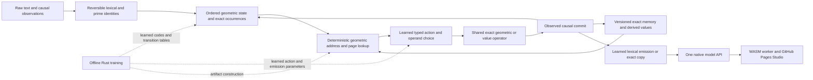

# Geometric language architecture reconciliation — September 2026

**Status:** source and retained-evidence review; owner constraints accepted; next implementation proposed. No training, inference, model benchmark or new mathematical proof was run for this review. The canonical project plan owns subsequent execution. This review answers the owner's explicit request for a broad inventory, including archived and contributor work; it does not make repeated broad audits a prerequisite for ordinary development.

## Decision

Continue the native Rust model as a **learned geometric state machine with exact addressed memory and shared typed operators**. Learn semantic placement and state transitions offline. At serving time, derive access from explicit geometric coordinates and page/address tables, preserve exact occurrence/version references, execute the selected operation and commit its result causally. Develop learned language emission together with those transitions.

The next useful implementation remains the **joint numerical/word/NoRead decision at the existing operator boundary**, followed by a reusable contextual transition and emission mechanism. The current model already performs geometric source choice and dependent value operations, but separate numerical and word entry paths interfere. Correcting that shared decision gives a concrete place to unify computation without another answer-suffix table. It is a first step toward the architecture, not its completion.

Do not start by importing an entire historical model, attaching every mathematical field to every token, building a new proof campaign, or increasing the context window. Each reused mechanism needs an explicit computational role and evidence that it preserves needed information. Some mechanisms belong in construction, indexing, representation or verification rather than every serving step.

## Owner-confirmed constraints

- Rust preparation, learning, artifact construction and inference.
- Prioritize a serving design without transformers, MoE expert banks or learned sparse gating networks. The owner subsequently clarified that expert gates may eventually be necessary: preserve them as a conditional later option, requiring a concrete capability/cost reason before adoption. This review does not adopt an expert architecture now.
- Deterministic geometric address and page-table selection may select bounded work. Learned placement can change the geometry consulted by that fixed access law. Learned typed-action and output selection remain necessary model behavior.
- No serving matrix products, including products implemented through `uor-matmul` lookup/add contraction. Exact finite group composition by table lookup and signed index permutations remain geometric operations, rather than a dense projection evaluated under another name.
- Offline Rust learning may use floating point, gradients and matrix multiplication, including `uor-matmul`, when useful. A teacher may supply declared offline training/comparison evidence; it cannot author a serving response.
- Frontier capability on a consumer M1 is the objective. Current bounded successes do not establish general prose, reasoning, frontier capability or whole-model laptop efficiency.
- After the same model exposes useful language, attention/context use, inference, prose completion, memory and reasoning through a complete API, integrate it into the separately developed GitHub Pages Studio.

These instructions supersede earlier unconditional permission for learned sparse routing and the potentially confusing label “geo-transformer.” The later allowance to consider expert gates is retained explicitly rather than turned into a permanent prohibition. Historical experiments retain their original equations, results and controls.

**Terminology matters in existing source.** `native_geometric/mixture.rs` learns seven feature-group weights; it does not dispatch token traffic to neural experts. `RelationAdmissionMode::Sparse` performs exact signature lookup for previously compiled NoWrite decisions; it is not a learned sparse gating network. Bounded sparse score storage and deterministic posting lookup are data structures. Conversely, the old Hopf/prime MoE experiments really do dispatch to expert FFNs and remain outside the current design; later reconsideration is conditional. Names do not decide compatibility: actual executed operations do.

## Verified implementation and present bottleneck

The reviewed native source is PR #1160 head `05f265ad4736c362aee126f0d555c5e365396939`, based on merged PR #1159 (`be32b4103d8f870f8b1f81057c451a609156172e`). PR #1160 subsequently merged at `aa841309c5b8911bdbbab0609aa15c9aa166ae1b` on September 7 at 02:13:38 UTC; its merged tree is identical to the reviewed head. Live delivery status belongs in the companion receipt. The retained model is `blake3:d59070c29e1cebcb12d25c2fc034083d9631b24ab04da0c57b94a007ad10ea6f`, 11,304,530 JSON bytes, with its exact `e7c14c99` parent reconstructible. The original main checkout's user changes, research files, worktrees, earlier artifacts and negative results remain preserved.

The artifact's base count construction reports 512 documents, 31,992 target positions, 22,221 rows and 131,373 learned associations. It has 611 token geometry entries, a 512-token recent window, 32 baseline candidates, eight fixed u16 zeta channels and a 120-element signed H4 product table. Optional memory/read, exact numerical values, word-copy, relation writes, dependent reads and learned H4 source/action selectors extend that prototype. These are small learned components, not a trained large language model.

The most recent source/NoRead refinement produces 20/20 fresh authored complete answers versus 14/20 for e7 and 10/20 for its matched exact-code continuation. It produces 551/603 combined construction responses versus 545/603, with no lost correct case. All 52 remaining wrong outputs equal their parent outputs. The fresh set uses familiar question forms and changed names, places, numbers and order; it is not a broad language benchmark. Both earlier 16-case computation populations and the listed memory/identifier preservation populations remain correct at their recorded scope. [Exact result and limitations](../../native_geometric_source_noread_1139.md).

The observed next failure is concrete: a supported location answer can be replaced by a retained number because numerical admission runs before source selection. Three earlier identifier prompts also emit numbers. The right source bytes may exist and the word router may work, yet that router never receives the decision. The next intervention should therefore compare legal typed alternatives before any candidate executes. Merely enlarging the source router's code vocabulary cannot repair an upstream bypass.

The larger bottleneck is **reusable learning of contextual roles, transitions and emission**. Current features and small codebooks transfer within useful bounded forms. They do not yet compose unrestricted linguistic meaning, retain arbitrary predicates, or generate novel sustained prose and programs. The model's result stores preserve exact values; finite H4/root summaries alone cannot preserve arbitrary history. A single 120-state root carries fewer than seven bits of state. Additional fields must carry real independent information, not duplicated coordinates of the same root.

## Current native model: what each part actually supplies

Source paths below are under `crates/uor-r4-core/src/native_geometric/` unless otherwise stated. The [older mechanism map](../../native_geometric_mechanism_map_973.md) retains version-specific details; this table identifies the present assembled behavior.

| Part | Actual operation | Useful evidence / missing capability |
|---|---|---|
| `training.rs`, `runtime.rs` | Corpus-selected lexical pieces plus byte fallback; count-fitted addressed conditional scores; greedy candidate emission | Executable source-free text generation. Not a general learned semantic codec or calibrated full-vocabulary language distribution. |
| `anchors.rs`, compiled geometry | Exact H4 product/inverse, signed orientation classes, eight zeta phase channels and exact golden coefficients | Integer/table state updates exist. Fixed geometry is not itself learned meaning. |
| `memory_runtime.rs`, `/4` occurrence reader | Exact retained source occurrences; ordered local H4/phase relationships and deduplicated feature evidence | Reuses useful occurrence composition; the `/5` response-state fits remain regressions. Raw-window values still require exact retention. |
| `source_routing.rs` | Two learned signed-H4 code lanes encode candidate-relative role features; fixed angular-rank table scores legal source/action choices | Bounded learned geometric selection works; current source selection scans up to sixteen retained words plus NoSource. It is not a scalable geometric page directory yet. |
| `role_read.rs`, `word_copy_runtime.rs` | Preserve exact selected occurrence, emit exact bytes, commit on observed matching prediction; bypass rescoring committed bytes | Useful copying and output coordination. Duplicate equal payload bytes do not prove correct duplicate-occurrence attribution. ASCII word records are bounded; arbitrary multilingual source binding is unqualified. |
| `relation.rs`, `relation_training.rs` | Learned NoWrite/assert/revise/contradict with exact participant bytes, current directory and sixteen retained versions | Facts/updates can survive raw-window eviction. Independent predicates, arbitrary relation graphs and broad discourse are not represented. |
| `relation_admission.rs` | Exact writer-signature guard; geometric partition or exact sorted lookup; fallback preserves full writer semantics | Large measured reduction in writer comparisons. The geometric partition did not establish advantage over its exact lookup control. |
| `dependent_read.rs` | Choose one exact relation geometrically, then follow value-to-owner identity into another current record | Real bounded dependent lookup, with version/conflict checks. Not arbitrary graph planning or unlimited hops. |
| `numeral.rs`, `value_runtime.rs`, `typed_routing.rs` | Parse signed integer payloads; learn Copy/Add/NoOperation and operand choice; execute selected exact addition; preserve derivation IDs and emit decimal bytes | Real constructed values and causal intermediates exist. Current numeric/word arbitration interferes; general arithmetic/program synthesis does not follow. |
| `completion_runtime.rs`, `response_entry_runtime.rs` | Learned entry/byte/EOS offers and continuation after committed value or literal NoRead | Bounded answer forms and stops improve. Repeated specialized suffix heads are not a scalable prose architecture. |
| `learned_routing.rs`, `recurrent_routing.rs` | Earlier optional two-channel token-code routing, transported output and two dependent code reads | Implemented development negatives. The retained d590 artifact does **not** contain this optional `learned_routing` block. Do not count it as simultaneously operating in the retained model. |
| `mixture.rs` | Offline gradient fitting of seven feature-group score weights; quantized shifts/additions at serving | Not MoE. Candidate-conditional loss excludes unreachable targets, so report support and free generation separately. |
| `snapshot.rs`, model validation | Model-bound session restore, causal state, recursive artifact lineage | Integrity and reproducibility mechanisms. Identity is not semantic similarity, and checkpoints do not prove useful memory. |
| `src/native_geometric_cli.rs`, `src/native_geometric_service.rs`, API re-export | Same core generates through CLI/loopback service with sessions, cancellation, limits and persistence | Real interface foundation. A complete language/reasoning API requires model capabilities and truthful capability declarations, not endpoint names alone. |

## Architecture assembled from the available mechanisms

The diagram is a proposed integration; it is not a claim that every arrow is already qualified. The same small operator family is reused across tokens and tasks. There is no learned expert dispatcher and no dense transformer hidden behind the directory.

1. **Identity and exact memory.** Use UOR canonical identities, prime/n-let structural addresses and typed occurrence/version references for recoverable payloads. Keep semantic coordinates distinct from identity. Store exact facts and selected intermediates independently of compressed geometric summaries.
2. **Geometric state and fibers.** Keep ordered signed H4 transport, exact golden coefficients and relative fixed-zeta phases. Treat S3 → S2 as Hopf observation with an S1 fiber; an S2 angle readout is a further projection, not an invertible chain. Local sections, chart transitions and connections describe how states relate across frames. The Hopf principal S1 bundle is distinct from an associated vector bundle: declare the base, carried vector representation, local section and transition/connection maps before claiming a particular vector-bundle implementation. Reuse the trigonometric/chart and vector-calculus source for offline construction, and finite transport/permutation tables in serving. Add explicit Hopf/fiber/torsion or independent paired-H4 state only where a task needs the information and its update law is defined. Hopf projection is an observation, not a substitute for the complete signed state.
3. **Access.** Use fixed coordinate-to-address or page-table rules over learned placement. Retain exact references inside cells. Page overflow, collisions and missing support need explicit bounded rules; a geometry-only key may not silently merge unequal records. Reuse packed graph-runtime address/layout techniques without assuming R4G1 already encodes the new model.
4. **Contextual transition and selected computation.** Learn shared role/state/action tables against actual hard execution. Begin with the existing exact Read/Copy/Add/NoRead/Emit/EOS semantics. Reuse exact H4 products and signed SpiralCore actions where their typed input/output bridge is defined. Rotations/permutations alone do not create nonlinear semantic computation; the learned state-dependent choice and update must supply it.
5. **Language learning and emission.** Train raw causal text and short compositions together. Represent both copying and constructing outputs, including tokens not retained in memory. Use the current lexical/byte codec first; score candidate coverage and failure to admit the correct continuation separately from selection accuracy. Avoid whole-answer lookup keys and task-specific question parsers.
6. **Offline learning.** Reuse current Rust count/gradient/discrete-code fitting and source-bound artifacts. The earlier dense softmax successes offer curricula, losses and role-binding diagnostics. Train against the exported hard/table behavior; a soft-training advantage that disappears under hard execution is not a deployed result. No larger model campaign is justified before an observed scaling projection.
7. **Serving and product.** Keep one core artifact/session API across CLI, local service and eventual WASM worker. Reuse validated packed tables, preallocation and immutable artifact references. The Studio should render the exact response from that model and declare artifact/backend identity. Pages hosting supplies static assets; browser-local inference requires a real WASM-compatible model path.

## Best next step and its acceptance

Implement one shared typed choice before numerical or word execution. It should enumerate legal metadata alternatives from existing retained records: numerical Copy/Add/NoOperation, exact source Read, and NoRead. Compare them using the existing learned geometric code/landmark machinery with explicit action domains and common selection semantics. Only the winner gathers/executes a payload. Keep NoOperation (no numerical operation) distinct from NoRead (no selected supported source); neither implies a universal Unknown response. Preserve exact provenance and observation-only commit. The design must account for incompatible score scales; independently trained scores cannot simply be concatenated and called a joint decision.

Start from the actual numeric-versus-location and numeric-versus-identifier failures. Use raw-text construction contrasts with numbers, words, missing attributes, reversed order, changed role names, and required derived intermediates. Couple the choice to complete answer generation. Include short causal composition and local prose continuations so the work advances language behavior, while preserving the d590 source/NoRead successes and computed roles. Use the existing example driver and reports; no new benchmark framework is required.

After that decision works, the next meaningful architecture increment is a shared learned contextual transition/emission table that uses exact selected records and state, rather than another special completion head. The earlier two-token/120-state residual and recurrent-code negatives explain why recovering exact source/role identity must precede another code-only generalization attempt. A scalable geometric page directory follows a measured access bottleneck; the current sixteen-record scans alone do not justify a paging subsystem.

Acceptance needs complete generated bytes and EOS, correct intermediate identities and dependent use, preservation per case, a matched exact-address/code comparator, and counted end-to-end work. Measure compile/load/encoding, observations, directory traversal, code lookup, comparisons, selected operators, writes, output and checkpoint costs. A geometrically correct route with missing output support is not an attention success; cheap wrong output is not an efficiency result.

**Preliminary resource requirement, not execution admission:** one local model process; one build job reusing the existing cache; 512-token context and existing sixteen-record stores; reuse the 603 construction cases and frozen preservation material; one geometric candidate and one matched control. A conservative initial envelope is 300 seconds of model work, 900 seconds engineering, 256 MiB new retained storage and 4 GiB model-child RSS, with a 128 MiB storage margin. The latest shared ledger has 564.374 seconds remaining. This proposal must be refreshed against live cache/storage and converted into the project's cumulative run projection before a fit; it is not permission to silently exceed the remaining budget. No model work was launched in this review.

## Options considered and consequences

| Direction | Benefit from existing work | Main limitation | Decision |
|---|---|---|---|
| Native geometric state, exact addressed memory, shared learned operators | Already executes causal learned source/value decisions without serving matrices; reuses strongest exact state and provenance | Small feature/code capacity, incomplete role generalization and prose, interference across entry decisions | Primary development path |
| Convert the working R4 softmax reference wholesale | Stronger existing raw continuation and useful learning/transport reference | Dense projections, attention and output products remain; no demonstrated faithful cheap whole-model lowering | Offline reference and curriculum source |
| Restart from an angular/prime or contributor model | Useful coordinate charts, state layouts, finite operators and page lifecycle | Whole engines include dense/expert operations, template answers or unqualified semantics | Adapt concrete pieces with exact attribution; no wholesale replacement |
| Geometric model with expert gates later | Could specialize computation if a demonstrated task needs it | Learning path, expert semantics, duplication, dispatch overhead and laptop cost must be measured | Preserve as a conditional option under the owner's latest steering |
| Rebuild all geometry/proofs/paging before language learning | Broad structural coverage | Does not resolve the observed selection/learning gap; delays decision-bearing behavior | Keep supporting work tied to a named implementation need |

Consequences: the model must learn useful state transitions and outputs rather than rely on geometry names, exact addresses or source-copy success alone. Keeping exact memory makes collision handling and causal reasoning possible, but brings explicit storage, eviction and version costs. Finite tables are attractive only while their working set and training search remain bounded; combining every coordinate by a Cartesian-product table would defeat the laptop objective. The next implementation must measure these costs as well as answer correctness.

Follow-through: implement the joint typed decision, then learn reusable contextual transitions and emission; introduce geometric pages when measured access growth requires them; qualify one capability API; finally connect the same accepted artifact to the Studio. The broad report is available for reuse and should not become a recurring process gate.

## Capability/API sequence toward the Studio

| Capability | Already available | Required before calling it complete |
|---|---|---|
| Load, encode/decode, session step, generation | Native artifact loader, tokenizer, observe/predict, CLI/service | Stable capability manifest, error/limit semantics, truthful backend identity |
| Attention/context use | Learned geometric exact-source choice and bounded dependent reads | Broader role/context transfer with causal controls and adequate support |
| Memory | Exact versions, updates/conflicts, eviction behavior, snapshots | Multiple predicates, longer useful retention, isolation/export/forget at product scope |
| Prose completion | Finite count predictor and learned small completion tables | Sustained new prose, coherence, grounded response behavior and calibrated abstention |
| Reasoning | Selected exact addition, copied identifiers and bounded two-link retrieval | Multiple learned operations, independent intermediate choice, novel composition and task correctness |
| Coding | Familiar Rust forms with retained identifiers and checked bounded examples | Novel function construction, compilation plus meaningful semantic tests, repair from feedback |
| Browser/Studio | Existing UI, workers, streaming/display and persistence mechanisms | Same native model lowered to WASM, real output, measured browser memory/latency and no provider/template substitution |

“Attention,” “reasoning” and “completion” are model behaviors. An API can expose their inputs/outputs and work traces, but adding methods cannot supply the absent capability. Preserve a single model identity across surfaces and qualify the actual generated result.

## Review scope, evidence and preservation

The local companion `tracked-source-inventory.json` lists every tracked path by Git blob and size. A compact [source inventory](source-inventory.json) binds repository source entries referenced by these reports. Detailed supplements cover [mathematics, fibers and RH](mathematics.md), [dependencies and contributors](imports.md), and [historical engines and Studio](engines.md). The review searches all tracked text families and inspects source owners, tests and retained records for the mechanisms discussed. It does not assert a line-by-line audit of all 14,288 paths, revalidation of every theorem, execution of every test, or interpretation of every image/PDF. Unresolved source identification and missing bridges are explicitly listed in the supplements.

All old fits, negative results, source imports and user changes remain. No model run was repeated, no storage cleanup occurred, and the cumulative model-time ledger was unchanged. Reports use the existing project knowledge import mechanism so a later agent can recover source, scope and proposed use without treating an old claim as current authority.
