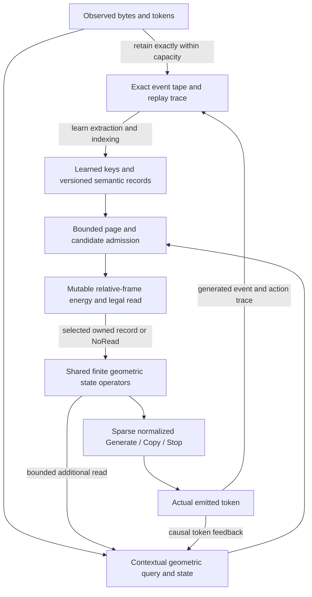

# Principal investigation and complete geometric-attention programme

2026-09-24 · UOR-R4 Geometric Language Model · References #820

**Outcome: a proposed integrated research and engineering plan, not a new trained model.** The recommendation is one learned, transformerless sequence model with **exact event memory, learned geometric candidate admission, a mutable discrete energy over selected records, shared finite geometric state operators, and a sparse normalized language head**. Develop the ordinary and geometric versions together under one end-to-end language/memory/code objective. The present RNN is a frozen control and an interim learning scaffold; the rejected exact-pair gate is not the next architecture.

This plan preserves D0-b and D4–D6. It changes the recommended unit of work from another isolated gate to a complete model. No new policy is ratified here, no earlier failure is relabeled, and no geometric, language, frontier or energy advantage is claimed. Proposed mechanisms and numerical design budgets below remain unimplemented until a later development milestone.

## 1. Investigation boundary and authority

The source checkpoint is `3101c06061726d9438a22649a25b98558525e8d0`; refreshed protected main is `552d847d49fb263966165004b835f2f53cccaae1`. PRs #1380–#1384 are an open stack at review time. The original owner checkout is intentionally dirty and was preserved. This review used its relevant untracked research notes read-only, the clean full worktree, live GitHub, current source and result records, the UOR knowledge MCP, historical GitNexus discovery, relevant local skills, and primary external research. Available GitNexus indexes date to September 3; they are not current-source authority.

There are **15,286 tracked paths and 1,181 commits reachable from the reviewed head**; imported history is separately preserved on archive refs. We inventoried the repository by mechanism family, recovered the historical programme through the source audits and Git history, and re-inspected the decision-bearing current and dormant source. We do **not** claim every archive line, every external theorem, every LFS payload or every historical model run was independently verified. Historical reports remain evidence at their pinned scope; no training or model replay was performed for this plan.

The common [review contract](principal-attention-review-packet-2026-09-24.md) gave all experts the whole-project goal, source checkpoint and evidence boundaries. The [mathematics report](principal-attention-mathematics-2026-09-24.md), [computer-science/frontier report](principal-attention-computer-science-2026-09-24.md) and [engineering/development report](principal-attention-engineering-2026-09-24.md) contain source ranges, derivations, alternatives, primary literature and cross-review corrections. Their recommendations were challenged and reconciled in this synthesis; agreement between agents is not experimental evidence.

## 2. What happened, and what is actually available

| Programme era / family | Surviving mechanism | What its result does and does not establish |
| --- | --- | --- |
| Original angular, Hopf, prime and hyperbolic routers; June/July archives | Partitioning, ordered transport, locality, identity-scoped retrieval, state telemetry | Much of the early work used PPMI/SVD proxies, Markov counts, dense Transformers or experts. Query/store coordinate mismatch and non-learning hard gates affected some comparisons. Preserve topology and layout ideas; do not inherit language or energy claims. |
| July/August TLA/TLS1 and R4G1 compiler/runtime | Packed validated formats, table lowering, integer signature routing, bounded scratch, operation accounting, independent replay | Real execution machinery. Compiling a teacher or passing a kernel contract did not yield a generally useful native language model. Dormant modules and stubs are explicitly distinguished in `model/ledger.toml`. |
| August prime-route attention and recursive state | Prime/UOR identity, ordered n-lets, finite 2I/H4 products, zeta phases, signed spin/fiber/torsion, causal prefix witnesses | Real causal attention interfaces exist. `prime_route_geometric_attention.rs:1318` admits last-one/last-two/sentence/divisor postings before geometric ranking. A fixed admission rule restricts what geometry can retrieve. Prefix-state vectors grow with history; a single group product does not retain that history. |
| R4/Spin, HELM-D and other dense references | Learned keys/values, causal attention, role binding, training and parity lessons | Some genuine bounded narrative/binding results survive. Their dense Q/K/V, softmax, readouts and numerical training paths are references, not the target runtime. The 13M capacity run stopped on projected resources; that is not a model-quality rejection. |
| Retained native exact memory and typed operators | Occurrences, versioned relations, provenance, Copy/Add, dependent reads, Read/Apply/Emit/Stop, restore and eviction semantics | Strong reusable correctness work and bounded authored behaviors. These do not compose automatically into the newer natural-text artifact. Supplied roles, keys, flags and syntax must not be mistaken for learned raw-text understanding. |
| TinyStories `.rgm` learner | Rust corpus training, root assignment, JEPA/lexical objectives, VSA/lattice/lane tables, binary export and generation | Large recorded training relative to the later small experiments, but training, full-vocabulary evaluation and routed generation use different scorers. Corrected candidate recall remains about 10.7–11.2% on two Dev slices. Generation is repetitive; parts of the serving path have variable integer multiplies/16-bit terms. This is not a compliant integrated artifact to promote. |
| September addressed prior and transferable lexical model | Consistent local prediction, low-bit training, exact emitted-token feedback, Generate/Copy/Stop, compiled execution | The best current natural-text path is a 64-dimensional ordinary integer RNN. Frozen-state adjudication adds only **0.022 bits** beyond an order-two count prior on the measured population. It is not a geometric language predictor. |
| September 24 memory bridge and sparse gate | KVAR learned overwrite memory; selected exact records can reach the loaded lexical decoder; gate fit/export/reload and causal source edits | KVAR proves a synthetic memory mechanism. The Q8 residual fails its narrower geometry gate; full original `(f)/(h)` remains unrun. Caller-addressed copying works. The learned metadata gate scores prose **319 vs recent cache 323**, Rust **674 vs 675**, and nearly always follows recent. Its eight continuations do not reproduce the exact targets and observed text is poor. It does not learn semantic addresses or useful content-conditioned prose. |

Further preserved mechanisms were included in the decision, not forgotten:

| Mechanism | Place in the new programme |
| --- | --- |
| Prime addresses, canonical UOR identity, ordered n-lets | Identity, provenance, deduplication and ordered relations. Preserve order explicitly; multiplying primes alone loses order. Numeric prime/hash proximity is not a semantic metric. |
| Fixed zeta phases | Artifact-bound optional phase features, precomputed offline. Compare to equal-bandwidth ordinary phase bases; fixed zeros do not require a proof of RH. They do not supply lexical meaning by themselves. |
| R4/S3, signed Q8 and 2I/H4 | Primary experimental representation for local frame, relation and shared state actions. Retain full signed orientation and directed relative elements. Do not conflate the 120-element quaternion group with the whole H4 reflection group. |
| Exact `Z[phi]`, paired-H4/icosian construction | Exact finite geometry and artifact identities. Keep the actual golden/Galois coupling and inverse witness; a second independent latent quaternion is not automatically that construction. |
| Hopf, S7/E8, harmonics, spectral/VSA memory | Conditional richer summaries, product codes or routing proposals. Preserve fiber/radius where relevant; finite sampled modes and superposition have interference. Use after an observed representational need, with the same exact memory beneath them. |
| Packed route attention and MSA selector | Reuse bounded scratch, table access and census where appropriate. Packed route attention has no production serving caller; the MSA selector has no query argument. Neither is a latent complete attention model. |
| Bott–Fock, Cayley–Dickson, Lie–Jordan, endomorphism, tropical paths, holographic/FMM and quantum-cover families | Preserve scoped source/results. They supply conditional algebra, compressed summaries or planning operators, not a reason to add every term to the score. Some are dormant negatives, some untested, some floating reference code. |
| Bounded planner and typed operator registry | Later learned Read/Apply/Verify/Emit composition. Reuse existing precondition/effect/decline/witness semantics. A supplied operator sequence or fixed hop schedule is not learned reasoning. |
| W33, NEMESIS, SpiralCore/FBS, GoldSnnail | Donors for finite actions, persistent pages, ancestry, state/action/observable separation and explicit incomplete routes. Their imported claims are not native model results; several need missing semantic maps or have known arithmetic/control defects. |
| APIs, Studio, graph service and native capability service | Delivery surfaces to connect after the single native artifact works. Historical provider/dense/canned paths and stale `QUALIFIED` labels must not author or qualify the new native result. |

The [September source audit](architecture-2026-09/README.md), [engine inventory](architecture-2026-09/engines.md), [import audit](architecture-2026-09/imports.md), [mathematics audit](architecture-2026-09/mathematics.md) and [September 13 research synthesis](geometric-attention-research-2026-09/README.md) retain deeper history and exact references. The important correction is **integration**: the repository contains many of the ingredients, but not one artifact with all of their useful behaviors.

## 3. Diagnosis from the complete path

The persistent failure is a broken or too narrow learned information path:

`observed text → useful contextual identity/role → memory admission → useful source → state change → appropriate new words`.

Repeated work has often strengthened only one arrow while other arrows remained fixed, supplied by an oracle/caller, or limited to a tiny representation. Some older geometric scores only break count ties. The recent source gate sees age/hits/conflicts, not enough content or role information. The frozen RNN remains a weak local generator even when a correct copied token is injected. More tests cannot supply missing information or a joint learning objective.

There is also a programme-level failure mode: each component result creates another tiny acceptance task, without requiring a single model to carry all capabilities to complete output. Earlier syntheses already recommended contextual retrieval and shared updates. This plan's substantive change is to make **joint training, geometric admission, sparse transition and normalized output part of one deliverable**, with one final integrated decision. Focused correctness checks support that deliverable; they do not become successive substitute goals.

Two important distinctions prevent overreaction. A finite failed Q8 residual does not refute a learned geometric architecture that changes admission and state. Conversely, many exact geometry identities do not show that the model has learned language. The current full step scans **611,814 packed parameter slots** for **153,052 nonzero terms**. Compiling nonzero terms improves implementation cost but still visits the learned output store; D5 remains unresolved. These are source-derived counts, not measured bytes from DRAM or energy.

## 4. What exact memory and Hamiltonian can mean here

### Exact history needs storage

For a vocabulary of size `V`, there are `V^N` arbitrary length-`N` sequences. A `B`-bit state has at most `2^B` values. Exact recovery of every such sequence therefore requires `B ≥ N log2 V`, before provenance or keys. A bijection conditioned on the input token does not remove this bound: inversion that requires the lost input is not recovery of it. Compressible real data may need less average storage, but a universal exact promise cannot assume compressibility.

One 120-valued root carries at most about 6.91 bits. An ordered tuple of `L` roots has up to `120^L` configurations; folding it to one group product again has at most 120. Retaining every prefix product consumes growing storage and still needs exact token identity if token-to-root assignments collide.

Thus **record every observed event within a declared retained-history budget**, independently of the learned semantic write gate. Keep raw bytes/token IDs, order, source and version changes in an append-only tape with checkpoint/replay. Learn what derived records and search indexes to maintain over it. A missed semantic write must not silently erase the raw observation. When retention is exhausted, checkpoint/declare unavailable history under policy; do not promise infinite exact memory on a finite laptop.

Transformers also do not exactly remember every computational step through “recursion.” Autoregressive generation repeats a model step; causal attention reads retained contextual representations, often through a growing KV cache. We want its useful content access without importing the Transformer backbone or its dense arithmetic. [Original Transformer](https://arxiv.org/abs/1706.03762).

### Three different Hamilton concepts

1. **Hamilton product:** quaternion multiplication; useful for directed noncommutative frame composition. Finite Q8/2I tables are cheap exact implementations of restricted products.
2. **Discrete Hamiltonian:** an energy function on a configuration, such as unary/pairwise compatibility factors over a query and memory. It can change when events are added or revised. This is the recommended first interpretation.
3. **Hamiltonian flow:** canonical/symplectic dynamics such as `dot z = J grad H`. Conservation/reversibility requires the actual hypotheses and numerical method; input injection, forgetting and version writes are separate operations. A score called energy is not proof of such a flow. [Hamiltonian Neural Networks](https://arxiv.org/abs/1906.01563).

Conservative flow alone is a poor match for selective overwrite. A valid reversible local operator may later help stable state propagation, but it is not the exact memory store. Nor does mathematical Hamiltonian energy measure electrical joules.

## 5. Proposed model, from bytes to output

Proposed architecture; every learned decision is part of one artifact. [Editable diagram](principal-attention-flow-2026-09-24.mmd) and [canonical source](principal-attention-flow-2026-09-24.json).

### 5.1 Exact tape and derived semantic memory

Each raw observed event has an immutable event ID, exact bytes/token range, source/turn and order. Derived semantic records and an action log add commit/version, parent links, learned key/value descriptors, scope/entity/relation proposals and geometric codes. Exact current/previous/initial authority is determined by commit semantics, not geometric similarity or parse score. That authority is conditional on the model having bound the right entity/relation: a wrong learned key remains a model error. Preserve `Absent`, `NoHistory`, `Evicted`, unresolved search and conflict as distinct outcomes.

Use the existing `scoped_memory` identity/ownership/version rules and native occurrence interfaces as the behavioral contract. Use immutable chunked pages and bounded indexes rather than cloning all state or storing every pairwise edge. Bind the action/selected-record/operator trace, random seed and draw counter, model/kernel version and checkpoints so every declared processing step can be reconstructed exactly by replay. Log nondeterministic choices; budget trace and checkpoint bytes. Model changes invalidate learned indexes unless their schema/codebook is unchanged. Pin live sessions to the old model or perform an audited migration: replay through a new binder can change semantic records, not merely their page labels.

### 5.2 Learned product geometry and candidate admission

Let `G = 2I`, the implemented 120-element unit-quaternion group. A contextual key is a tuple `g_i ∈ G^L`, not a single collapsed root. A query `q_t ∈ G^L` is learned from the causal input and current state. Exact IDs remain separate. Start with a small number of lanes and explicitly coupled neighboring lanes; do not allocate the full Cartesian table `120^L`.

A deterministic bounded search over **learned geometric codes** selects a few product-code pages, merged with exact typed postings and a recent-event tier. Shared table operators compute the code and scores; no independent expert network is loaded for a page. Use geometry here, **before final candidate ranking**, so it can affect whether distant relevant content is reachable. The ordinary branch uses competent learned categorical/product codes or an LSH-like index with the same observations and measured work.

A concrete first encoder can score each of the 120 possible actions per lane by adding a selected token row, a selected current-lane row, a selected neighboring-lane row and a typed query/key/operator row. Each selected row has 120 low-bit coefficients; argmax selects the action. With 16 lanes this example reads `16 × 120 × 4 = 7,680` coefficients per encoder invocation, not every stored parameter. A token table with 4,096 token IDs and 16 lanes contains `4,096 × 16 × 120 = 7,864,320` coefficients (3.75 MiB packed at four bits). This is a concrete starting hypothesis, not evidence that additive logits are expressive enough. Exact token IDs select independent learned rows; token-to-root modulo assignment must not merge lexical identity. Shared token rows can feed key/query/operator selectors through distinct typed rows, with every invocation charged. Couple lanes through subsequent selected actions; if that representation fails, replace the identified factorization rather than silently adding a dense encoder.

At prediction step `t`, the selected token row uses only an already observed/emitted prefix token; the target token being scored is unavailable. During Rust training, the hard selected action remains the forward state. Use a declared softmax/straight-through relaxation over this small 120-way action set for credit, and supervised relevant-source contrast coupling the query and stored-key codes; both are offline training devices. A missed posting does not acquire a useful gradient from straight-through selection alone. Track action occupancy, hard-versus-relaxed loss and actual bounded-index recall. Deterministic product-prefix pages can consume the learned codes first, with alternate prefixes generated from their action-score margins. Cap enumeration at 32 proposed code combinations, deduplicate probes, and visit at most four pages per read; count enumeration and failed lookups as work. Never enumerate the Cartesian `120^L` space. This avoids assuming a second unexplained page-routing network. A more general learned page selector is an alternative only if it has a specified hard forward path, training signal and access budget. Stored-key versions must follow encoder versions.

Cap pages visited, entries examined, candidates retained and read rounds. A fixed budget cannot guarantee the best match for arbitrary collisions. Retaining a fact, admitting it and selecting it are three different measurements. Index overflow goes to explicit spill/maintenance handling and produces a truthful search status; an unfollowed page or truncated list is not proof of absence.

### 5.3 Mutable relative-frame energy

For a candidate event `i` and lane `l`, define

`r_(i,l) = (q_(t,l) · a_(t,l))^(-1) · g_(i,l)`.

Here `a_(t,l)` is a learned action in the query's **local** frame. Under a common left frame change `q→h q`, `g→h g`, with the local action unchanged, the relative element is unchanged. The query/key encoders must transform jointly and the local-action selector must respect that convention; finite table closure alone does not enforce whole-model equivariance. If an action is instead stored in a global frame it must transform appropriately; do not mix conventions.

An initial bounded energy is

`E_t(i) = b(metadata_i, state_t) + Σ_l w_l[r_(i,l)] + Σ_(l,m in E) J_lm[r_(i,l), r_(i,m)]`.

`E` is a sparse lane-coupling graph. `w` and `J` are learned signed, at-most-four-bit table coefficients with declared power-of-two scales. Restrict `b` to a bounded selected typed/status row and a few declared state features; its interface must not conceal an arbitrary dense state map. Serving reads one selected entry per factor and adds the results. This has **factor order two in one-hot relative-code variables**; it is not a claim of a quadratic polynomial in real quaternion coordinates. Retain full directed relative elements initially; a conjugacy-class-only kernel can erase relevant distinctions.

Appending/revising memory changes the available factors and legal version views; observations change the query. That is an operationally mutable discrete Hamiltonian with frozen learned weights. There is no required online gradient descent or physical simulation. Read the lowest-energy legal candidate or `NoRead`, then update state and, if needed, form a new query. Multiple reads compose through the shared state; the model receives no gold hop count. Bound the number of silent reads and preserve unresolved outcomes.

For `K` admitted candidates, `L` lanes and `F` pair factors, one read costs `O(K(L+F))` energy accesses. No all-pairs event graph or full-history energy scan is implicit. Bounded retrieval approximates global search; it is exact only within the admitted candidate set. This may become useful geometric attention, but the equations alone do not establish learning, novelty or predictive advantage.

### 5.4 Shared geometric state transition

The terminal candidate is a product of finite signed geometric lanes plus bounded integer residual/state fields where needed. A learned selector reads a few rows of shared low-bit tables using current lane codes, neighboring lanes, the observed/emitted token and selected record. It selects finite actions and bounded residual updates. Group composition, inverses, signed permutations, additions, shifts and table reads execute them. Coupled selection is nonlinear; no all-parameter dense transition is hidden in the term “operator.”

Train an equally informed ordinary selected-table transition at the same time. Keep the present D0-b RNN as a frozen control and optional diagnostic branch in the same training/evaluation harness. Its presence does not qualify a candidate as D5-compliant. All published candidate output must name which transition actually ran. Sparse geometry cannot be promoted merely because it uses fewer operations if it loses required behavior.

Q8 is a useful cheap action subset, but arbitrary 2I quaternion actions on unrestricted integer vectors are not automatically signed permutations. Use exact finite state-ID tables, a declared exact `Z[phi]` action with bounded coefficients, or an explicitly evaluated quantized lowering. Do not generalize Q8's L1-distance invariance to all orthogonal transforms. Shared rotations of both query and keys alone do not improve their dot-product ranking.

For the initial candidate, full `2I` relative IDs index the energy while state transport uses exact finite `2I` ID composition; Q8 signed permutations are used only on separately typed integer-vector fields after binding the Q8-to-2I embedding. An arbitrary `2I→Q8` reduction would not inherit a homomorphism or full equivariance claim. Precompute and artifact-bind the exact group tables: the existing `group_table.rs` lazily initializes via floating products on first use and must not be invoked inside a declared float-free request path. Structural state/operator IDs can require seven or more bits; the four-bit limit applies to learned numerical coefficients, not to identifiers or exact payloads.

### 5.5 Sparse normalized language and action output

Train a hierarchical vocabulary distribution together with `Generate`, `Copy` and `Stop`. Each internal node uses selected shared low-bit logit rows and a fixed, artifact-bound probability/CDF lookup; the CDF is a numerical lowering table, not a new store of arbitrary higher-bit learned weights. Complementary integer branch probabilities preserve normalization and positive token support. A conditioned legal-mode table renormalizes when Copy is unavailable, retaining legal Generate/Stop support. Source copying remains an owned pointer/cursor action, and the actual emitted token feeds back into the same state.

For a generated token `v`, `P(v|Generate,h)` is the product of its path conditionals. Training/scoring can evaluate that path without scanning every vocabulary row. Serving can sample each branch from an integer random threshold; no floating softmax is required. Greedy branch descent is **not** guaranteed global MAP; bounded beam is an approximate decoder with separately counted work. Exact global argmax can require much wider traversal.

If Copy and Generate emit the same surface token, token likelihood must sum their probabilities. Over a sequence, different action choices can lead to different cursor/state trajectories, potentially requiring exponentially many compatible paths. **Milestone A therefore reports action-labelled CE for Copy-enabled runs and exact token NLL only on an explicitly declared NoCopy branch or a tractable exactly marginalized panel.** NoCopy is a distinct ablation, not the likelihood of the Copy-enabled generator. Approximate beam/particle marginalization must be labeled as such. Complete Copy-enabled generation is assessed through the task outputs as well. A shortlist normalized only over admitted tokens also cannot claim full-vocabulary likelihood. [Hierarchical probabilistic language models](https://proceedings.mlr.press/r5/morin05a.html), [adaptive output clustering](https://proceedings.mlr.press/v70/grave17a.html).

## 6. The learning programme is as important as the geometry

One versioned Rust trainer must own the causal forward path for code formation, semantic writes, page admission, read selection, state update, output and emitted-token feedback. Bind data, tokenizer, geometry, parameter bytes, quantization, output tree and state schema to one loadable bundle. Exact raw-tape capture is deterministic infrastructure; the semantic writes and decisions above it are learned.

Specify the gradient estimator and sparse access for **raw token→key/query code, page selector, operator selector and every output-tree node**, not only the energy. These are the likely places where a hidden dense encoder or a non-learning hard choice would re-enter. Their parameter rows, numerical operations and bytes are part of the same hard-forward trace.

Use permitted offline floating training and differentiable relaxations where helpful, but evaluate the **actual hard exported path throughout**. Straight-through gradients are estimators; hard forward alone does not solve credit assignment. The prior hard-selection KVAR failures argue against relying on an unexamined train-soft/serve-hard transition.

The shared objective should include:

- ordinary source-separated prose/code likelihood, with a declared normalized distribution;
- source-grounded query/key and page-admission supervision, including hard same-role/wrong-version distractors;
- read/write and scope/rebinding decisions trained from observed text, not caller-supplied gold semantic fields;
- counterfactual downstream loss when a relevant source changes or reading is disabled;
- joint Generate/Copy/Stop and post-copy continuation, with actual emitted-token identity;
- a charged access/overflow budget, with code utilization and hard-serving recall visible.

A wider search or positive-source insertion can provide **training-only** credit to a missed page. Its usefulness must be judged on the bounded hard index without inserted targets. Cache/codebook versions must stay synchronized; train encoders and stored keys consistently. Track where information fails: extraction, write, retention, admission, ranking, state use or lexical emission. Diagnose the failing interface rather than sweep unrelated geometric dimensions.

Use raw text episodes containing names, corrections, definitions, functions, repeated identifiers, source conflicts and variable-length dependencies. Training-only span/relation annotations may supervise learning; they must not enter serving features. Controlled random worlds verify the D6 count-at-chance condition; natural prose and code are separate companions, where chance must not be asserted by construction. Split by source/document/repository family and near-duplicate groups, not adjacent windows. Existing project reports and previously used books are exposed development material.

## 7. Alternatives considered and why this route leads

| Route | Strong reason to pursue it | Decisive current limitation / disposition |
| --- | --- | --- |
| **Exact events + learned sparse geometric access + shared operator state + language head** | Meets the exact-storage requirement, makes geometry affect access and computation, gives D5 an architectural route, reuses much of the repository | Joint discrete learning and language quality remain open. Highest-priority integrated experiment. |
| Pure low-bit RNN/SSM or gated delta memory | Strong published language precedents and simpler training | Finite compressed state cannot guarantee arbitrary exact history; published kernels and projections do not automatically satisfy D5. Keep as serious controls and possible statistical state components. |
| Pure conservative/reversible Hamiltonian state | Structured stable dynamics, exact finite transforms, potential compositional bias | Does not supply selection, learned meaning, overwrite or unbounded memory. Keep as a conditional state operator, not the sole memory strategy. |
| Harmonic/VSA/holographic superposition | Compact approximate retrieval and broad associations; bitwise implementations can be cheap | Interference and retrieval capacity; geometry or orthogonality is not an exact record store. Candidate-generation option when the primary index shows a measured need. |
| Revive fixed prime-route/radial score or enlarge H4/E8 alone | Existing code and elegant structure | Fixed support, identity-derived distances and representation collisions remain. Revive its interfaces and finite actions; do not repeat unchanged failed scorers. |

Recent research supports separating compressed state from more exact access. Gated DeltaNet provides a useful learned-update precedent; Titans/ATLAS investigate memory management; Kimi Linear and HOLA combine compressed state with other access. **ARM, posted September 21, 2026**, directly studies learned memory routing. These are relevant precedents, not ready compliant replacements: the published designs use floating operations and often Transformers; fixed blended slots do not guarantee exact historical values. MatMul-free LM and T-MAC show useful low-bit execution techniques but do not establish terminal sparse access. The [CS literature table](principal-attention-computer-science-2026-09-24.md) records primary papers, actual-source limits and transfer boundaries.

There is no defensible claim that this is the first energy-based, geometric, routed-memory or multiplier-free model. A possible contribution is the **integrated** exact versioned memory, learned relative geometry and sparse integer language path at demonstrated quality/cost. That remains a research hypothesis.

## 8. Complete roadmap and acceptance decisions

### Milestone A — one end-to-end attention-language artifact

This is the next development milestone, with four jointly required work packages, not four separate capability claims:

1. **Causal model contract and reusable memory adapter.** One `observe/step/snapshot/restore` spine, raw tape, exact record ownership, indexed views, loaded artifact identity and per-token access counters. Reuse `scoped_memory`, occurrence/snapshot contracts and packed scratch patterns. No parallel product backend.
2. **Joint sparse ordinary/geometric learner.** Implement contextual product keys, page admission, mutable relative energy, selected shared transition rows and learned semantic writes. Train ordinary and geometric arms on the same episodes from the start. D4 is a promotion criterion, not a prohibition on investigating geometry before a local cache succeeds.
3. **Sparse complete language output.** Train the normalized tree and Generate/Copy/Stop, source-conditioned uncopied output and cross-window state on that same forward path. Keep the old RNN as a named control; no hidden fallback output.
4. **One frozen integrated evaluation and decision.** Fresh source-separated prose, memory dialogue and small Rust tasks; complete loaded generations, source edits, read-disabled and missing/scope/history controls; exact arithmetic/serialization contracts; cost accounting. Use actual execution for code and semantic answer membership for grounded questions. Exact agreement with one prose continuation is not the language-quality criterion.

The expected deliverable is a model that can read a small unfamiliar document/code context, remember a correction, retrieve the right earlier occurrence, derive a simple consequence, and generate an appropriate complete answer—including words absent from the selected span. It is a limited capability milestone, not general chat or LLM replacement.

**Acceptance must be frozen before the fresh draw.** Preserve existing exact-memory/causality contracts. The new protocol must specify numerical effect sizes using only Fit/Tune/control variability, then freeze all thresholds and denominators. Required outcomes are: reliable raw-history replay inside capacity; useful held-out learned access beyond exact-pair/recency and count controls; complete generated-task improvement over NoRead; no unacceptable ordinary-language regression; and reported hard access/bytes. Geometry promotion additionally needs a same-information and capacity/work-matched ordinary comparison, with a source/transport intervention that explains its contribution. Do not relabel a tie or expose-then-retune result as a geometry win.

**No fixed retry quota.** Development may diagnose and correct real failures within a recorded budget. Each continued attempt must change the failed assumption/interface and return to the whole-model endpoint. If oracle-correct retrieval cannot help output, work on state/output learning. If useful records never enter candidates, work on key/admission learning. If geometry loses while an ordinary path works, retain the learned memory-language advance and keep the exact geometric hypothesis scoped. Stop unchanged threshold/fixture tuning. No new standalone benchmark framework is required.

### Milestone B — compositional attention and useful sessions

Extend the same artifact to longer and variable read depth, aliases, corrections, nested scope, unfamiliar identifiers and mixed prose/code. Train Read/Apply/Emit/Stop from actual consequences with no supplied hop schedule. Existing typed arithmetic and bounded planning can execute selected operations. Require unseen compositions and complete sessions, including content-dependent depth and changed-source/read-disabled behavior. Restore exact history across process boundaries. General conversation and small executed coding tasks become promotion endpoints; retained authored fixtures remain regression evidence, not the capability definition.

### Milestone C — scale quality without losing sparse access

Increase data diversity and model capacity only after measuring a learning curve and bytes touched per token. Scale **stored capacity** through product-code pages/shared parameter tables while capping the active work. Compare the sparse geometry route, ordinary sparse route and interim dense D0-b route on identical data. Track candidate recall, parameter utilization, rare-token loss, training/serving gap, sequence quality and the quality-versus-access frontier. A larger codebook that is never read is not useful capacity; sparse access that destroys learning is not an efficient model.

Start with local licensed/source-permitted text and code; fit throughput must determine feasible corpus/model size. There is no evidence supporting a promise that frontier-scale training will fit the present laptop budget. External training or paid compute is not authorized by this plan. If scaling curves require unavailable resources, preserve the best local model and state that limitation rather than disguise it as a geometric impossibility or promise a shortcut.

### Milestone D — complete-path numerical, energy and product qualification

D0-b/D5 are design constraints from Milestone A; this is final qualification. Audit tokenizer/session/model dispatch, index maintenance, normalization/sampling, transition, read, output and persisted state. Measure cold and warm prefill/decode, complete-task latency, RSS, model/index/tape bytes and **physical joules per useful completed task** on the named M1. Compare capable local baselines at matched or clearly charted quality. Symbol scans and microbenchmarks are evidence only for their measured scopes.

Connect the one qualified native bundle to CLI/API and then the WASM Studio worker, retaining explicit artifact/backend identity. Repair stale capability labels and floating/dense alternative dispatch at this boundary; do not silently use an older `.rgm`, Transformer/provider or canned response. Browser visuals and endpoint compatibility are not proof that the model authors useful output.

### Milestone E — replacement claim, task by task

Only after B–D, compare sustained dialogue/memory, document reasoning and executed coding against contemporary local LLMs on held-out tasks and long sessions. Publish limitations, failures, learning/cost curves and artifacts. Win a defined useful workload first; broader replacement and frontier capability remain long-term objectives. A failed local construction is not a proof against geometric language models, and a successful limited model is not a frontier claim.

## 9. Starting dimensions and complete resource accounting

The host reports **Apple M1, 16 GiB unified memory**. The following are design examples to make implementation concrete, not measured results or permission to launch training:

| Initial engineering parameter | Proposed starting value / consequence |
| --- | --- |
| Token vocabulary / lexical fallback | Existing pinned 4,096-token BPE plus exact raw bytes; no new tokenizer campaign initially |
| Context for language learning | Causal episodes spanning 512–2,048 tokens; random diagnostic lags 32–512; carry memory across training chunks without future leakage |
| Product geometry | 16 lanes, 120 states/lane, 16 selected pair couplings; Q8 action subset first, full finite 2I relations retained |
| Search/read budget | At most 4 pages and 512 examined posting entries across all exact/learned/recent tiers per read, 64 admitted candidates, 2 silent reads per token initially; limits are explicit configuration, with unresolved status at exhaustion |
| Energy work | At most `2 × 64 × (16+16) = 4,096` coefficient reads/token for energy terms, **excluding** routing, state, output and memory metadata; those must also be counted |
| Exact history example | 65,536 raw-event headers × 192 fixed bytes = 12 MiB per session, before raw payloads, derived semantic records, indexes, action traces, allocator overhead and checkpoints. This is a possible compact layout, not the size of today's Vec/String record. Separately, 65,536 arbitrary 4,096-way tokens need at least 96 KiB; token and record counts coincide only for one-token events. |
| Learned table scale | Grow stored rows without enumerating `120^16`. Initial complete target is ≤64 MiB packed model, ≤256 MiB tape/index/payload budget and ≤8 GiB training RSS; calibrate actual trainer memory before selecting capacity. |
| D5 accounting | Proposed initial target ≤5% of the non-padding learned store and ≤131,072 coefficient-slot reads (≤64 KiB packed four-bit traffic) per observed/emitted token including bounded silent reads; separately cap total index/state/geometry/payload logical reads at 256 KiB/token. Freeze packing/metadata accounting and any beam-search addition before fitting. These are access targets, not DRAM traffic measurements or a measured pass. Report per-subsystem utilization; unused padding cannot manufacture sparsity. |

Before training, measure a short complete Rust fit/export/load segment at the chosen dimensions. Project the whole ordinary/geometric comparison, necessary controls, generated evaluation and checkpoints from that measurement. Record the cumulative allowance extension before use if needed. At review start, space above reserve plus the 128 MiB margin was 1,060,016,128 bytes (0.987 GiB). A later reading during review was only 275,623,936 bytes (about 263 MiB); this document-only review did not create the difference. Refresh storage immediately before any implementation run. Large data/model/build expansion is not presently budgeted simply because RAM is available. Preserve all unique artifacts and use existing build caches. No cleanup or paid compute follows from this plan.

**Packed model size is not training size.** For `P` learned coefficients, a conventional FP32 master, gradient and two FP32 optimizer moments require about `16P` bytes before activations; saving master and moments requires about `12P` bytes per checkpoint. The 64 MiB four-bit ceiling permits about 134 million coefficients, implying about 2 GiB optimizer/master/gradient RAM per arm and 1.5 GiB per training checkpoint. Even one such checkpoint exceeds current available disk headroom. The actual initial model must be much smaller or use an explicitly sized alternative optimizer/checkpoint design. Before launch, tabulate actual parameter counts and bytes for both arms, activations, corpus/cache, optimizer, retained/current/retry checkpoints, exported artifacts and temporary files. Sequential arm training reduces concurrent RAM but does not erase retained storage. A tiny-shape timing run is insufficient to establish full-shape feasibility; combine exact size formulas with a measured chosen-shape segment. The 64 MiB figure is a ceiling, not the initial allocation.

The review itself uses no cargo build or model run and has its own [prospective resource receipt](principal-attention-review-packet-2026-09-24.md). Subsequent implementation should keep one cargo process at a time, Rust data preparation/training, focused causal/arithmetic/serialization checks and one same-artifact integrated evaluation. Queue compatibility acknowledgements remain distinct from executed validation.

## 10. Cross-review resolution and final recommendation

The cross-review changed the proposal in concrete ways:

- Exact raw event capture is independent of learned semantic writes; otherwise a missed write would violate the requested history guarantee.
- Product tuples remain tuples; folding them to one root does not increase memory capacity.
- Geometry participates in admission and state updates, rather than only rescoring a fixed local candidate set.
- “Degree two” is defined over discrete relative-code factors, and frame conventions are explicit. No Hamiltonian-flow or conservation claim is borrowed.
- Full-support output, Copy/Generate overlap, sequence action ambiguity and the cost of global MAP are part of the model contract.
- Ordinary and geometric arms are developed together. D5 is designed in from the beginning, with a named dense interim control, rather than treated as a late compiler trick.
- Exact prose continuation match is retained only as its old scoped metric; the roadmap judges complete grounded meaning, prose distribution/quality and actual executed code.

**The best-supported direction is to make geometry the learned organization and computation of an exact-memory language model.** Exact records supply the information; geometric state supplies a candidate compositional representation; the mutable discrete Hamiltonian supplies a learned compatibility law; sparse shared operators and a sparse language distribution supply the execution path. The unresolved scientific problem is learning useful keys, operations and language together under hard sparse access. That is the next coherent model to build and falsify. Another metadata gate or a larger untrained manifold would not answer it.
