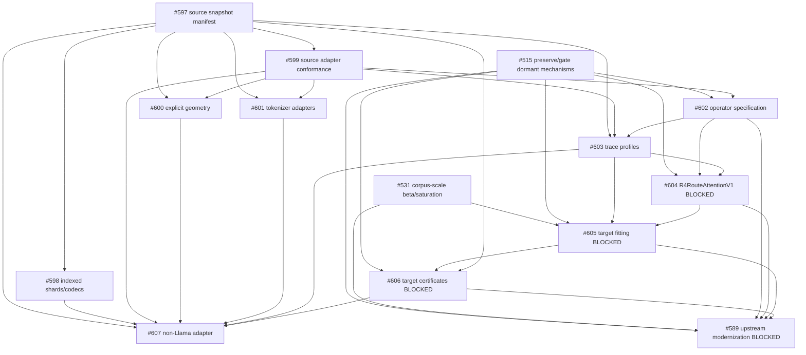

# Open-weight behavioral recompilation into R⁴

> **Status:** historical source-model/recompilation plan, drafted 2026-08-10.
> It remains a reference for teacher ingestion, provenance, and transitional
> compiler surfaces, but it is not the current product architecture or work
> order. See the
> [Geometric Intelligence Programme](geometric_intelligence_programme.md).
> The source-free route-native path does not load these weights at serving and
> does not yet provide working chat.

This plan covers the staged path from

```text
pinned open model snapshot
    -> faithful offline source execution
    -> deterministic observations and traces
    -> target-operator fitting
    -> packed R4 artifact
    -> witnessed allocation-free integer runtime
```

This is behavioral cross-compilation. It does not claim exact transformer equivalence; parity and quality statements are empirical criteria on declared sources and distributions.

## 1. Scope and current-state assessment

The repository already has a working R4G1 path: a host-side teacher, observation/corpus generation, multiresolution cover induction, packed graph format, allocation-free runtime surfaces, and certifier/reporting infrastructure. The missing work is the trustworthy boundary around open-weight source semantics and the first genuinely R4-native target operator.

The current relevant surfaces are:

| Boundary | Existing implementation | Verified limitation or status |
|---|---|---|
| Source download/provenance | `src/model.rs:474-559` (`SourceDownload`, `download_source`); `models/*.json` descriptors | Pinned revision and selected files exist, but descriptors/κs are not a complete snapshot identity. 135M records only `model.safetensors`; 360M has no source κ in the descriptor. |
| Source execution | `crates/uor-r4-model-source/src/lib.rs` (`HuggingFaceLlamaOracle`, `TeacherOracle`) | Llama-family tensor names/configuration; one `model.safetensors`; BF16 only; eager flattening into `Vec<f32>`. |
| Tokenizer | `hf_bpe.rs` (`HfBpeTokenizer`, `TokenizerKind`) | Correct byte-level BPE, added tokens, ByteLevel and SmolLM2 Digits support; no general versioned family adapter or SentencePiece/Unigram path. |
| Source versus compiled geometry | `source_dimension()` plus `TeacherOracle::dim()`; `compiler::D = 288` | HF 135M is native width 576 while the oracle reports compiled width 288 and bucket-averages embeddings into it. The projection is implicit and not independently versioned in provenance. |
| Observation | `ObservationManifest`, `ObservationShardWriter`, `TeacherOracle::hidden_state/top_k`, `induction::Observation` | Content-addressed sharding, resume, final hidden state, top-k, and v4 probability rows exist. No versioned multi-profile trace bundle or per-layer/QKV/support surfaces. |
| Compiler | `uor-r4-core::transformerless::compiler`, `uor-r4-graph-compiler::induction`, `pack` | The current boundary is compiler-specific `Corpus`/`Observation` to cover/pack; no stable `ObservationBundle -> R4ProgramIR` contract is active. |
| Artifact/runtime | `uor-r4-graph-format` R4G1, `uor-r4-graph-runtime`, `uor-r4-api` | Packed artifact parsing, ROUT support, bounded state, integer scoring, witness/provenance and no-allocation paths exist. Dormant packed-kernel placeholders remain owned by #515. |
| Certification | `uor-r4-graph-certify`, `tests/bdd.rs`, `uor-r4-proof-model` | Gate C, teacher parity, operation/allocation, deterministic rebuild, and witness surfaces exist; target-operator certificate composition is missing. |

The requested files `docs/RESEARCH.md`, `docs/MODEL_LIFECYCLE.md`, and `docs/CONFIGURATION.md` are present on the current `origin/main`. `CONTRIBUTING.md`, `CONFORMANCE.md`, and `model/ledger.toml` are referenced by repository guidance or active #515 work but are not present in the fetched default-branch tree; the plan treats #515 and its active PRs as the owner of that transition rather than recreating those files here.

## 2. Truthful attention assessment

The current source implementation is in `crates/uor-r4-model-source/src/lib.rs` around the multi-head attention loop.

Standard branch, for each key position `t`, computes

```text
score = (((q[0] * k[0]) + (q[1] * k[1])) + ...) / sqrt(head_size)
att[t] = softmax(score)
```

The experimental branch sets `chunks = head_size / 4`, computes each four-coordinate block as

```text
dot_4d = q[4j] * k[4j] + q[4j+1] * k[4j+1]
       + q[4j+2] * k[4j+2] + q[4j+3] * k[4j+3]
head_score += dot_4d
att[t] = softmax(head_score / sqrt(head_size))
```

Therefore:

- When `head_size` is divisible by four, the relation is the same scalar dot product, with the same mathematical reduction and only a possible floating-point grouping concern to test explicitly.
- It still invokes `softmax_with_mode` in the experimental branch. “Softmax-free” is not a truthful description of current control flow.
- When `head_size % 4 != 0`, the experimental loop omits the remainder coordinates. That is a correctness defect for a general adapter; the current SmolLM2 head width is 64, so this defect is not exercised by its pinned geometry.
- `r4_attention` is selectable through `HuggingFaceLlamaOracle::set_r4_attention`, `uor-r4-api::CompileOptions`, the root CLI flag, the server cascade, and the chat engine menu. It is default-off.
- No pinned standard-versus-experimental teacher-parity A/B was found. #425/#426 created the dated deferral record; #515 now owns preservation and activation-gate discipline. The update on #515 records the formula/control-flow finding and the next action.

The plan consequently treats this path as a dormant/source-teacher experiment. It is not the target R4-native operator. #602 defines the truthful operator-spec boundary; #604 is the later target-operator work.

## 3. Architecture boundaries

The repository-native names should remain the primary interfaces:

1. **Source snapshot and provenance.** `SourceDownload`, model descriptors, and compile provenance are extended by #597 into a versioned manifest binding revision, license, every file/shard, tokenizer/config/chat semantics, adapter/compiler version, and source execution mode.
2. **Source model adapter.** `TeacherOracle` remains the compiler-facing two-surface boundary: representation (`RepresentationSource`) and sequential behavior (`BehaviorSource`). #598 adds indexed shards/codecs; #599 adds conformance and explicit supported/rejected features; #607 proves a non-Llama adapter.
3. **Tokenizer adapter.** `TokenizerKind` and `HfBpeTokenizer` remain the starting point. #601 makes family/policy/version/CID explicit and keeps source, observation, evaluation, serving, and exported runtime tokenization aligned.
4. **Observation/trace bundle.** `ObservationManifest`, `ObservationShardWriter`, `Corpus`, and `Observation` remain the current infrastructure. #603 adds versioned bounded profiles and dependency CIDs without replacing the existing shard pipeline.
5. **Compiled geometry.** `source_dimension()` is distinct from compiled `D`; #600 names and versions the current projection and records its parameters/implementation identity.
6. **Target attention/operator specification.** #602 defines the source/target distinction and operator identity. The current `r4_attention` boolean is not sufficient.
7. **Compiler IR.** The active path is `Corpus`/`Observation` -> `induction` -> packed sections. A new `ObservationBundle -> R4ProgramIR` abstraction is not created now: existing `reference_compiler_ir`/related graph surfaces are dormant or under #515, and the active boundary is sufficient for the first source-adapter increments.
8. **Packed artifact/runtime.** R4G1 `GraphView`, ROUT/CODE/EMIT sections, `uor-r4-graph-runtime`, and `uor-r4-api` remain the deployed boundary. Runtime work stays within the inference operation contract: no matrix multiplication, float, multiply/divide, unbounded search, mutable global inference state, or hot-path heap allocation.
9. **Certifier.** Existing Gate C, teacher parity, performance, operation, allocation, witness, and proof-status infrastructure remains authoritative. #606 adds target-operator joins and absent/blocked states rather than a second certification framework.
10. **Future registry/formal integrations.** `uor-matmul`, UOR-NAF, `kappa-registry`, UOR Framework, `uor-addr`, and Lean/F1 exports remain a #589 phase. They do not become prerequisites for the local source boundary.

## 4. Dependency and ownership matrix

The matrix records the 14 proposed capabilities from the audit. “Existing closed work” is included so a new issue is not mistaken for a re-opening of completed work.

| Candidate capability | Current files/symbols | Existing open issue/PR | Relevant closed issue/PR | Current status | Disposition | Dependency/blocker | Evidence |
|---|---|---|---|---|---|---|---|
| 1. Complete source snapshot identity | `src/model.rs` `SourceDownload`, `ModelManifest`; `models/*.json`; HF loader κ | None | #322 source provenance; #450/#452 teacher/corpus κ announcement | Weight/revision descriptors exist, but no full snapshot root | **NEW ISSUE #597** | Phase 1; #589 only for future registry publication | File-level source identity is absent; current 135M scope is only `model.safetensors`. |
| 2. Indexed shards and source codecs | `HuggingFaceLlamaOracle::load_inner`, `append_tensor` | None | #525 host-ingestion error boundary | Single-file BF16 only; eager flattening | **NEW ISSUE #598** | Depends #597 | `model.safetensors.index.json` is not read; F16/F32 are rejected. |
| 3. Source-executor parity/conformance | `TeacherOracle`; ignored `smollm2_adapter`; `HuggingFaceConfig` | None | #307 runtime teacher parity; #202/#207 chat-template work | Smoke finite-output test, not source reference conformance | **NEW ISSUE #599** | Depends #597/#598 | No per-layer/reference logit/top-k/config conformance gate. |
| 4. Explicit compile geometry | `compiler::D = 288`; `source_dimension`; `TeacherOracle::dim`; `embedding` bucket average | None | #95 hidden-state lane rejected non-288 widths | 576→288 is implicit in the adapter/compiler boundary | **NEW ISSUE #600** | Depends #597/#599; migration/re-pin review | Current HF descriptor says hidden 576; oracle compiled dim is 288. |
| 5. Versioned tokenizer adapters | `HfBpeTokenizer`, `TokenizerKind`, `Tokenizer::address` | None | #242/#253 BPE correction; #285 serving follow-through; #203/#206 tokenizer CID | Current byte-level BPE is implemented; broader family/policy boundary is not | **NEW ISSUE #601** | Depends #597/#599; legacy path preserved | Existing tests cover BPE/added tokens/Digits; no SentencePiece/Unigram or versioned family registry. |
| 6. Truthful experimental attention surface | `r4_attention`, `set_r4_attention`, `softmax_with_mode`; deferral record | #515; PRs #593/#594/#596 | #425/#426 deferral/negative hygiene | Selectable but stale “Spin(4)”/“softmax-free” wording; remainder bug | **UPDATE EXISTING #515** | Wait for #515 gate/ledger conventions | Current experimental and standard branches are both scalar dot-product + softmax; comment posted on #515. |
| 7. Versioned operator specification | Source attention loop; inference contract; R4G1 ROUT/CODE | #515 | #123 formal vocabulary; #159-era ROUT design | No source/target attention spec | **NEW ISSUE #602** | Depends #515/#599; target work follows | Required distinction is not represented by current boolean flag. |
| 8. Deterministic teacher trace profiles | `ObservationManifest`, `ObservationShardWriter`, `TeacherOracle::hidden_state/top_k` | None | #59; #95; #74/#94 | Shards/final hidden/top-k exist; profiles/layer/QKV/support bundle absent | **NEW ISSUE #603** | Depends #597/#599/#602 | Existing #95 hidden-state lane was measured negative and must remain evidence. |
| 9. First R4-native target operator | `packed_kernels` placeholders; `routing.rs`; ROUT format | #515; PR #594 | #425/#426 preserved negative mechanisms | No target attention operator; dormant packed kernels are placeholders | **NEW ISSUE #604 — BLOCKED BY #515** | Depends #602/#603; do not activate dormant path early | `packed_kernels.rs` returns placeholders for registered dormant operations. |
| 10. Fit target operator from traces | `induction`; Gate C; #603/#604 outputs | #531 owns corpus scale; #515 owns dormant gates | #456/#460 measured structural/reconstruction limits; #320/#509 teacher upgrade | No progressive target-operator fitting harness | **NEW ISSUE #605 — BLOCKED BY #515** | Depends #531/#603/#604 | Must separate source weights from target semantics and preserve nulls. |
| 11. Recompilation certification | `graph-certify`, `tests/bdd.rs`, proof model | #515; #531 inputs | #307; #180; #45; #317 | Existing gates cover adjacent paths, not target-operator joins | **NEW ISSUE #606 — BLOCKED BY #515** | Depends #597–#605 as applicable | Extend existing owners; do not duplicate Gate C/proof tests. |
| 12. Stable observation-to-IR boundary | `Corpus`, `Observation`, `induction`, `pack`; dormant `reference_compiler_ir` | #515/PR #593 owns dormant graph/compiler surfaces | #129/#130 reference compiler/semantic lowering | Active compiler boundary exists; named conceptual abstraction does not | **DEFER** | Revisit after #515 and target operator; avoid duplicate IR | Current active stages already provide the first bounded path; a second IR would duplicate dormant work. |
| 13. First non-Llama adapter | `HuggingFaceLlamaOracle`; `TeacherOracle` | None | #120 modular crate restructuring; #525 host boundary | Interface is architecture-neutral in shape; only Llama HF adapter exists | **NEW ISSUE #607** | Depends #597–#601, #603/#606; source selection must verify revision/license | A canary is missing; issue leaves exact family/revision selection to a pinned preflight. |
| 14. Modern GQA/QKV-bias adapter | Llama config has GQA fields but no generic bias support | None | SmolLM2 is GQA but same Llama family | Valid future work; exact Qwen/source snapshot not selected or verified | **DEFER** | After #607 and #601; #589 for upstream options | Do not name a Qwen revision/license before the source-selection check. |

### Explicit non-issue ownership

- Corpus scale, saturation knees, multi-teacher β, and evidence scale remain **owned by #531**. The comment on #531 records that Phase 6 consumes its result without broadening the issue.
- Dormant mechanisms, feature flags, activation gates, claim ledger, and all-features CI remain **owned by #515** and #593/#594/#596. The attention truthfulness finding was added to #515 rather than creating a parallel modularization issue.
- `uor-matmul`, UOR-NAF, `kappa-registry`, UOR Framework/ADDR/transformerless rebase, and formal-proof exports remain **blocked by #589**. The current #589 body already captures the upstream checklist; no duplicate comment was required.

## 5. Dependency-aware implementation phases

### Phase 0 — audit, truthfulness, and baseline preservation

- Keep the current SmolLM2 broad baseline and stories15M home-distribution fixtures intact.
- Merge or otherwise resolve the #515 preserve-and-gate tranche before activating dormant route surfaces.
- Correct the experimental-attention description and add its remainder-dimension/A-B activation evidence under #515.
- Use #531’s current compute-bound scope as the only corpus-scale workstream.
- Keep #589 explicitly blocked.

### Phase 1 — trustworthy source ingestion

Order: **#597 -> (#598, #599, #601) -> #600**.

- Emit a complete immutable source snapshot identity.
- Resolve indexed shards and declared BF16/F16/F32 codecs.
- Run source-executor conformance before observations are trusted.
- Version tokenizer adapters and differential fixtures.
- Make native source width, compiled width, and projection identity explicit while preserving historical artifact eras.

### Phase 2 — explicit operator and trace boundary

Order: **#602 -> #603** (with #597/#599 as prerequisites).

- Define source versus target operator specifications.
- Preserve a standard-attention reference surface.
- Add bounded minimal/layer/attention/full trace profiles using existing observation shards.
- Keep absent data absent and every dependency CID explicit.

### Phase 3 — first genuinely R4-native target operator

Issue **#604**, blocked by #515.

- Define reference semantics, then packed lowering.
- Enforce zero-float/zero-multiply/zero-allocation and bounded candidate/operation/byte-read behavior.
- Add independent witness replay without changing the default serving path.

### Phase 4 — teacher-guided fitting and progressive replacement

Issue **#605**, after #604 and the #531 corpus decision.

- Fit one head, one layer, a layer range, and only then whole-model scope.
- Use nulls and predeclared positive/negative exit rules.
- Distinguish source parity, target fit, runtime contract, and quality.

### Phase 5 — architecture independence

Issue **#607**, after the phase-1 source boundary is real.

- Start with a generated one-layer fixture.
- Use the existing small Llama-family canary (SmolLM2-135M, Apache-2.0, pinned descriptor) without changing its historical baseline.
- Add one selected small non-Llama decoder only after #607 verifies an immutable revision, license, tokenizer, format, and local execution budget.
- Add a modern GQA/QKV-bias family only after that source selection and #601; do not hard-code a Qwen revision in this plan.
- Test a larger same-family scale separately; current SmolLM2-360M descriptor provenance needs the source-manifest work and the revision-drift note in #320/#516 resolved first.

### Phase 6 — quality scale and product gate

- Consume #531’s saturation-selected corpus and β result.
- Re-run #605/#606 on the selected corpus with source, corpus, tokenizer, trace, geometry, and operator CIDs.
- Report instruction/grounding evaluation separately from compilation and runtime-contract results.
- Distinguish a smoke artifact from a quality-qualified model.

### Phase 7 — coordinated upstream integration

Start only when #589 is genuinely unblocked, meaning #515, #531, and all follow-ups are complete:

- canonical `uor-matmul` source backend and exact source codecs;
- UOR-NAF semantic manifests/quantization witnesses;
- `kappa-registry` model-bundle media types and source -> observation -> program -> certificate lineage;
- current UOR Framework and `uor-addr` alignment;
- bounded formal exports for deterministic top-k, accumulation, and route scoring.

## 6. Dependency graph



## 7. Model verification ladder

The ladder prioritizes architecture coverage and boundary correctness over parameter count:

1. Generated one-layer, tiny-vocabulary fixture with known tensors and tokenizer behavior.
2. Existing SmolLM2-135M Llama-family canary, Apache-2.0, using the pinned descriptor and source manifest.
3. One small non-Llama decoder selected by #607 after revision/license/format/tokenizer/resource verification.
4. One modern GQA/QKV-bias family selected only after the adapter and tokenizer boundaries are real; a Qwen-family source is a candidate, not a pinned claim.
5. A larger same-family scale test, with source revision and weights reverified because the current 360M descriptor has revision-drift and incomplete source κ history recorded in #320/#516.

Every rung must pass source conformance before producing a quality report. A larger teacher is not evidence that the compiler or target operator is correct.

## 8. Gates and definitions of done

- **Immutable source identity:** full snapshot manifest, revision, license, file/shard CIDs, tokenizer/config/chat semantics, adapter/compiler identity.
- **Source parity:** pinned tokenizer and source-executor fixtures pass or explicitly reject unsupported features.
- **Explicit target operator:** source and target specifications are distinct; operator/version is present in outputs.
- **Evidence-guided fitting:** #605 reports nulls, progressive replacement, predeclared exits, and source/corpus/trace CIDs.
- **Deterministic artifact rebuild:** same pinned inputs and compiler settings produce identical manifest/observation/artifact/certificate bytes.
- **Quality report:** teacher floor, top-1/top-k, bits/token, task/instruction/grounding measures, and distribution are reported separately from compile success.
- **Runtime operation contract:** no matrix multiplication, float, multiply/divide, unbounded search, mutable global inference state, or hot-path allocation; bounded candidates/bytes/operations are measured.
- **Witness replay:** an independent replay checks the emitted target/runtime decision and provenance.
- **Clean-machine deployment:** the deployed artifact runs without original source weights; source execution remains offline/compiler-side.
- **Architecture independence:** downstream compiler/runtime code does not branch on tensor names or model-family details; family logic stays in adapters.

## 9. Risks and falsifiers

- A new operator may not preserve useful behavior; a negative fit is a valid result and must keep the operator dormant.
- Unchanged source weights are not automatically valid under a new attention/relation equation.
- A smoke corpus may falsely suggest pipeline success equals model success; #531 and the quality gate prevent that conflation.
- More regions or keys may split useful evidence rather than improve fit; #456/#460 provide current negative and bounded evidence.
- Source parity bugs may contaminate the observation corpus; #599 must precede fitting.
- Artifact/projection/codec changes may invalidate existing κ fixtures; #600 requires an explicit migration/re-pin decision.
- A new abstraction may duplicate an existing one; #603 and #602 reuse current observation/operator surfaces, while candidate 12 is deferred.
- Cross-repository adoption is blocked by #589 and must not be prematurely coupled to local source work.

## 10. Actual issue index

| Issue | Dependency/blocker | Expected artifact | Verification gate | Type |
|---|---|---|---|---|
| [#597](https://github.com/UOR-Foundation/uor-r4/issues/597) | Phase 1; no direct #515/#531 blocker | Versioned full source snapshot manifest and root CID | Canonical digest coverage/double-build | Engineering |
| [#598](https://github.com/UOR-Foundation/uor-r4/issues/598) | Depends #597 | Indexed-shard resolver and BF16/F16/F32 codec boundary | Shard completeness/dtype/shape tests | Engineering |
| [#599](https://github.com/UOR-Foundation/uor-r4/issues/599) | Depends #597/#598 | Source adapter conformance fixture/report | Tokenizer/layer/hidden/logit/top-k parity | Engineering/measurement |
| [#600](https://github.com/UOR-Foundation/uor-r4/issues/600) | Depends #597/#599; migration review | Explicit geometry/projection metadata | Projection determinism and historical rebuild | Engineering |
| [#601](https://github.com/UOR-Foundation/uor-r4/issues/601) | Depends #597/#599 | Versioned tokenizer adapter registry/fixtures | Differential source tokenizer tests | Engineering |
| [#602](https://github.com/UOR-Foundation/uor-r4/issues/602) | Depends #515/#599 | Versioned source/target operator specification | Formula, version, tie, and claim checks | Engineering/definition |
| [#603](https://github.com/UOR-Foundation/uor-r4/issues/603) | Depends #597/#599/#602 | Versioned bounded trace bundles/shards | Resume, CID, absence, and T-invariance tests | Engineering |
| [#604](https://github.com/UOR-Foundation/uor-r4/issues/604) | **Blocked by #515**; depends #602/#603 | `R4RouteAttentionV1` reference + packed lowering | Runtime contract, differential replay, witness | Research/engineering |
| [#605](https://github.com/UOR-Foundation/uor-r4/issues/605) | **Blocked by #515**; depends #531/#603/#604 | Progressive fit manifest and null/exit report | One-head -> layer -> range -> model measurements | Research/measurement |
| [#606](https://github.com/UOR-Foundation/uor-r4/issues/606) | **Blocked by #515**; depends fitting outputs | Target-operator certificate schema/report | Existing Gate C/parity/runtime/proof extensions | Engineering/measurement |
| [#607](https://github.com/UOR-Foundation/uor-r4/issues/607) | Depends Phase 1/#603/#606 | Pinned non-Llama adapter/canary bundle | Source conformance + end-to-end architecture boundary | Engineering/measurement |

Existing owners: [#515](https://github.com/UOR-Foundation/uor-r4/issues/515) owns dormant/ledger/feature gating; [#531](https://github.com/UOR-Foundation/uor-r4/issues/531) owns corpus-scale β/saturation; [#589](https://github.com/UOR-Foundation/uor-r4/issues/589) remains explicitly blocked for upstream modernization. Active related PRs are [#593](https://github.com/UOR-Foundation/uor-r4/pull/593), [#594](https://github.com/UOR-Foundation/uor-r4/pull/594), and [#596](https://github.com/UOR-Foundation/uor-r4/pull/596).

## 11. Recommended implementation order

After the current #515 PR tranche and any required maintainer decisions, begin with **#597**. It has the highest dependency leverage: every trustworthy source parity result, tokenizer/codec decision, geometry record, trace bundle, fitted operator, certificate, and architecture canary needs one unambiguous source snapshot identity. It is also independent of the blocked #589 integration and does not broaden #531.
